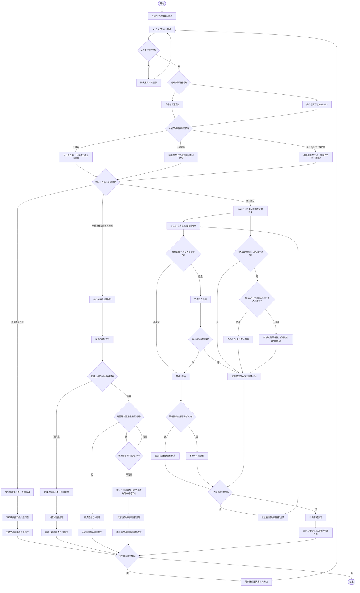

# AI Agent 模拟陌生组织中真实需求流转的总状态机

## 1. 模型目标

这个模型用于模拟：一个外部提问者带着真实需求进入某个陌生组织后，需求如何在组织入口、领域接待节点、内部处理节点之间流转，并最终得到答案。

模型重点不是单纯问答，而是模拟物理世界中真实组织的处理方式：

- 外部用户不一定知道该找谁。
- 入口节点需要像医院导诊台一样分诊。
- 一个需求可能涉及多个领域节点。
- 真正能解决问题的节点，未必被允许直接对外。
- 每个节点分发任务时，可以选择是否跟踪后续流程。
- 组织可以选择一对一处理、隐藏内部处理，或者建群协同处理。
- 最终目标是给外部用户一个可用答案。

## 2. 核心角色

### 外部用户

外部用户是需求提出者，只知道自己的问题，不一定知道组织内部结构。

外部用户的目标是获得答案，而不是理解完整的内部流程。

### A：总入口 / 导诊节点

A 是组织的第一接触点，类似医院接待员或导诊台。

A 的职责：

- 接收外部用户的问题。
- 判断问题涉及哪些领域。
- 将问题分发给一个或多个领域节点。
- 在必要时作为外部用户的对话节点。
- 判断下级领域节点是否可以直接对外。
- 分发任务时选择是否跟踪后续处理过程。

### B：领域对外接待节点

B 是某个领域的对外接待部门或人。一个问题可以被 A 分发给多个 B。

B 的职责：

- 判断问题是否属于本领域。
- 判断需要哪些内部模块或负责人参与。
- 判断其下级节点是否可以直接对外。
- 可以自己和用户沟通，也可以把具体处理节点暴露给用户。
- 可以创建群聊来协调多个节点共同解决问题。
- 分发给内部节点时选择跟踪、不跟踪，或等待子节点直接上报结果。

### N：具体处理节点 / 最终处理 Agent

N 是真正处理具体问题的节点，可以是某个模块负责人、专业人员、内部 agent 或执行单元。

N 可以直接和外部用户对话，也可以被隐藏在内部流程中。

## 3. 核心规则

### 规则一：领域可以是多个

一个真实需求可能涉及多个领域，因此 A 不一定只分发给一个 B。

例如，像去医院看病一样，接待员可能判断用户需要去内科，也可能同时涉及影像科、检验科、外科等多个领域。

### 规则二：每一级节点都是可见性守门人

每一级流转节点都可以判断其下级节点是否允许直接对外。

这个判断不是审批整个业务流程，而是只判断一件事：

> 下级节点是否可以直接与外部用户对话并解决问题。

例如：

- A 判断 B 是否可以直接对外。
- B 判断 B-1、B-2、B-3 是否可以直接对外。
- B-1 继续判断更下级节点是否可以直接对外。

### 规则三：谁不同意，谁成为对话节点

如果某个下级节点希望直接对外，但上级链路中的某个节点不同意，那么：

> 第一个不同意的上级节点成为外部用户的对话节点。

被拒绝直接对外的节点不会消失，而是转入内部处理。

也就是说：

- 用户和“不同意节点”对话。
- 不同意节点和内部节点沟通。
- 内部节点继续处理问题。
- 不同意节点向用户反馈答案。

### 规则四：群聊由群主和群员自主组织

每一级节点都可以选择是否建群解决问题。

群聊可以包含：

- 外部用户或其他外部人员。
- 群主。
- 群员。
- 被上报或转入的相关节点员。
- 多个部门或领域的人。

群聊规则：

- 接待员仅仅是接待功能，不控制群聊。
- 是否创建群聊，由当前处理链路中的节点自主选择。
- 群聊创建后，群主和群员可以自主选择拉哪些内部节点进群。
- 被拉的内部节点可以自主选择是否进群。
- 已进群的节点可以自主判断是否离群。
- 节点一旦进入群聊，发言不需要被把控。
- 不进群的节点可以选择内部支持，也可以不参与。
- 只有在拉外部人员进群时，才由选择继续跟踪或要求上报处理结果的最高上级节点决定是否允许。

### 规则五：分发任务时可选择跟踪策略

每一个节点在向下级节点分发任务时，都可以选择是否跟踪后续流程。

可选策略：

- 不跟踪：节点只完成任务分发，不持续关注后续处理过程。
- 一直跟踪：节点持续关注子节点处理进度和结果。
- 子节点直接上报结果：节点不持续追踪过程，只等待子节点在处理完成后直接上报结果。

这个规则适用于每一级分发：

- A 分发给 B。
- B 分发给 B-1/B-2/B-3。
- 群聊中继续邀请或上报其他节点。
- 内部处理节点继续分发给更下级节点。

### 规则六：最终输出是答案

系统内部可以记录流转路径、可见性判断、节点参与情况和信息来源，但对外部用户的最终目标是输出答案。

## 4. 状态级版本

### 状态 S0：需求提出

外部用户提出真实需求。

进入条件：

- 用户有一个问题或任务。
- 用户不知道应该找组织内哪个节点。

退出条件：

- 需求进入 A。

### 状态 S1：入口接收

A 接收需求，并进行初步理解。

可能动作：

- 询问用户补充信息。
- 判断需求类型。
- 判断涉及哪些领域。

退出条件：

- A 能够进行领域分发。
- 或 A 判断无法处理并结束。

### 状态 S2：领域分发

A 将需求分发给一个或多个领域节点 B。

可能动作：

- 分发给单个 B。
- 分发给多个 B。
- 保留 A 作为总对话节点。
- 选择是否跟踪 B 的后续处理流程。

退出条件：

- 一个或多个 B 接收需求。

### 状态 S2.1：分发节点选择跟踪策略

每个分发任务的节点，都需要选择自己是否继续跟踪后续流程。

可选策略：

- 不跟踪：只完成分发，不持续关注后续过程。
- 一直跟踪：持续关注子节点处理状态和最终结果。
- 子节点直接上报结果：不持续跟踪过程，但要求子节点处理完成后直接上报结果。

退出条件：

- 跟踪策略确定。
- 子节点继续进入处理模式判断。

### 状态 S3：领域节点判断处理模式

B 判断采用哪种处理方式。

可选模式：

- B 自己作为对话节点，内部隐藏处理。
- 申请让具体处理节点 N 直接对外。
- 建群解决问题。

退出条件：

- 进入代理处理、直连审批或群聊处理。

### 状态 S4：代理隐藏处理

当前节点作为外部用户的对话窗口，下级节点在内部处理。

适用场景：

- 下级节点不允许直接对外。
- 当前节点选择统一对外。
- 内部流程不希望暴露。

退出条件：

- 当前节点拿到内部处理结果。
- 当前节点向用户反馈答案。

### 状态 S5：直连可见性判断

如果某个具体处理节点 N 希望直接对外，则需要沿上级链路判断是否允许。

判断逻辑：

- 直接上级同意，继续向更上级判断。
- 任意上级不同意，则该不同意节点成为用户对话节点。
- 所有必要上级都同意，则用户可以直接与 N 对话。

退出条件：

- 进入直接对话。
- 或进入由不同意节点代理沟通。

### 状态 S6：直接对话

外部用户直接与具体处理节点 N 对话。

适用场景：

- N 可以解决问题。
- 上级链路允许 N 直接对外。

退出条件：

- N 形成答案并回复用户。

### 状态 S7：群聊处理

当前处理链路中的节点可以选择创建群聊，并邀请相关节点共同解决问题。

群聊包含：

- 群主。
- 群员。
- 外部用户或其他外部人员。
- 相关领域节点。
- 被上报或转入的节点员。

群聊控制：

- 接待员仅仅是接待功能，不控制群聊。
- 群主和群员可以自主拉内部节点。
- 被拉节点自主选择是否进群。
- 进群节点自主判断是否离群。
- 群内成员自由发言。
- 拉外部人员进群时，由选择继续跟踪或要求上报处理结果的最高上级节点判断是否允许。
- 节点可以选择不进群。

退出条件：

- 群内形成足够答案。
- 或信息不足，继续邀请节点。
- 或回退到代理处理。

### 状态 S8：答案形成

答案可以来自：

- A 汇总。
- 某个主领域节点 B 汇总。
- 群聊共同形成。
- 具体处理节点 N 直接给出。
- 外部用户或外部 agent 汇总多个领域答案。

退出条件：

- 形成可回复给外部用户的答案。

### 状态 S9：答案反馈

将答案反馈给外部用户。

反馈方式：

- 当前对话节点反馈。
- 具体处理节点直接反馈。
- 群聊中反馈。
- 汇总节点统一反馈。

退出条件：

- 用户接受答案，流程结束。
- 用户继续追问，回到需求理解或领域分发。

## 5. 总状态机



## 6. 最简规则摘要

```text
1. A 像医院导诊台，负责把需求分给一个或多个领域节点。
2. 每一级节点都可以判断下级是否能直接对外。
3. 如果某个上级不同意下级直接对外，则该不同意节点成为用户对话节点。
4. 下级节点即使不能对外，也可以继续在内部处理问题。
5. 每个节点分发任务时，都可以选择不跟踪、一直跟踪，或只等待子节点直接上报结果。
6. 每一级都可以选择建群解决问题。
7. 接待员仅是接待功能，不控制群聊。
8. 群主和群员可以自主邀请内部节点，被拉节点自主决定进群或离群。
9. 拉外部人员进群时，由选择继续跟踪或要求上报结果的最高上级节点决定。
10. 最终目标是向外部用户输出答案。
```

## 7. HTML 可视化版本

已生成一个独立 HTML 可视化状态图：

```text
agent-org-demand-flow-visualization.html
```

该 HTML 使用内嵌 SVG 绘制状态图，不依赖外部网络资源。
