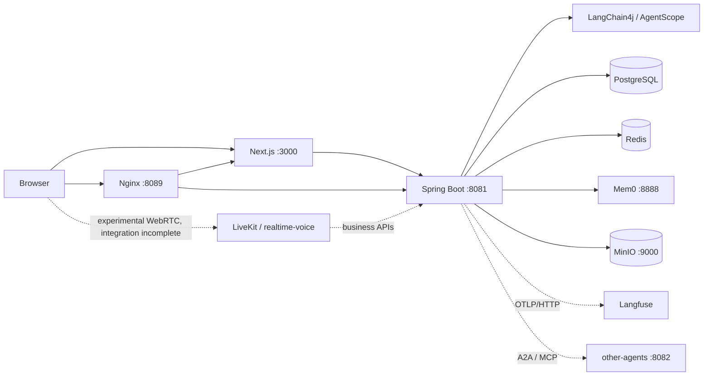

# H Agent

[简体中文](README_zh.md) | English

H Agent is a full-stack AI workspace for streaming chat, domain agents, Harness-style multi-agent collaboration, knowledge retrieval, long-term memory, versioned Skills, multimodal resources, and end-to-end agent observability.

The project combines a Next.js interface with a Spring Boot agent platform. It supports three execution styles—standard streaming chat, synchronous LangChain4j agent workflows, and an AgentScope Harness runtime—behind one session and chat experience.

> This repository is under active development. The configuration currently targets a development environment; review credentials, storage policies, and network exposure before production use.

## Highlights

- Streaming conversations with persistent sessions, Markdown rendering, and attachments.
- Standard assistants with private System Prompts and per-prompt RAG knowledge bases.
- Domain-agent catalog, topology views, and built-in specialist/workflow agents.
- Harness collaboration with dynamic subagents, progress events, human approval, workspace files, and Skills.
- Redis-backed short-term chat context plus Mem0-backed long-term memory for enabled LangChain4j agents.
- Versioned user Skills with proposal validation, immutable releases, activation, revocation, and MinIO artifacts.
- MinIO-backed private storage for chat files and generated image/audio/video artifacts.
- OpenTelemetry traces exported directly to Langfuse without making observability part of business correctness.
- Optional A2A/MCP agent service and an experimental LiveKit + LangGraph realtime-voice module that has not completed end-to-end integration.

## Architecture



| Area | Main technologies |
| --- | --- |
| Frontend | Next.js 16, React 19, TypeScript, Tailwind CSS |
| Backend | Java 26, Spring Boot 4, LangChain4j, AgentScope, MyBatis-Plus, Flyway |
| Data | PostgreSQL/pgvector, Redis/Redisson, MinIO |
| Memory | Redis chat memory, Mem0 long-term memory, Harness `MEMORY.md` |
| Observability | OpenTelemetry, Langfuse, Micrometer, Prometheus |
| Optional/experimental services | A2A and MCP; a not-yet-integrated LiveKit, LangGraph, and FastAPI voice module |

## Product Tour

The following pages were verified against the local application at `http://localhost:3000/`.

### 1. Sign in

Open [http://localhost:3000/](http://localhost:3000/) and use the development account:

```text
Email:    test@test
Password: 12345678
```

> Development account only. Do not reuse these credentials outside the local environment.


### 2. Start a conversation

Open the left menu and select **New Session (`新会话`)**. A session is bound to the selected Agent and execution mode; choosing another Agent creates a separate session so that histories and runtime state do not become mixed.

The new-session picker provides three entry points:

| Entry | Runtime | Choose it when |
| --- | --- | --- |
| **General Assistant (`通用助手`)** | `STANDARD_STREAMING_CHAT` | You want open-ended conversation using a selected System Prompt, its knowledge base, and common tools. |
| **Domain Agent (`领域 Agent`)** | `AGENTIC_SYNC` | The task fits a predefined specialist or workflow topology. Search by name/domain/tag and select a card. |
| **Collaborative Agent (`协作 Agent`)** | `HARNESS_STREAMING` | The goal is complex enough to be decomposed and delegated dynamically to multiple collaborating Agents. |


After the session is created:

1. For the General Assistant, choose a System Prompt at the top of the chat. Its linked knowledge base is used for retrieval.
2. For a Domain Agent, open **Topology Details (`拓扑详情`)** to see its Sequence, Router, Parallel, Loop, Supervisor, AI, or Human nodes.
3. For the Collaborative Agent, watch the collaborator cards under **Collaboration Progress (`协作进度`)**. Open a card to read that collaborator's transcript and send a follow-up after it stops running.
4. Use the paperclip to attach supported resources, enter the request, and select **Send (`发送`)**.

> **Voice status:** A phone icon is currently visible in the chat header, but browser speech recognition, backend TTS, and the standalone `realtime-voice` service have not completed stable end-to-end integration. Voice is therefore not considered an available feature and should not be included in the current product demo or acceptance scope.

#### Built-in Agent guide

##### General Assistant — `standard-chat`

- **Best for:** everyday Q&A, summarization, writing, knowledge-base Q&A, and tasks that need a custom persona or instruction set.
- **How it works:** streams the response token by token; combines the selected System Prompt, its private RAG knowledge base, Redis-backed conversation context, and enabled long-term memory.
- **Special UI:** only this mode shows the System Prompt selector and direct **Knowledge Base** / **Manage** links.
- **Example:** `Summarize our refund rules from the current knowledge base and list the supporting points.`

##### Collaborative Agent — `harness-agent`

- **Best for:** research-and-write work, multi-part analysis, planning, implementation tasks, or any goal whose independent parts can be delegated.
- **How it works:** acts as the parent Agent, decomposes the goal, creates collaborating Agents, follows their live progress, and consolidates their results. It can use workspace files, Skills, plans, long-term `MEMORY.md`, and human approval.
- **What you see:** each collaborator appears with a running/completed/failed state. Its detailed transcript is kept separate from the parent answer, while the final result is returned in the main conversation.
- **Example:** `Compare three Java Agent frameworks. Delegate architecture, ecosystem, and observability research separately, then produce a recommendation table.`

Choose the approval mode when creating the collaborative session. The choice is inherited by the whole session tree and cannot drift during a run:

| Approval mode | Behavior |
| --- | --- |
| **Standard approval** | Ask before sensitive operations; recommended for ordinary work. |
| **Auto-accept edits** | File edits run automatically; other risky operations still ask. |
| **Read-only exploration** | Allow reading and analysis while blocking mutations. |
| **Do not ask** | Reject operations that would otherwise require approval. |
| **Bypass** | Use the most permissive mode in a trusted development environment; explicit deny/ask rules and non-bypassable safety checks may still apply. |


###### Runtime HITL approval flow

Approval mode selection is only the policy setup. The actual Human-in-the-Loop flow happens later, when the Harness permission engine evaluates a proposed tool call as `ASK`:

1. The Agent proposes one or more tool calls. The backend stores a sanitized approval request and changes the existing Agent Run from `RUNNING` to `WAITING_APPROVAL`.
2. The current SSE response ends with `action_required`; this pauses the HTTP stream without treating the Agent Run as completed or failed.
3. The chat timeline displays **Your approval is required (`需要你的批准`)**, including each tool name and a safe summary. Raw tool parameters remain hidden by the server.
4. Choose **Allow execution (`允许执行`)** or **Deny (`拒绝`)**. The decision applies to the displayed approval episode.
5. A new SSE request restores the saved Agent state and resumes the **same Agent Run**. The Agent receives either the real tool result or the denial result and continues its answer.
6. If another operation requires approval, the same run may enter `WAITING_APPROVAL` again. Pending requests can be recovered after refresh or sign-in instead of being lost with the original HTTP connection.

This runtime HITL card applies to directly addressed Harness sessions, including a root collaborative session and a collaborator session opened by the user. A child event merely forwarded inside a parent's synchronous delegation is currently observable but is not turned into a separately actionable approval card.

> **Screenshot placeholder — Runtime approval card**
> Capture a real `需要你的批准` card as `docs/images/demo-02-hitl-runtime.png`. Triggering it requires an actual Harness tool request, so this repository does not fabricate one during documentation generation.

<!--  -->

##### Expert Agent — `export-assistant`

- **Best for:** questions clearly belonging to medical, legal, or technical domains.
- **Topology:** `CategoryRouter` first classifies the request, then a conditional Router invokes exactly one of **Medical Expert**, **Legal Expert**, or **Technical Expert**.
- **Memory:** the responsive expert leaves can recall USER, AGENT, and RUN Mem0 scopes when long-term memory is enabled.
- **Examples:** `Diagnose why a Java SSE connection closes after 60 seconds.` or `Explain the general legal risks in this contract clause.`
- **Boundary:** medical and legal output is informational assistance, not a substitute for a qualified professional or emergency service. Requests outside the three registered categories may not produce a specialist answer.

##### Car-rental Emergency Agent — `car-rental-assistant`

- **Best for:** rental-car breakdowns, towing, accidents, fire, medical emergencies, or police-related incidents.
- **Topology:** extracts customer/vehicle data → pauses for missing information through a Human-in-the-Loop node → evaluates towing → detects emergency types → conditionally invokes fire, medical, and/or police specialists → combines everything into one customer-facing response.
- **Required context:** customer name; booking reference or customer ID; vehicle make; vehicle model; and current location. If any item is missing, the Agent asks for it before continuing.
- **Example:** `I am Li Ming, booking B-1024, driving a Toyota Camry near Beijing South Station. The engine is smoking after a collision and my passenger is injured. What should I do?`
- **Boundary:** the workflow demonstrates assistance and simulated dispatch. In a real emergency, contact local emergency services first.

##### Story Creation Agent — `story-chat-agent`

- **Best for:** producing a short story for a specific topic, style, and audience.
- **Topology:** extracts topic/style/audience → asks for missing fields → creates a draft → adapts it for the audience → repeatedly edits and scores the style, stopping at a score of at least `0.8` or after five review iterations.
- **Memory:** the creative-writer leaf can recall enabled Mem0 context.
- **Example:** `Write a three-sentence cyberpunk story about a lost delivery robot, in a warm humorous style, for children aged 8–10.`

##### Bank Agent — `banker-agent`

- **Best for:** demonstrating Supervisor routing and tool calls for USD deposit/withdrawal requests.
- **Topology:** a bank Supervisor interprets the request, delegates to the deposit or withdrawal teller, invokes an in-process account tool, and summarizes the updated balance.
- **Example:** `Create a demo account for Alice with USD 100, then withdraw USD 25 and show the balance.`
- **Boundary:** this is an in-memory workflow demonstration, not a real banking system. It has no durable ledger, authentication, or financial controls, and process restarts can discard its demo account state.

##### Evening Planner Agent — `evening-planner-agent`

- **Best for:** quickly pairing dinner ideas with movies based on the user's mood.
- **Topology:** runs **Dinner Planner** and **Evening Activity Planner** concurrently, obtains three meals and three movies, and pairs them into the final plan.
- **Example:** `I feel tired and want a quiet, comforting evening. Recommend tonight's meal-and-movie combinations.`

##### Optional A2A Story Agent — `a2a-story-assistant`

- **Availability:** appears only when the `other-agents` A2A integration is enabled and reachable.
- **How it differs:** the backend keeps the story-information gate and style scoring locally, while creative writing, audience editing, and style editing are executed by remote Agents through A2A. W3C trace context keeps the cross-service work in the same Langfuse trace.
- **Example:** use the same topic/style/audience prompt as the local Story Creation Agent, then compare the topology and trace across both services.


### 3. Manage prompts and knowledge

Open **My → SystemPrompt Management** to create or edit a private assistant prompt and set the default. Open **My → Knowledge Base Management** to upload `md`, `txt`, `doc`, `docx`, `xls`, or `xlsx` files, or enter text manually. Each System Prompt owns an independent knowledge base.


### 4. Use domain agents and collaboration

Open **My → Domain Agent Management** to inspect registered agents, execution modes, and orchestration topology. Available local entries include standard chat, the Harness collaboration agent, specialist agents, and workflow examples. From an agent card, choose **View orchestration** or **Start Q&A**.


The car-rental topology below also shows a separate workflow-level Human-in-the-Loop node: when required customer information is missing, the workflow routes to the orange `Human / askUser` node before it may continue.


### 5. Manage Skills

Open **My → My Skills**. Skill changes first enter a Proposal draft, are validated, published as immutable releases, and then explicitly activated. Releases are stored as artifacts in the configured MinIO Skill bucket.


See [the screenshot checklist](docs/images/README.md) for all recommended captures and filenames.

## Prerequisites

- Java 26. Confirm that `mvn -version` also reports Java 26.
- Maven 3.9+.
- Node.js 22.15+ and npm.
- PostgreSQL with the `vector` extension available.
- Redis.
- MinIO with pre-created private resource and Skill buckets.
- A compatible self-hosted Mem0 service when long-term memory is enabled.
- A Langfuse project when trace export is enabled.
- Python 3.11–3.14 and `uv` only for `realtime-voice` development.

This repository does not currently provide a root Docker Compose stack for PostgreSQL, Redis, MinIO, Mem0, or Langfuse. Start those dependencies separately and point `.env` at them.

## Quick Start

### 1. Configure the environment

```bash
cp .env.example .env
```

At minimum, fill in the model, database, Redis, JWT, and MinIO values. The current backend configuration also enables Mem0 long-term memory, so fill all four Mem0 fields or set `MEMORY_LONG_TERM_ENABLED=false` for a development run without Mem0.

```dotenv
API_KEY=<model-api-key>
MODEL_NAME=<model-name>
ANTHROPIC_BASE_URL=https://api.minimaxi.com/anthropic

DB_URL=jdbc:postgresql://127.0.0.1:5432/h_agent_db?currentSchema=skill_platform,public
DB_USERNAME=h_agent
DB_PASSWORD=<database-password>

REDIS_HOST=127.0.0.1
REDIS_PORT=6379
REDIS_PASSWORD=<redis-password>
JWT_SECRET=<long-random-secret>

MINIO_ENDPOINT=http://127.0.0.1:9000
MINIO_ACCESS_KEY=<application-access-key>
MINIO_SECRET_KEY=<application-secret-key>
MINIO_RESOURCES_BUCKET=h-agent-resources
MINIO_SYSTEM_SKILLS_BUCKET=h-agent-skills
MINIO_USER_SKILLS_BUCKET=h-agent-skills
```

Never commit `.env` or real credentials.

### 2. Build and run the backend

From the repository root:

```bash
mvn -pl backend -am package -DskipTests
java -jar backend/target/backend-0.0.1-SNAPSHOT.jar
```

Flyway applies database migrations on startup. The API listens on [http://localhost:8081](http://localhost:8081), and health is available at [http://localhost:8081/actuator/health](http://localhost:8081/actuator/health).

### 3. Run the frontend

In another terminal:

```bash
cd frontend
npm install
npm run dev
```

Open [http://localhost:3000/](http://localhost:3000/). Next.js rewrites `/api/*` to `http://localhost:8081` by default; override it with `BACKEND_API_BASE_URL` if needed.

### 4. Optional Nginx gateway

The development gateway configuration is [`deploy/nginx/h-agent-dev.conf`](deploy/nginx/h-agent-dev.conf). It exposes the combined application at `http://localhost:8089`, routes `/api/*` directly to Spring Boot, and sends all other traffic to Next.js.

```bash
nginx -t
nginx -s reload
```

## Mem0 Usage

Mem0 is the long-term-memory adapter for enabled LangChain4j agents. It is separate from:

- Redis short-term conversation windows; and
- the Harness `MEMORY.md` editor currently shown at `/me/memory`.

### Configure Mem0

```dotenv
MEM0_BASE_URL=http://127.0.0.1:8888
MEM0_API_KEY=<mem0-api-key>
MEM0_CONTRACT_VERSION=<pinned-deployment-version>
MEM0_OPENAPI_SHA256=<sha256-of-the-pinned-openapi-contract>
```

When `memory.long-term.enabled=true`, all four fields are required and missing values fail startup. Use the exact version and OpenAPI digest of the deployed service; floating Mem0 contracts are intentionally not accepted.

### Runtime behavior

- `standard-chat` recalls USER, AGENT, and RUN scopes and automatically captures successful turns into USER scope.
- Participating domain agents recall all three scopes and capture successful turns into RUN scope according to their registered memory policy.
- Capture is written to a PostgreSQL outbox first, then delivered asynchronously to Mem0 with retries.
- Recall is fail-open: a Mem0 outage should not prevent an agent response.
- User identity and scope IDs are derived on the server; clients never submit raw Mem0 owner IDs.

| Scope | Meaning | Required API fields |
| --- | --- | --- |
| `USER` | Shared across agents and sessions for the authenticated user | `text`, `scope` |
| `AGENT` | Shared for one stable logical agent | plus `agentId` |
| `RUN` | Limited to one agent and logical task | plus `agentId`, `runId` |

### Manage Mem0 memories through H Agent

Authenticate once and keep the local cookie:

```bash
curl -sS -c /tmp/h-agent-cookies.txt \
  -H 'Content-Type: application/json' \
  -d '{"email":"test@test","password":"12345678"}' \
  http://localhost:3000/api/auth/login
```

Create and list a user-scoped memory:

```bash
curl -sS -b /tmp/h-agent-cookies.txt \
  -H 'Content-Type: application/json' \
  -d '{"text":"Prefer concise answers in Chinese.","scope":"USER"}' \
  http://localhost:3000/api/memories

curl -sS -b /tmp/h-agent-cookies.txt \
  'http://localhost:3000/api/memories?scope=USER&pageSize=20'
```

Search, update, history, and delete are available at:

```text
GET    /api/memories/search?q=<query>&limit=10
GET    /api/memories/{localId}
PUT    /api/memories/{localId}              # text + expectedVersion
GET    /api/memories/{localId}/history
DELETE /api/memories/{localId}?expectedVersion=<version>
```

Updates and deletes use `expectedVersion` for optimistic concurrency and return HTTP 409 on a version conflict.

## MinIO Usage

MinIO is the only production resource-storage adapter in the current backend; there is no local-file fallback. It stores private chat uploads, generated media, and versioned Skill artifacts, while PostgreSQL stores ownership and metadata.

```dotenv
# S3 API endpoint—not the :9001 Console URL
MINIO_ENDPOINT=http://127.0.0.1:9000
MINIO_ACCESS_KEY=<application-access-key>
MINIO_SECRET_KEY=<application-secret-key>
MINIO_RESOURCES_BUCKET=h-agent-resources
MINIO_RESOURCES_PREFIX=h-agent/

# Optional dedicated Skill credentials/buckets
MINIO_SKILLS_ACCESS_KEY=<skill-access-key>
MINIO_SKILLS_SECRET_KEY=<skill-secret-key>
MINIO_SYSTEM_SKILLS_BUCKET=h-agent-skills
MINIO_USER_SKILLS_BUCKET=h-agent-skills
```

Create the buckets before the first operation. Use an application account limited to the required buckets rather than MinIO root credentials. Startup validates configuration syntax only; reachability, credentials, and bucket existence are exercised on the first storage operation.

To verify the integration:

1. Sign in and upload an attachment from the chat composer.
2. Send the message and confirm that the attachment can be previewed or downloaded.
3. Inspect the private resource bucket in the MinIO Console, normally on port `9001`.
4. Publish a Skill release and confirm an artifact appears in the Skill bucket.
5. Inspect storage metrics at `/actuator/prometheus` using the `h_agent_resource_storage_*` prefix.

> **Screenshot placeholder — MinIO resource and Skill buckets**
> `docs/images/demo-07-minio.png`

<!--  -->

Detailed storage behavior, IAM guidance, metrics, and recovery procedures are documented in [`docs/runbooks/minio-resource-storage.md`](docs/runbooks/minio-resource-storage.md).

## Langfuse Usage

H Agent creates OpenTelemetry traces for agent runs, model generations, tools, retrievers, workflows, A2A/MCP calls, and selected persistence operations. Traces are exported directly to:

```text
${LANGFUSE_BASE_URL}/api/public/otel/v1/traces
```

Configure project credentials from Langfuse:

```dotenv
LANGFUSE_BASE_URL=http://127.0.0.1:<langfuse-port>
LANGFUSE_PUBLIC_KEY=<project-public-key>
LANGFUSE_SECRET_KEY=<project-secret-key>
LANGFUSE_ENVIRONMENT=local
LANGFUSE_SAMPLE_RATE=1.0
LANGFUSE_CONTENT_MODE=structured
```

`LANGFUSE_BASE_URL` must be the Langfuse server, not the H Agent frontend. If Langfuse also uses port `3000`, move one service to a different host port. Leaving the URL and both keys empty disables export. A partial or invalid configuration degrades to no-op observability and does not block business requests.

To verify the integration:

1. Start the backend and check for `Agent observability ACTIVE` in its startup log.
2. Send a chat message or run a domain agent.
3. Open the Langfuse project and filter by environment `local`, service `backend`, session, or user.
4. Inspect the trace tree for agent, generation, tool, retriever, and workflow observations.
5. For cross-service traces, configure the same Langfuse variables for `other-agents` and enable A2A/MCP integration.

Business artifacts remain in MinIO; Langfuse receives bounded semantic references rather than duplicate file bytes. Resource health metrics remain in Prometheus and are not inferred from sampled traces.

> **Screenshot placeholder — Langfuse trace tree**
> `docs/images/demo-06-langfuse.png`

<!--  -->

## Optional Services

### Other agents (A2A and MCP)

```bash
mvn -pl other-agents -am package -DskipTests
java -jar other-agents/target/other-agents-0.0.1-SNAPSHOT.jar
```

The service listens on port `8082`. Enable the corresponding `agents.a2a.other-agents` or `agents.mcp.other-agents` settings in the backend only when needed.

### Realtime voice (experimental; not yet operational)

`realtime-voice` is a standalone LiveKit + LangGraph experiment, not an available capability in the main chat flow. Although the chat UI retains a phone icon, browser speech recognition, backend HTTP TTS, LiveKit rooms, and the Python service have not completed stable end-to-end integration. Use text chat for the current demo and do not treat voice as an acceptance item. See [`realtime-voice/README.md`](realtime-voice/README.md) for the LiveKit credentials, model configuration, and development commands needed for continued integration work.

## Project Layout

```text
h-agent/
├── frontend/             Next.js web application
├── backend/              Main Spring Boot API and agent runtime
├── agent-observability/  Shared OpenTelemetry/Langfuse module
├── other-agents/         Optional A2A and MCP service
├── realtime-voice/       Experimental voice service; not yet working end to end
├── deploy/               Nginx and Prometheus configuration
├── docs/                 Designs, ADRs, plans, runbooks, and screenshots
├── teaching/             Teaching notes and reference material
├── .env.example          Environment-variable template
└── pom.xml               Maven reactor root
```

## Validation

```bash
# Java modules
mvn -pl backend -am test
mvn -pl other-agents -am test

# Frontend
cd frontend
npm test
npm run lint
npm run build

# Experimental realtime voice (development checks only; not end-to-end availability)
cd realtime-voice
uv run pytest
uv run ruff check .
uv run ruff format --check .
```

## Troubleshooting

| Symptom | Check |
| --- | --- |
| Backend fails before listening | Confirm `mvn -version` uses Java 26 and all required MinIO/Mem0 fields are present. |
| Frontend shows API/network errors | Confirm the backend is on `8081` and `BACKEND_API_BASE_URL` is correct. |
| Upload fails | Use MinIO API port `9000`, verify the bucket exists, and check the application account policy. |
| No long-term recall | Verify Mem0 configuration, enabled agent policy, and pending/dead-letter outbox rows. |
| No Langfuse traces | Check all three Langfuse fields, startup status, sampling, and that the base URL is not the H Agent UI. |
| Knowledge ingestion fails | Confirm PostgreSQL/pgvector availability and the supported file type/size. |

## Documentation

- [Chinese README](README_zh.md)
- [MinIO resource-storage runbook](docs/runbooks/minio-resource-storage.md)
- [Mem0 long-term-memory design](docs/superpowers/specs/2026-08-27-langchain4j-mem0-long-term-memory-design.md)
- [Unified Langfuse trace design](docs/superpowers/specs/2026-08-26-unified-agent-langfuse-trace-design.md)
- [Realtime voice guide](realtime-voice/README.md)
- [Domain language](CONTEXT.md)

## Contributing

Keep secrets out of commits, preserve module boundaries, add tests for behavioral changes, and run the relevant validation commands before opening a pull request.

## License

Licensed under the [MIT License](LICENSE).
