# H Agent

简体中文 | [English](README.md)

H Agent 是一个全栈 AI Agent 工作台，提供流式聊天、领域 Agent、Harness 多 Agent 协作、知识库检索、长期记忆、Skill 版本管理、多模态资源和端到端 Agent 可观测能力。

项目以 Next.js 提供统一交互界面，以 Spring Boot 承载 Agent 平台，在同一套会话和聊天体验中支持三种执行方式：普通流式聊天、LangChain4j 同步 Agent 工作流，以及 AgentScope Harness 运行时。

> 项目仍在持续开发中。当前配置以开发环境为主，生产部署前请重新审查凭据、存储权限和网络暴露范围。

## 核心能力

- 流式对话、历史会话、Markdown 渲染和附件上传。
- 私有 SystemPrompt，以及与每个 SystemPrompt 独立绑定的 RAG 知识库。
- 领域 Agent 目录、编排拓扑和内置专家/工作流 Agent。
- Harness 动态协作 Agent、进度事件、人工批准、工作区文件和 Skills。
- Redis 短期对话上下文，以及面向已启用 LangChain4j Agent 的 Mem0 长期记忆。
- 用户 Skill 的草稿校验、不可变版本发布、激活、撤销和 MinIO 制品存储。
- 使用 MinIO 私有保存聊天文件和生成的图片、音频、视频等资源。
- 基于 OpenTelemetry 将 Agent Trace 直接导出到 Langfuse，观测故障不影响业务结果。
- 可选 A2A/MCP Agent 服务，以及尚未完成端到端联调的 LiveKit + LangGraph 实时语音实验模块。

## 系统架构

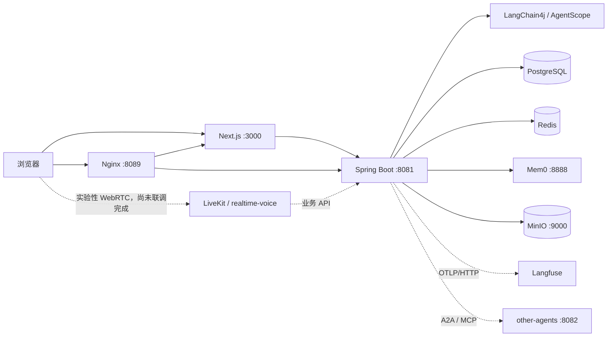

| 模块 | 主要技术 |
| --- | --- |
| 前端 | Next.js 16、React 19、TypeScript、Tailwind CSS |
| 后端 | Java 26、Spring Boot 4、LangChain4j、AgentScope、MyBatis-Plus、Flyway |
| 数据 | PostgreSQL/pgvector、Redis/Redisson、MinIO |
| 记忆 | Redis 对话记忆、Mem0 长期记忆、Harness `MEMORY.md` |
| 可观测 | OpenTelemetry、Langfuse、Micrometer、Prometheus |
| 可选/实验服务 | A2A、MCP；尚未联调完成的 LiveKit、LangGraph、FastAPI 语音模块 |

## 操作演示

以下页面信息已通过本地应用 `http://localhost:3000/` 核对。

### 1. 登录

打开 [http://localhost:3000/](http://localhost:3000/)，使用开发账号：

```text
账号：test@test
密码：12345678
```

> 此账号仅用于本地开发演示，请勿在其他环境复用。

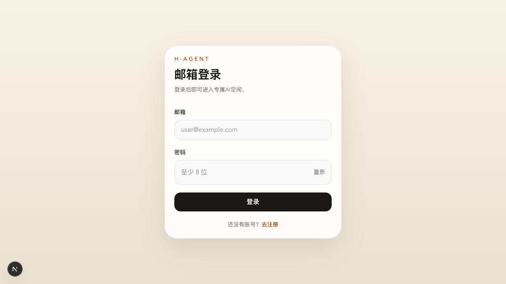

### 2. 发起聊天

打开左侧菜单并点击 **新会话**。每个会话都会绑定创建时选择的 Agent 和运行方式；选择另一个 Agent 会创建独立会话，避免不同 Agent 的历史消息和运行状态相互混淆。

新会话选择器提供三类入口：

| 入口 | 运行类型 | 适用情况 |
| --- | --- | --- |
| **通用助手** | `STANDARD_STREAMING_CHAT` | 需要自由对话，并希望结合指定 SystemPrompt、对应知识库和常用工具。 |
| **领域 Agent** | `AGENTIC_SYNC` | 问题符合一个已经定义好的专家或工作流编排；可以按名称、领域、说明或标签搜索。 |
| **协作 Agent** | `HARNESS_STREAMING` | 目标较复杂，需要动态拆分，并交给多个协作 Agent 分工处理。 |

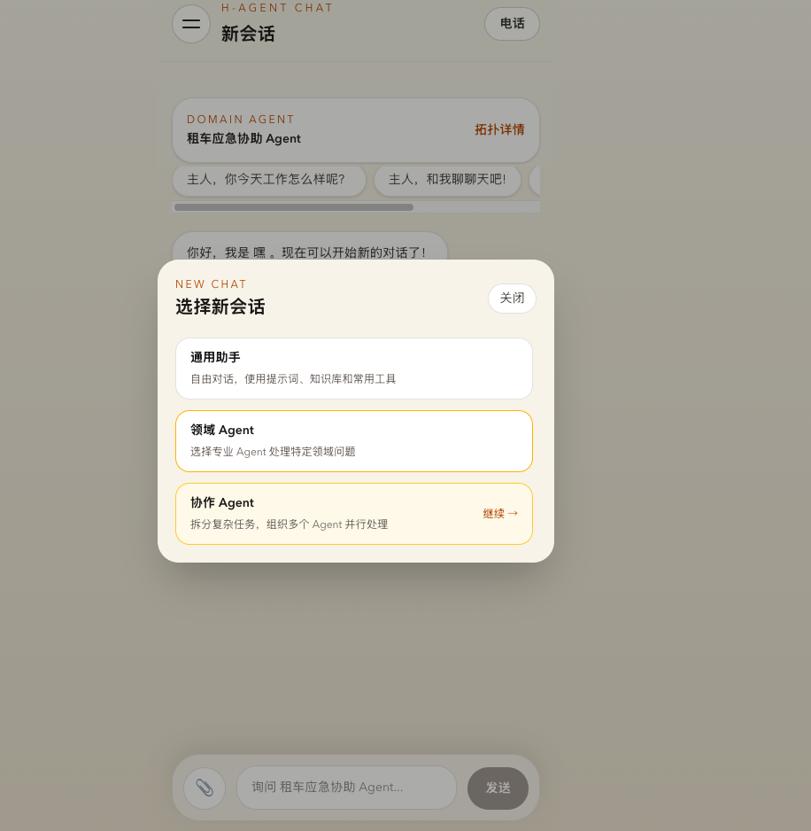

创建会话后：

1. 使用通用助手时，在聊天顶部选择 SystemPrompt；系统会同时使用该提示词绑定的独立知识库。
2. 使用领域 Agent 时，可以点击 **拓扑详情** 查看其 Sequence、Router、Parallel、Loop、Supervisor、AI 或 Human 节点。
3. 使用协作 Agent 时，可以在 **协作进度** 中查看每位协作者的状态；点击头像可查看独立执行记录，协作者停止运行后还可以继续追问。
4. 通过回形针上传支持的资源，在输入框填写任务后点击 **发送**。

> **语音功能状态：** 聊天页顶部目前可以看到电话图标，但浏览器语音识别、后端 TTS 与独立 `realtime-voice` 服务尚未完成稳定的端到端联调，因此语音入口不属于当前可用功能，也不建议纳入操作演示或验收范围。

#### 内置 Agent 详细说明

##### 通用助手 — `standard-chat`

- **适合：** 日常问答、总结、写作、知识库问答，以及需要自定义角色或回复规则的任务。
- **工作方式：** 逐 Token 流式返回回答；组合当前 SystemPrompt、对应私有 RAG 知识库、Redis 对话上下文和已启用的长期记忆。
- **页面特点：** 只有通用助手显示 SystemPrompt 选择器，以及直接进入 **知识库** 和 **管理** 的链接。
- **示例提问：** `根据当前知识库总结退款规则，并列出支持结论的要点。`

##### 协作 Agent — `harness-agent`

- **适合：** 调研并撰写报告、多维度分析、规划、实现任务，或任何可以拆成多个相对独立部分的复杂目标。
- **工作方式：** 作为父 Agent 理解目标、拆分工作、创建协作 Agent、跟踪执行进度，最后汇总多个结果；运行时可以使用工作区文件、Skills、计划、长期 `MEMORY.md` 和人工批准。
- **页面表现：** 每位协作者都会显示运行中、已完成或失败等状态；子 Agent 的详细过程与父 Agent 主回答分开呈现，最终结论回到主会话。
- **示例提问：** `对比三个 Java Agent 框架，把架构、生态和可观测性分别交给不同协作 Agent 调研，最后给出推荐表格。`

创建协作会话时必须选择批准模式。该模式会由整个会话树继承，运行过程中不会改变：

| 批准模式 | 行为 |
| --- | --- |
| **标准审批** | 敏感操作先询问，适合日常任务。 |
| **自动接受编辑** | 文件编辑自动执行，其他风险操作仍然询问。 |
| **只读探索** | 允许读取和分析，阻止修改性操作。 |
| **不弹出审批** | 原本需要询问的操作直接拒绝。 |
| **完全放行** | 在可信开发环境中使用最宽松模式；显式 DENY/ASK 规则和不可绕过的工具安全检查仍可能生效。 |

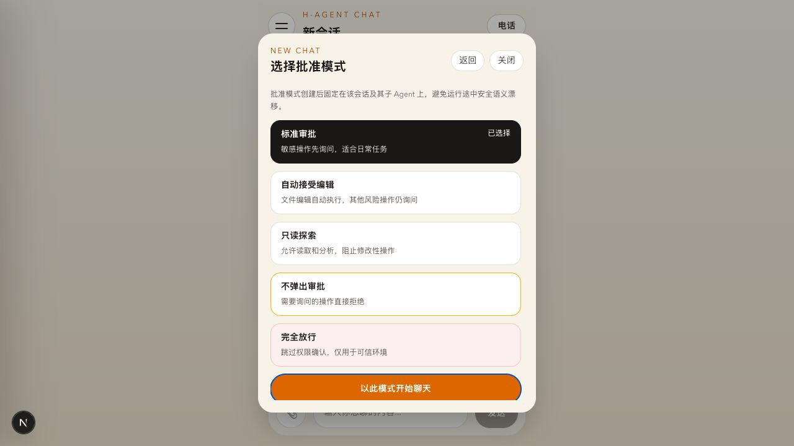

###### 运行中的 HITL 批准流程

创建会话时选择批准模式只是设定权限策略。真正的 Human-in-the-Loop 会在 Harness 权限引擎把某次工具调用判定为 `ASK` 时发生：

1. Agent 提议执行一个或多个工具调用；后端保存经过脱敏的批准请求，并把现有 Agent Run 从 `RUNNING` 改为 `WAITING_APPROVAL`。
2. 当前 SSE 以 `action_required` 事件结束；HTTP 流暂停，但该 Agent Run 不会被标记为完成或失败。
3. 聊天时间线展示 **需要你的批准** 卡片，其中包含工具名称和安全摘要；原始工具参数由服务端隐藏。
4. 用户选择 **允许执行** 或 **拒绝**，该决定对卡片中本次批准事件包含的操作生效。
5. 前端发起新的 SSE 恢复请求，后端从已保存的 Agent 状态继续执行**同一个 Agent Run**。Agent 会收到真实工具结果或拒绝结果，然后继续生成回答。
6. 如果后续操作再次需要批准，同一个 Run 可以再次进入 `WAITING_APPROVAL`。刷新页面或重新登录后仍能恢复待批准请求，不依赖原 HTTP 长连接一直保持。

运行时批准卡片适用于用户直接寻址的 Harness Session，包括顶级协作会话，以及用户打开后直接交互的协作者 Session。父 Agent 同步委派过程中仅转发出来的子 Agent 确认事件目前可以被观测，但不会生成一张可单独操作的批准卡片。

> **截图占位：运行时批准卡片**
> 请在真实出现 `需要你的批准` 卡片时保存为 `docs/images/demo-02-hitl-runtime.png`。生成该界面需要实际发起 Harness 工具任务，因此本次编写文档时没有伪造一次工具执行。

<!--  -->

##### 专家智能体 — `export-assistant`

- **适合：** 明确属于医疗、法律或技术领域的问题。
- **编排流程：** `CategoryRouter` 先判断请求类别，再由条件 Router 精确调用 **医疗专家**、**法律专家** 或 **技术专家** 中的一个。
- **记忆能力：** 各响应型专家叶子在启用长期记忆时可以召回 USER、AGENT 和 RUN 三层 Mem0 记忆。
- **示例提问：** `诊断 Java SSE 连接为什么总是在 60 秒后断开。` 或 `解释这段合同条款可能存在的一般法律风险。`
- **使用边界：** 医疗和法律回答只用于信息辅助，不能替代持证专业人员或紧急服务。不属于三个已注册类别的请求可能无法获得专家回答。

##### 租车应急协助 Agent — `car-rental-assistant`

- **适合：** 租赁车辆故障、拖车、交通事故、车辆火情、人员急症或治安/警务事件。
- **编排流程：** 提取客户与车辆信息 → 信息不足时通过 Human-in-the-Loop 暂停并追问 → 判断拖车需求 → 提取紧急事件类型 → 按需调用消防、医疗和/或警务专家 → 汇总为一份面向客户的完整回复。
- **必要信息：** 客户姓名、预订参考号或客户编号、车辆品牌、车辆型号、当前位置。缺少任意一项时，Agent 会先要求补充。
- **示例提问：** `我是李明，预订号 B-1024，驾驶丰田凯美瑞，目前在北京南站附近。车辆碰撞后发动机冒烟，乘客受伤，我该怎么办？`
- **使用边界：** 该流程提供协助建议和模拟调度；真实紧急情况应优先联系当地紧急服务。

##### 故事创作代理 — `story-chat-agent`

- **适合：** 按指定主题、文风和目标受众创作短故事。
- **编排流程：** 提取主题/风格/受众 → 追问缺失字段 → 生成初稿 → 针对受众调整 → 循环执行风格编辑与评分；评分达到 `0.8` 或最多完成五轮审核后结束。
- **记忆能力：** 创意写作者叶子可以召回已启用的 Mem0 上下文。
- **示例提问：** `为 8～10 岁儿童写一个三句话的赛博朋克故事，主题是迷路的送货机器人，风格温暖幽默。`

##### 银行代理 — `banker-agent`

- **适合：** 演示 Supervisor 路由，以及美元存款、取款场景中的工具调用。
- **编排流程：** 银行 Supervisor 理解请求并委派给存款或取款柜员，由进程内账户工具执行，再汇总更新后的余额。
- **示例提问：** `为 Alice 创建一个初始余额 100 美元的演示账户，然后取出 25 美元并显示余额。`
- **使用边界：** 这是内存中的工作流演示，不是真实银行系统；没有持久化账本、真实鉴权和金融风控，进程重启可能清空演示账户状态。

##### 晚间规划代理 — `evening-planner-agent`

- **适合：** 根据当前情绪快速组合晚餐和电影建议。
- **编排流程：** 并行运行 **晚餐规划师** 和 **晚间活动规划师**，分别生成三份餐食和三部影片，再配对为最终晚间方案。
- **示例提问：** `今天很累，想安静放松一下，请推荐今晚的三组晚餐和电影组合。`

##### 可选 A2A 故事协作 Agent — `a2a-story-assistant`

- **可用条件：** 只有启用 `other-agents` A2A 集成且远端服务可访问时才会出现在 Agent 目录中。
- **与本地故事 Agent 的区别：** 后端保留故事信息完整性判断和风格评分，创意写作、受众编辑、风格编辑由 A2A 远端 Agent 执行；W3C Trace Context 会把跨服务执行保持在同一条 Langfuse Trace 中。
- **示例提问：** 使用与本地故事创作代理相同的主题/风格/受众提示词，然后比较两个版本的编排拓扑与跨服务 Trace。

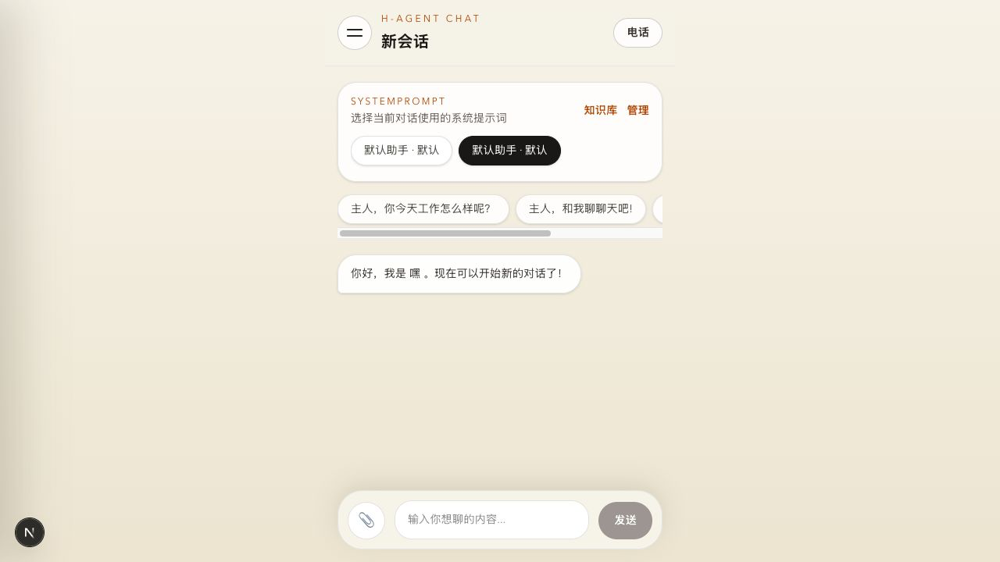

### 3. 管理 SystemPrompt 和知识库

进入 **我的 → SystemPrompt 管理**，可以新建或编辑私有系统提示词，并设置默认助手。进入 **我的 → 知识库管理**，可以上传 `md`、`txt`、`doc`、`docx`、`xls`、`xlsx` 文件或手动录入文本。每个 SystemPrompt 拥有独立知识库。

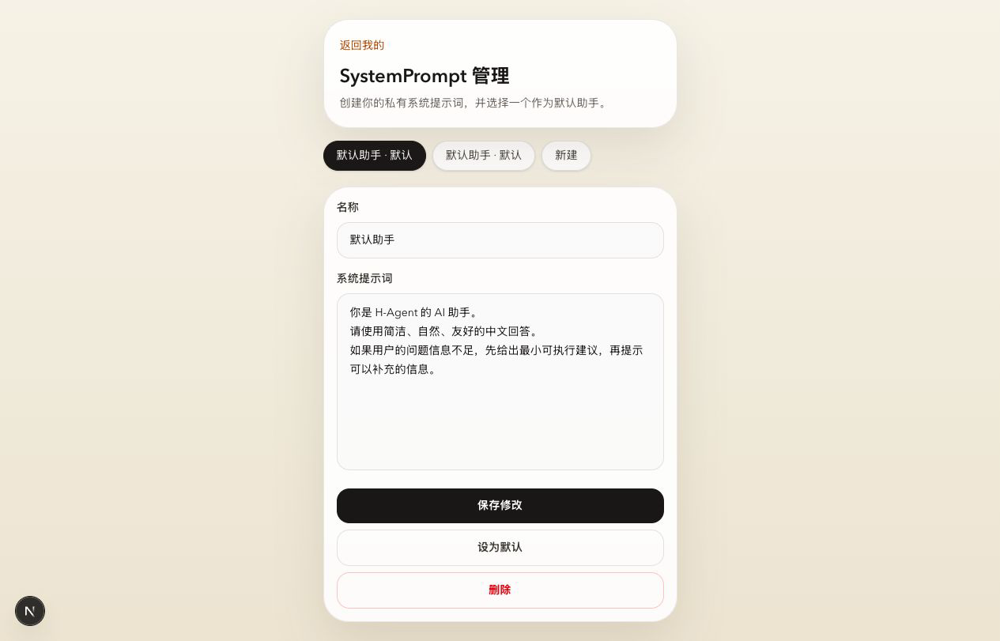

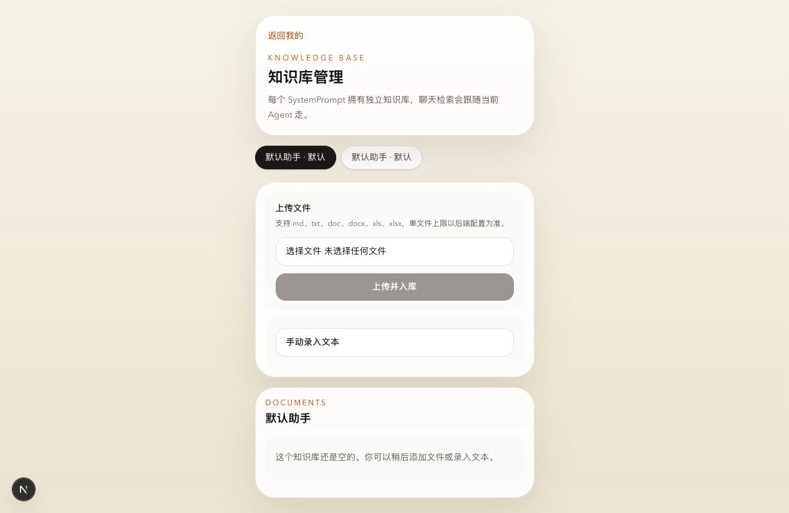

### 4. 使用领域 Agent 与协作 Agent

进入 **我的 → 领域 Agent 管理**，可以查看已注册 Agent、运行类型和编排拓扑。本地页面包括普通聊天、Harness 协作 Agent、专家 Agent 以及多个工作流示例。可以从 Agent 卡片进入 **查看编排** 或 **开始问答**。

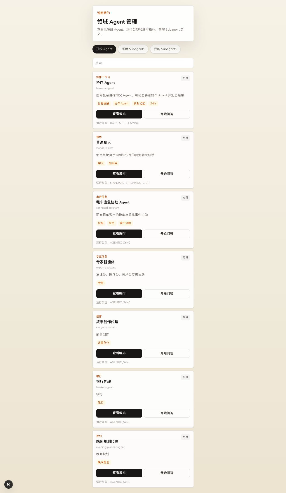

下面的租车编排图还展示了另一类工作流级 Human-in-the-Loop：当必要客户信息不完整时，流程会先进入橙色的 `Human / askUser` 节点向用户追问，然后才能继续处理。

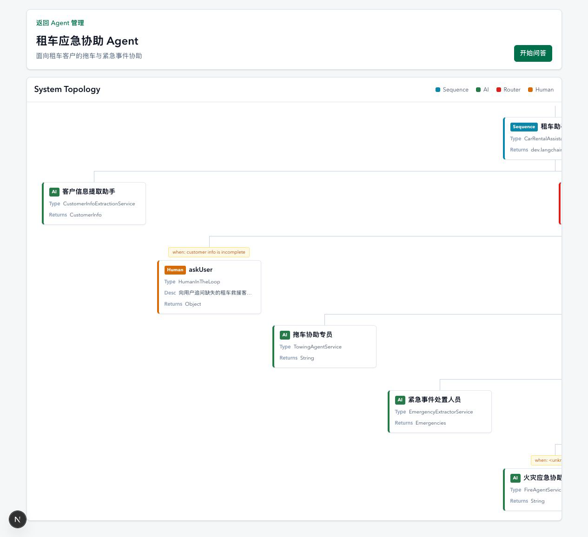
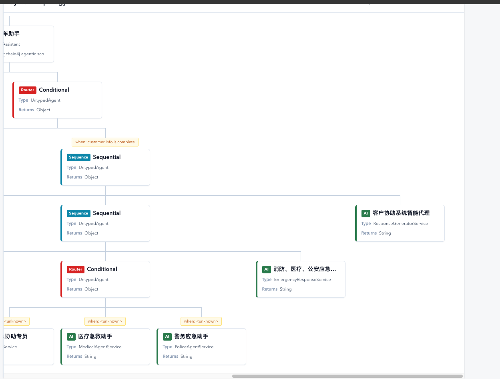

### 5. 管理 Skill

进入 **我的 → 我的 Skill**。Skill 修改会先进入 Proposal 草稿，校验通过后发布为不可变版本，再由用户明确激活。发布后的版本制品保存在配置的 MinIO Skill Bucket 中。

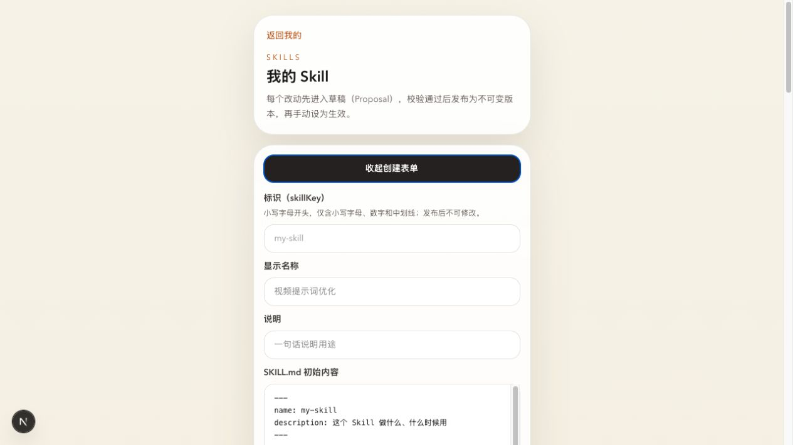

完整截图建议和文件名见[截图清单](docs/images/README.md)。

## 环境要求

- Java 26，并确认 `mvn -version` 显示的运行时同样是 Java 26。
- Maven 3.9+。
- Node.js 22.15+ 和 npm。
- 支持 `vector` 扩展的 PostgreSQL。
- Redis。
- MinIO，并提前创建私有资源 Bucket 和 Skill Bucket。
- 启用长期记忆时，需要兼容当前契约的自托管 Mem0 服务。
- 启用 Trace 导出时，需要 Langfuse 项目。
- 仅开发 `realtime-voice` 时需要 Python 3.11–3.14 和 `uv`。

仓库目前没有提供覆盖 PostgreSQL、Redis、MinIO、Mem0、Langfuse 的根目录 Docker Compose。请单独启动这些依赖，并在 `.env` 中填写实际地址。

## 快速开始

### 1. 配置环境变量

```bash
cp .env.example .env
```

至少需要填写模型、数据库、Redis、JWT 和 MinIO 配置。当前后端配置还启用了 Mem0 长期记忆，因此需要填写全部四个 Mem0 字段；如果本次开发不使用 Mem0，可设置 `MEMORY_LONG_TERM_ENABLED=false`。

```dotenv
API_KEY=<模型 API Key>
MODEL_NAME=<模型名称>
ANTHROPIC_BASE_URL=https://api.minimaxi.com/anthropic

DB_URL=jdbc:postgresql://127.0.0.1:5432/h_agent_db?currentSchema=skill_platform,public
DB_USERNAME=h_agent
DB_PASSWORD=<数据库密码>

REDIS_HOST=127.0.0.1
REDIS_PORT=6379
REDIS_PASSWORD=<Redis 密码>
JWT_SECRET=<足够长的随机密钥>

MINIO_ENDPOINT=http://127.0.0.1:9000
MINIO_ACCESS_KEY=<应用 Access Key>
MINIO_SECRET_KEY=<应用 Secret Key>
MINIO_RESOURCES_BUCKET=h-agent-resources
MINIO_SYSTEM_SKILLS_BUCKET=h-agent-skills
MINIO_USER_SKILLS_BUCKET=h-agent-skills
```

不要提交 `.env` 或任何真实凭据。

### 2. 构建并启动后端

在仓库根目录执行：

```bash
mvn -pl backend -am package -DskipTests
java -jar backend/target/backend-0.0.1-SNAPSHOT.jar
```

启动时 Flyway 会自动执行数据库迁移。API 地址为 [http://localhost:8081](http://localhost:8081)，健康检查地址为 [http://localhost:8081/actuator/health](http://localhost:8081/actuator/health)。

### 3. 启动前端

另开一个终端：

```bash
cd frontend
npm install
npm run dev
```

打开 [http://localhost:3000/](http://localhost:3000/)。Next.js 默认将 `/api/*` 转发到 `http://localhost:8081`，如后端地址不同可设置 `BACKEND_API_BASE_URL`。

### 4. 可选 Nginx 开发网关

开发网关配置位于 [`deploy/nginx/h-agent-dev.conf`](deploy/nginx/h-agent-dev.conf)。它在 `http://localhost:8089` 提供统一入口，将 `/api/*` 直接转发到 Spring Boot，其余请求转发到 Next.js。

```bash
nginx -t
nginx -s reload
```

## Mem0 使用说明

Mem0 是已启用 LangChain4j Agent 的长期记忆 Adapter。它与以下两类记忆相互独立：

- Redis 中的短期对话窗口；
- 当前 `/me/memory` 页面管理的 Harness `MEMORY.md`。

### 配置 Mem0

```dotenv
MEM0_BASE_URL=http://127.0.0.1:8888
MEM0_API_KEY=<Mem0 API Key>
MEM0_CONTRACT_VERSION=<固定的部署版本>
MEM0_OPENAPI_SHA256=<固定 OpenAPI 契约的 SHA-256>
```

当 `memory.long-term.enabled=true` 时，四个字段全部必填，缺失会导致后端启动失败。版本号和摘要必须来自实际部署的 Mem0 契约，不要使用浮动版本或随意填写的值。

### 运行机制

- `standard-chat` 会召回 USER、AGENT、RUN 三层记忆，并把成功对话自动整理到 USER 层。
- 参与长期记忆的领域 Agent 会按已注册策略召回三层记忆，并把成功对话整理到 RUN 层。
- 自动写入先与消息一起进入 PostgreSQL outbox，再由 Worker 异步提交到 Mem0，并按策略重试。
- 召回采用 fail-open：Mem0 故障不应阻止 Agent 返回回答。
- 用户身份和各层 scope ID 均由服务端生成，客户端不会直接提交 Mem0 owner ID。

| Scope | 含义 | API 必填字段 |
| --- | --- | --- |
| `USER` | 当前用户跨 Agent、跨会话共享 | `text`、`scope` |
| `AGENT` | 当前用户与一个稳定逻辑 Agent 共享 | 再提供 `agentId` |
| `RUN` | 限定在某 Agent 的一个逻辑任务内 | 再提供 `agentId`、`runId` |

### 通过 H Agent API 管理 Mem0 记忆

先登录并把本地 Cookie 保存到临时文件：

```bash
curl -sS -c /tmp/h-agent-cookies.txt \
  -H 'Content-Type: application/json' \
  -d '{"email":"test@test","password":"12345678"}' \
  http://localhost:3000/api/auth/login
```

新增并查询 USER 层记忆：

```bash
curl -sS -b /tmp/h-agent-cookies.txt \
  -H 'Content-Type: application/json' \
  -d '{"text":"偏好简洁的中文回答。","scope":"USER"}' \
  http://localhost:3000/api/memories

curl -sS -b /tmp/h-agent-cookies.txt \
  'http://localhost:3000/api/memories?scope=USER&pageSize=20'
```

其他管理接口：

```text
GET    /api/memories/search?q=<关键词>&limit=10
GET    /api/memories/{localId}
PUT    /api/memories/{localId}              # text + expectedVersion
GET    /api/memories/{localId}/history
DELETE /api/memories/{localId}?expectedVersion=<version>
```

更新和删除使用 `expectedVersion` 做乐观并发控制，版本冲突时返回 HTTP 409。

## MinIO 使用说明

MinIO 是当前后端唯一的生产资源存储 Adapter，没有本地文件回退。聊天上传、生成媒体和 Skill 版本制品的二进制内容保存在 MinIO，PostgreSQL 保存资源身份、所有者和元数据。

```dotenv
# 这里必须是 S3 API 地址，而不是 :9001 Console 地址
MINIO_ENDPOINT=http://127.0.0.1:9000
MINIO_ACCESS_KEY=<应用 Access Key>
MINIO_SECRET_KEY=<应用 Secret Key>
MINIO_RESOURCES_BUCKET=h-agent-resources
MINIO_RESOURCES_PREFIX=h-agent/

# 可选：为 Skill 制品使用独立账号/Bucket
MINIO_SKILLS_ACCESS_KEY=<Skill Access Key>
MINIO_SKILLS_SECRET_KEY=<Skill Secret Key>
MINIO_SYSTEM_SKILLS_BUCKET=h-agent-skills
MINIO_USER_SKILLS_BUCKET=h-agent-skills
```

首次操作前必须先创建 Bucket。建议使用仅能访问目标 Bucket 的应用专用账号，不要长期使用 MinIO root 凭据。后端启动只校验配置格式；Endpoint 连通性、凭据和 Bucket 是否存在会在第一次存储操作时验证。

验证步骤：

1. 登录后，在聊天输入框通过附件按钮上传文件。
2. 发送消息，并确认附件可以预览或下载。
3. 在 MinIO Console（通常为 `9001` 端口）查看私有资源 Bucket 中的新对象。
4. 发布一个 Skill 版本，确认 Skill Bucket 中生成了版本制品。
5. 打开 `/actuator/prometheus`，检查 `h_agent_resource_storage_*` 指标。

> **截图占位：MinIO 资源与 Skill Bucket**
> `docs/images/demo-07-minio.png`

<!--  -->

完整存储语义、IAM 建议、监控指标和恢复流程见 [`docs/runbooks/minio-resource-storage.md`](docs/runbooks/minio-resource-storage.md)。

## Langfuse 使用说明

H Agent 为 Agent Run、模型生成、工具、检索、工作流、A2A/MCP 调用和部分持久化操作建立 OpenTelemetry Trace，并直接发送到：

```text
${LANGFUSE_BASE_URL}/api/public/otel/v1/traces
```

在 Langfuse 中创建项目并配置项目凭据：

```dotenv
LANGFUSE_BASE_URL=http://127.0.0.1:<Langfuse 端口>
LANGFUSE_PUBLIC_KEY=<项目 Public Key>
LANGFUSE_SECRET_KEY=<项目 Secret Key>
LANGFUSE_ENVIRONMENT=local
LANGFUSE_SAMPLE_RATE=1.0
LANGFUSE_CONTENT_MODE=structured
```

`LANGFUSE_BASE_URL` 必须指向 Langfuse 服务，而不是 H Agent 前端。如果 Langfuse 也占用 `3000` 端口，请调整其中一个服务的宿主机端口。URL 和两个 Key 全部留空时会关闭导出；配置不完整或 URL 非法时会降级为 no-op 观测，不阻断业务请求。

验证步骤：

1. 启动后端，确认启动日志出现 `Agent observability ACTIVE`。
2. 发送一条聊天消息，或执行一个领域 Agent。
3. 打开 Langfuse 项目，按 `local` 环境、`backend` 服务、session 或 user 筛选。
4. 查看 Trace 树中的 agent、generation、tool、retriever、workflow 等 Observation。
5. 如需跨服务 Trace，为 `other-agents` 配置同一组 Langfuse 变量，再开启 A2A/MCP 集成。

业务 Artifact 的二进制内容仍只保存在 MinIO，Langfuse 接收有界的语义引用，不复制文件内容。资源健康指标由 Prometheus 负责，也不会从采样 Trace 中推算。

> **截图占位：Langfuse Trace 树**
> `docs/images/demo-06-langfuse.png`

<!--  -->

## 可选服务

### Other Agents（A2A 与 MCP）

```bash
mvn -pl other-agents -am package -DskipTests
java -jar other-agents/target/other-agents-0.0.1-SNAPSHOT.jar
```

服务默认监听 `8082`。仅在需要时启用后端的 `agents.a2a.other-agents` 或 `agents.mcp.other-agents` 配置。

### 实时语音（实验性，尚未跑通）

`realtime-voice` 是独立的 LiveKit + LangGraph 实验模块，并非当前主聊天流程中的可用能力。聊天页虽然保留电话图标，但浏览器语音识别、后端 HTTP TTS、LiveKit 房间和该 Python 服务之间尚未完成稳定的端到端联调。当前请以文字聊天为准，不要将语音入口用于演示或功能验收。开发所需的 LiveKit 凭据、模型配置和调试命令见 [`realtime-voice/README.md`](realtime-voice/README.md)。

## 项目结构

```text
h-agent/
├── frontend/             Next.js Web 应用
├── backend/              主 Spring Boot API 与 Agent 运行时
├── agent-observability/  OpenTelemetry/Langfuse 共享模块
├── other-agents/         可选 A2A 与 MCP 服务
├── realtime-voice/       尚未端到端跑通的实验性语音服务
├── deploy/               Nginx 与 Prometheus 配置
├── docs/                 设计、ADR、计划、Runbook 和截图
├── teaching/             教学笔记与参考资料
├── .env.example          环境变量模板
└── pom.xml               Maven 聚合工程
```

## 测试与验证

```bash
# Java 模块
mvn -pl backend -am test
mvn -pl other-agents -am test

# 前端
cd frontend
npm test
npm run lint
npm run build

# 实时语音实验模块（仅开发验证，不代表端到端可用）
cd realtime-voice
uv run pytest
uv run ruff check .
uv run ruff format --check .
```

## 常见问题

| 现象 | 检查项 |
| --- | --- |
| 后端未监听端口就退出 | 确认 `mvn -version` 使用 Java 26，并补全必需的 MinIO/Mem0 配置。 |
| 前端出现 API/网络错误 | 确认后端监听 `8081`，并检查 `BACKEND_API_BASE_URL`。 |
| 上传失败 | 确认使用 MinIO API `9000` 端口、Bucket 已创建、应用账号 Policy 正确。 |
| 长期记忆没有召回 | 检查 Mem0 配置、Agent 记忆策略，以及 outbox 是否存在待处理/死信记录。 |
| Langfuse 没有 Trace | 检查三个必需字段、启动状态、采样率，并确认 Base URL 不是 H Agent 页面。 |
| 知识库入库失败 | 检查 PostgreSQL/pgvector，以及文件类型和大小限制。 |

## 相关文档

- [English README](README.md)
- [MinIO 资源存储运行手册](docs/runbooks/minio-resource-storage.md)
- [Mem0 长期记忆设计](docs/superpowers/specs/2026-08-27-langchain4j-mem0-long-term-memory-design.md)
- [统一 Langfuse Trace 设计](docs/superpowers/specs/2026-08-26-unified-agent-langfuse-trace-design.md)
- [实时语音说明](realtime-voice/README.md)
- [项目领域语言](CONTEXT.md)

## 参与贡献

请勿提交密钥；保持现有模块边界；功能变更应补充测试；提交 PR 前运行对应的验证命令。

## 许可证

项目基于 [MIT License](LICENSE) 开源。
