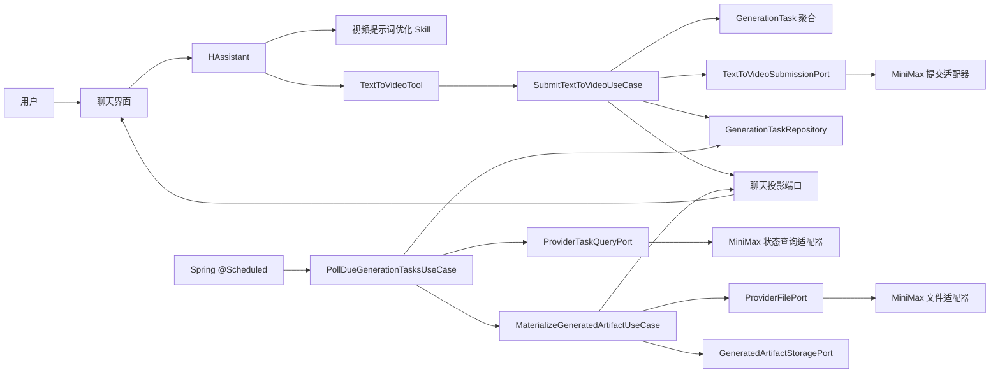
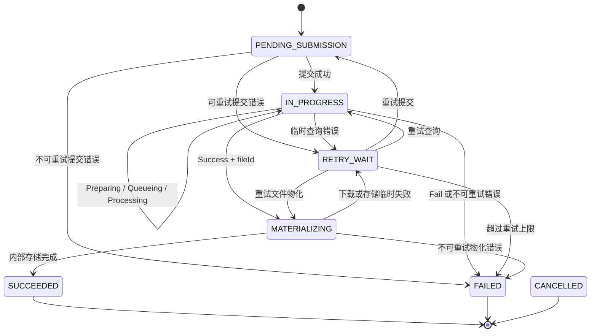
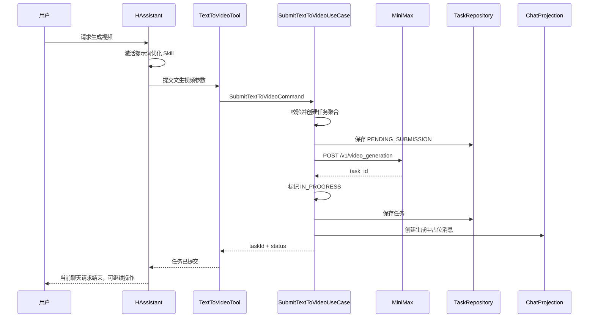

# 异步媒体生成 DDD 架构设计

- 日期：2026-07-14
- 状态：设计确认稿
- 首版范围：HAssistant 调用 MiniMax 文生视频，后台轮询状态，视频下载入库并在聊天中异步展示
- 开发方法：SDD（Specification-Driven Development）+ TDD（Test-Driven Development）
- 部署假设：首版单实例，使用 Spring `@Scheduled` 调度；生产化时由 XXL-JOB 替换调度入口

## 1. 背景

视频生成是耗时较长的异步操作。MiniMax 提交生成任务后只返回 `task_id`，调用方需要继续查询任务状态；任务成功后再通过 `file_id` 获取一个有效期为一小时的下载地址，并及时将视频下载到自己的存储中。

当前环境没有公网入口，因此不使用 MiniMax `callback_url`。系统以数据库中的生成任务为事实来源，由后台调度器定期查询 MiniMax 状态。

首版虽然只实现文生视频，但后续会增加图生视频、首尾帧生视频以及异步音频生成等能力。这些能力应拥有独立的 Tool 和强类型参数，同时复用异步任务生命周期、状态轮询、文件物化、结果通知和聊天展示能力。

## 2. 设计目标

1. 文生视频 Tool 可以被 HAssistant 直接调用。
2. 提交任务后立即结束本次 Tool 调用，不阻塞聊天请求。
3. 在聊天中创建持久化占位消息，展示生成中、准备播放、成功或失败状态。
4. 后台通过 `@Scheduled` 查询所有到期的未完成任务。
5. 生成成功后立即取得临时下载地址，并将视频流式写入系统自己的资源存储。
6. 页面刷新或后端重启后，任务能够从数据库恢复并继续执行。
7. 查询任务、获取文件信息和下载文件形成可复用的提供商基础能力。
8. 文生视频、图生视频和异步音频保持独立用例、独立 Tool 和强类型参数。
9. 采用 DDD 分层，领域模型不依赖 Spring、MyBatis、MiniMax DTO 或聊天 DTO。
10. 先定义可验收规格，再按照 TDD 的 Red-Green-Refactor 循环实现。
11. 文生视频提示词可由 HAssistant Skill 优化，并保留原始提示词与实际提交提示词。

## 3. 非目标

首版不包含以下内容：

1. MiniMax 公网回调接口。
2. 多实例任务抢占、分布式锁、数据库租约和分片调度。
3. XXL-JOB 的接入实现。
4. Kafka、RabbitMQ 等外部消息中间件。
5. 多云厂商自动路由、自动降级或同一任务跨厂商迁移。
6. 通用的万能媒体生成 Tool。
7. 视频编辑、转码、审核、抽帧、封面生成和内容分发。
8. 取消 MiniMax 远端任务；若供应商未来支持取消，再单独补充能力。
9. 实时通话 TTS 等同步或低延迟音频能力的迁移。

## 4. 核心设计决策

### 4.1 建立独立的生成任务限界上下文

新增 `generation` 限界上下文，与 `chat`、`voice` 等业务上下文并列。

异步生成任务具备自己的统一语言和生命周期：

- 生成任务
- 生成方式
- 生成规格
- 提供商任务
- 任务状态
- 下次查询时间
- 失败与重试
- 生成产物
- 产物物化
- 完成事件

聊天只是生成结果的一个投影目标，不是生成任务的所有者。未来独立生成页面、工作流 Agent 或批量任务也可以复用同一应用能力。

### 4.2 Tool 独立，任务框架共享

对 HAssistant 暴露语义清晰的独立 Tool：

```text
text_to_video
image_to_video
first_last_frame_to_video
text_to_audio
```

每个 Tool 对应一个强类型应用命令。禁止使用如下万能入口：

```java
generateMedia(String type, Map<String, Object> options)
```

共享内容限定为：

- 任务聚合与状态机
- 任务仓储
- 到期任务扫描
- 状态查询流程
- 重试策略
- 文件物化流程
- 产物存储端口
- 领域事件与投影
- 用户通知协议

每种生成方式独立拥有：

- Tool
- 应用用例
- 强类型命令
- 强类型生成规格
- 参数校验规则
- 提交端口与提供商适配器

### 4.3 调度器只是驱动适配器

首版使用 Spring `@Scheduled`，但它只负责触发应用用例：

```java
@Scheduled(fixedDelayString = "${generation.polling.fixed-delay:5000}")
public void pollDueTasks() {
    pollDueGenerationTasksUseCase.execute();
}
```

轮询业务逻辑不能写在带 `@Scheduled` 的类中。未来迁移到 XXL-JOB 时，只新增或替换驱动适配器：

```text
SpringScheduledGenerationJob
        ↓ 替换为
XxlJobGenerationHandler
```

两者都调用相同的 `PollDueGenerationTasksUseCase`。领域层、应用层、仓储、MiniMax 客户端和前端协议不需要修改。

首版单实例，不设计：

- `locked_by`
- `locked_until`
- 分布式锁
- `SELECT ... FOR UPDATE SKIP LOCKED`
- 多 worker 抢占
- 调度分片

任务处理仍需保证方法级幂等，防止同一单实例因超时、重启或手动重试产生重复副作用。

### 4.4 数据库状态是唯一事实来源

内存定时器、聊天 SSE 连接和前端页面状态都不能作为任务事实来源。

数据库需要持久化：

- 当前领域状态
- MiniMax `task_id`
- MiniMax `file_id`
- 下次查询时间
- 查询与物化重试次数
- 失败原因
- 生成规格快照
- 聊天投影目标
- 最终资源标识

服务重启后，调度器重新扫描 `next_poll_at <= now` 的未完成任务即可恢复。

### 4.5 聊天消息是生成任务的投影

生成任务不依赖聊天消息类型。应用层通过输出端口将任务状态投影到聊天：

```java
public interface GenerationConversationProjectionPort {
    ProjectionRef createPendingProjection(GenerationTask task);
    void updateProjection(GenerationTask task);
}
```

HAssistant 提交文生视频任务后立即创建占位消息。后续状态变化更新同一条消息，而不是另外追加一条完成消息。

## 5. 总体架构



## 6. DDD 模块与依赖方向

推荐包结构：

```text
com.h.backend.generation
├── domain
│   ├── model
│   │   ├── GenerationTask
│   │   ├── GenerationTaskId
│   │   ├── GenerationType
│   │   ├── OutputMediaType
│   │   ├── GenerationStatus
│   │   ├── GenerationSpec
│   │   ├── TextToVideoSpec
│   │   ├── ProviderTask
│   │   ├── GeneratedArtifact
│   │   ├── RetryState
│   │   └── GenerationFailure
│   ├── event
│   │   ├── GenerationTaskSubmitted
│   │   ├── GenerationTaskProgressed
│   │   ├── GenerationTaskCompleted
│   │   └── GenerationTaskFailed
│   ├── policy
│   │   ├── GenerationPollingPolicy
│   │   └── GenerationRetryPolicy
│   └── repository
│       └── GenerationTaskRepository
│
├── application
│   ├── port
│   │   ├── in
│   │   │   ├── SubmitTextToVideoUseCase
│   │   │   ├── PollDueGenerationTasksUseCase
│   │   │   ├── GetGenerationTaskUseCase
│   │   │   └── RetryGenerationTaskUseCase
│   │   └── out
│   │       ├── TextToVideoSubmissionPort
│   │       ├── ProviderTaskQueryPort
│   │       ├── ProviderFilePort
│   │       ├── GeneratedArtifactStoragePort
│   │       ├── GenerationConversationProjectionPort
│   │       └── GenerationNotificationPort
│   ├── command
│   │   └── SubmitTextToVideoCommand
│   ├── result
│   │   └── SubmitGenerationResult
│   └── service
│       ├── SubmitTextToVideoService
│       ├── PollDueGenerationTasksService
│       └── MaterializeGeneratedArtifactService
│
├── infrastructure
│   ├── provider
│   │   └── minimax
│   │       ├── shared
│   │       │   ├── MiniMaxApiClient
│   │       │   ├── MiniMaxTaskClient
│   │       │   ├── MiniMaxFileClient
│   │       │   └── MiniMaxErrorTranslator
│   │       └── video
│   │           ├── MiniMaxTextToVideoAdapter
│   │           └── MiniMaxVideoProperties
│   ├── persistence
│   │   ├── GenerationTaskEntity
│   │   ├── GenerationTaskMapper
│   │   └── MyBatisGenerationTaskRepository
│   ├── scheduling
│   │   └── SpringScheduledGenerationJob
│   ├── storage
│   │   └── ResourceStorageArtifactAdapter
│   ├── projection
│   │   └── ChatGenerationProjectionAdapter
│   └── notification
│       └── UserGenerationSseAdapter
│
└── interfaces
    ├── tool
    │   └── TextToVideoTool
    ├── web
    │   └── GenerationTaskController
    └── dto
        └── GenerationTaskResponse
```

依赖方向：

```text
interfaces      ─────→ application ─────→ domain
infrastructure ─────→ application ─────→ domain
domain          ─────→ 不依赖外层
```

约束：

1. `domain` 不使用 Spring 注解。
2. `domain` 不引用数据库 Entity、MiniMax DTO 或聊天 DTO。
3. `application` 只通过端口访问外部系统。
4. `interfaces.tool` 只负责 Tool 参数映射、身份上下文提取和结果表达。
5. `infrastructure.provider.minimax` 是防腐层，负责把 MiniMax 协议转换为内部协议。

## 7. 领域模型

### 7.1 生成方式与产物类型

```java
public enum GenerationType {
    TEXT_TO_VIDEO,
    IMAGE_TO_VIDEO,
    FIRST_LAST_FRAME_TO_VIDEO,
    TEXT_TO_AUDIO
}

public enum OutputMediaType {
    VIDEO,
    AUDIO,
    IMAGE
}
```

`GenerationType` 表示生成方式，`OutputMediaType` 表示最终产物。二者不能合并，因为多个生成方式可能产生相同媒体类型。

### 7.2 强类型生成规格

```java
public sealed interface GenerationSpec
        permits TextToVideoSpec, ImageToVideoSpec, TextToAudioSpec {
}
```

首版只实现 `TextToVideoSpec`：

```java
public record TextToVideoSpec(
        String originalPrompt,
        String submittedPrompt,
        PromptOptimizationMode optimizationMode,
        String model,
        int durationSeconds,
        VideoResolution resolution,
        boolean providerPromptOptimizer,
        boolean fastPretreatment,
        boolean aigcWatermark
) implements GenerationSpec {
}
```

后续新增图生视频时增加新的规格，不修改文生视频规格：

```java
public record ImageToVideoSpec(
        String originalPrompt,
        String submittedPrompt,
        ResourceId sourceImageId,
        String model,
        int durationSeconds,
        VideoResolution resolution
) implements GenerationSpec {
}
```

禁止把生成规格设计为不受约束的 `Map<String, Object>`。持久化层可以用 JSON 保存规格快照，但仓储必须根据 `generation_type` 恢复成具体领域类型。

### 7.3 GenerationTask 聚合根

建议包含：

```text
id
userId
generationType
outputMediaType
provider
spec
status
providerTask
artifact
conversationTarget
retryState
nextPollAt
failure
createdAt
updatedAt
completedAt
```

所有状态变化必须通过行为方法完成：

```java
task.markSubmitted(providerTaskId, nextPollAt);
task.recordProviderProgress(providerStatus, nextPollAt);
task.startMaterialization(fileId);
task.complete(artifact);
task.scheduleRetry(nextPollAt, failure);
task.fail(failure);
```

禁止在应用服务中直接 `setStatus(...)`。

聚合需要保证以下不变量：

1. 只有未提交任务可以绑定 `providerTaskId`。
2. 没有 `providerTaskId` 的任务不能查询提供商状态。
3. 只有提供商成功且存在 `fileId` 时才能进入产物物化。
4. 只有产物已经保存到内部存储后才能进入 `SUCCEEDED`。
5. `SUCCEEDED`、`FAILED`、`CANCELLED` 是终态，不能回退。
6. `SUCCEEDED` 必须具有 `GeneratedArtifact`。
7. 同一个任务只能形成一个主产物；以后支持多产物时再扩展产物集合模型。

## 8. 内部状态机

MiniMax 状态属于外部协议，不能直接作为内部领域状态。

内部状态：

```text
PENDING_SUBMISSION
IN_PROGRESS
RETRY_WAIT
MATERIALIZING
SUCCEEDED
FAILED
CANCELLED
```

状态流转：



MiniMax 状态映射：

| MiniMax 状态 | 内部处理 |
|---|---|
| `Preparing` | 保持 `IN_PROGRESS`，安排下次查询 |
| `Queueing` | 保持 `IN_PROGRESS`，安排下次查询 |
| `Processing` | 保持 `IN_PROGRESS`，安排下次查询 |
| `Success` | 校验 `file_id` 后进入 `MATERIALIZING` |
| `Fail` | 进入 `FAILED` |

`MATERIALIZING` 表示提供商已经完成生成，但系统尚未完成视频下载与内部存储。前端应显示“生成完成，正在准备播放”。

## 9. 文生视频提交用例

### 9.1 Tool 参数

首版 Tool 建议暴露：

```java
submitTextToVideo(
    @ToolMemoryId String memoryId,
    String prompt,
    String originalPrompt,
    String model,
    Integer duration,
    String resolution,
    Boolean promptOptimizer,
    Boolean fastPretreatment,
    Boolean aigcWatermark
)
```

其中：

- `prompt`：最终提交给 MiniMax 的提示词。
- `originalPrompt`：用户原始描述；未经过 Skill 优化时与 `prompt` 相同。
- `model`：允许的 MiniMax 视频模型。
- `duration`：视频时长。
- `resolution`：视频分辨率。
- `promptOptimizer`：是否启用 MiniMax 自带提示词优化。
- `fastPretreatment`：是否启用快速预处理。
- `aigcWatermark`：是否添加 AIGC 水印。

以下参数不能暴露给 HAssistant：

- MiniMax API Key
- MiniMax base URL
- 查询周期
- 下载目录
- 重试次数
- HTTP 超时
- `callback_url`

### 9.2 确定性校验

Skill 和语言模型不能替代后端校验。应用层或领域值对象必须校验：

1. 提示词必填且不超过 2000 字符。
2. 模型必须属于允许枚举。
3. 时长必须与模型和分辨率组合兼容。
4. 分辨率必须与模型和时长组合兼容。
5. `fastPretreatment` 只能用于支持该能力的模型。
6. 参数缺失时只能使用规格明确的默认值。
7. 用户、会话和聊天投影目标必须有效。

### 9.3 提交流程



提交方法不查询任务状态，不等待视频完成，也不下载视频。

### 9.4 提交一致性

远端提交和本地数据库事务无法组成原子事务，需要区分失败阶段：

1. 在远端调用前先保存 `PENDING_SUBMISSION` 任务。
2. MiniMax 明确返回业务失败时，将任务标记为 `FAILED` 或 `RETRY_WAIT`。
3. MiniMax 返回 `task_id` 后立即保存 `providerTaskId` 并进入 `IN_PROGRESS`。
4. 若 HTTP 超时导致无法判断 MiniMax 是否已接受任务，首版将任务标记为明确的提交失败原因，不自动创建第二个远端任务。
5. 用户可以从失败卡片重新提交一个新任务；新任务保留来源任务 ID 以便追踪。

首版不尝试解决供应商不支持幂等键情况下的“提交结果未知但远端可能已创建任务”问题，避免自动重试造成重复扣费。

## 10. 后台轮询设计

### 10.1 扫描入口

```java
public interface PollDueGenerationTasksUseCase {
    PollSummary execute();
}
```

`@Scheduled` 适配器每次调用该用例。用例按配置的批量大小查询：

```text
status in (IN_PROGRESS, RETRY_WAIT, MATERIALIZING)
and next_poll_at <= now
order by next_poll_at asc
limit :batchSize
```

首版为单实例，无需领取和锁定任务。为避免一次慢任务阻塞整批，应用服务应对每个任务独立捕获异常，记录失败后继续处理下一任务。

### 10.2 建议轮询间隔

| 场景 | 建议间隔 |
|---|---:|
| 提交成功后的首次查询 | 5 秒 |
| `Preparing` / `Queueing` | 10 秒 |
| `Processing` | 15 秒 |
| 第一次临时查询失败 | 30 秒 |
| 后续临时查询失败 | 60、120 秒，设最大值 |
| 文件物化失败 | 30、60、120 秒，设最大值 |

具体数值通过配置提供，不写死在 Tool、调度器或 HTTP 客户端中。

### 10.3 单次任务处理

```text
读取聚合
  → 判断当前待执行动作
  → 查询 MiniMax 状态或重试物化
  → 将外部结果映射为领域行为
  → 保存聚合
  → 更新聊天投影
  → 通知在线用户
```

幂等要求：

1. 终态任务再次被扫描时直接跳过。
2. 已存在内部 `artifactId` 时不得重复下载。
3. 聊天投影使用任务 ID 或投影 ID 更新同一条消息。
4. 重复的同状态更新不得生成重复聊天消息。
5. 重试次数和 `nextPollAt` 每次都持久化。

## 11. MiniMax 防腐层

### 11.1 应用层端口

```java
public interface TextToVideoSubmissionPort {
    ProviderSubmission submit(TextToVideoSpec spec);
}

public interface ProviderTaskQueryPort {
    ProviderTaskSnapshot query(Provider provider, String providerTaskId);
}

public interface ProviderFilePort {
    ProviderFileDescriptor retrieve(Provider provider, String providerFileId);
    ProviderFileContent download(ProviderFileDescriptor descriptor);
}
```

### 11.2 MiniMax 共享客户端

MiniMax 视频生成方式共享：

- `GET /v1/query/video_generation`
- `GET /v1/files/retrieve`
- 下载临时 URL
- Bearer 鉴权
- HTTP 超时
- 错误码翻译
- 请求与响应日志脱敏

不同生成方式只新增提交适配器：

```text
MiniMaxTextToVideoAdapter
MiniMaxImageToVideoAdapter
MiniMaxFirstLastFrameToVideoAdapter
```

MiniMax DTO 只能存在于基础设施层。应用层只接收内部的 `ProviderSubmission`、`ProviderTaskSnapshot` 和 `ProviderFileDescriptor`。

### 11.3 错误分类

错误至少分为：

```text
VALIDATION_ERROR       参数错误，不重试
AUTHENTICATION_ERROR   鉴权错误，不自动重试
INSUFFICIENT_BALANCE   余额不足，不自动重试
CONTENT_REJECTED       输入或输出内容违规，不重试
RATE_LIMITED           限流，可重试
PROVIDER_UNAVAILABLE   服务端错误，可重试
NETWORK_ERROR          网络错误，可重试
INVALID_RESPONSE       响应不符合契约，有限次重试
DOWNLOAD_EXPIRED       下载地址过期，重新 retrieve 后重试
STORAGE_ERROR          内部存储失败，可重试
```

提供商原始状态码与脱敏后的消息可以保留在任务失败信息中，但不能直接决定领域行为；领域行为由错误分类决定。

## 12. 文件物化与存储

MiniMax 返回的 `download_url` 只有一小时有效，不能将它保存为最终播放地址。

正确流程：

```text
Success + fileId
  → retrieve(fileId)
  → 获得临时 download_url
  → 流式下载到临时文件
  → 校验响应、类型和大小
  → 原子移动到正式位置
  → 创建 GeneratedArtifact
  → 绑定聊天资源
  → 任务进入 SUCCEEDED
```

视频不能整体读取为 `byte[]`。存储端口应支持流式输入：

```java
public interface GeneratedArtifactStoragePort {
    GeneratedArtifact store(
            ArtifactStoreCommand command,
            InputStream content
    );
}
```

物化要求：

1. 设置连接超时和读取超时。
2. 限制最大文件大小。
3. 使用临时文件，成功后原子移动。
4. 下载失败时删除临时文件。
5. 校验实际响应是允许的视频 MIME 类型。
6. 保留供应商文件名，但生成内部安全文件名。
7. 播放和下载只使用系统自己的资源 URL。
8. 下载地址过期时重新调用文件信息接口获取新地址。

## 13. 持久化模型

建议新增 `generation_tasks`：

| 字段 | 类型示意 | 说明 |
|---|---|---|
| `id` | `VARCHAR(64)` | 内部任务 ID |
| `user_id` | `BIGINT` | 所属用户 |
| `generation_type` | `VARCHAR(32)` | 生成方式 |
| `output_media_type` | `VARCHAR(16)` | 产物类型 |
| `provider` | `VARCHAR(32)` | 提供商 |
| `status` | `VARCHAR(32)` | 内部状态 |
| `spec_json` | `TEXT` | 强类型规格快照的持久化形式 |
| `provider_task_id` | `VARCHAR(128)` | MiniMax `task_id` |
| `provider_status` | `VARCHAR(64)` | 最近一次外部状态 |
| `provider_file_id` | `VARCHAR(128)` | MiniMax `file_id` |
| `artifact_id` | `VARCHAR(64)` | 内部产物资源 ID |
| `projection_type` | `VARCHAR(32)` | 首版为 `CHAT_MESSAGE` |
| `projection_id` | `VARCHAR(64)` | 聊天消息或投影标识 |
| `source_task_id` | `VARCHAR(64)` | 重试或派生任务的来源 |
| `poll_attempts` | `INTEGER` | 查询失败次数 |
| `materialize_attempts` | `INTEGER` | 物化失败次数 |
| `next_poll_at` | `TIMESTAMP` | 下次执行时间 |
| `failure_type` | `VARCHAR(64)` | 归一化失败分类 |
| `failure_code` | `VARCHAR(64)` | 提供商或系统错误码 |
| `failure_message` | `TEXT` | 可诊断的脱敏错误信息 |
| `created_at` | `TIMESTAMP` | 创建时间 |
| `updated_at` | `TIMESTAMP` | 更新时间 |
| `completed_at` | `TIMESTAMP` | 完成时间 |

首版建议索引：

```sql
CREATE INDEX idx_generation_tasks_due
    ON generation_tasks(status, next_poll_at);

CREATE INDEX idx_generation_tasks_user_created
    ON generation_tasks(user_id, created_at DESC);

CREATE UNIQUE INDEX uk_generation_tasks_provider_task
    ON generation_tasks(provider, provider_task_id)
    WHERE provider_task_id IS NOT NULL;
```

不加入任何多实例租约字段。

## 14. 聊天投影与前端展示

### 14.1 占位消息

提交成功后创建一条可持久化消息，至少包含：

```json
{
  "messageType": "MEDIA_GENERATION",
  "content": "正在生成视频",
  "payload": {
    "generationTaskId": "task-uuid",
    "generationType": "TEXT_TO_VIDEO",
    "outputMediaType": "VIDEO",
    "status": "IN_PROGRESS",
    "originalPrompt": "用户原始描述",
    "submittedPrompt": "实际提交提示词",
    "model": "MiniMax-Hailuo-2.3",
    "duration": 6,
    "resolution": "1080P",
    "failureMessage": null
  },
  "resources": []
}
```

状态变化时更新同一个 `generationTaskId` 对应的消息。

### 14.2 展示状态

| 内部状态 | 前端文案 | 主要交互 |
|---|---|---|
| `PENDING_SUBMISSION` | 正在提交视频任务 | 无 |
| `IN_PROGRESS` | 视频生成中 | 可继续聊天 |
| `RETRY_WAIT` | 暂时无法查询，系统将自动重试 | 可继续聊天 |
| `MATERIALIZING` | 视频已生成，正在准备播放 | 可继续聊天 |
| `SUCCEEDED` | 视频已生成 | 播放、下载 |
| `FAILED` | 视频生成失败 | 查看原因、重新生成 |
| `CANCELLED` | 任务已取消 | 无 |

### 14.3 浏览器通知

MiniMax 无法回调后端，与浏览器接收后端通知是两个独立方向。浏览器可以连接本机或内网后端，不需要公网。

推荐提供用户级 SSE：

```text
GET /api/generation/events
```

事件：

```text
generation.task.updated
generation.task.completed
generation.task.failed
```

事件载荷返回完整的最新投影，前端按 `generationTaskId` 或消息 ID 原地替换。

SSE 只负责提升实时体验，不能承担可靠状态保存。页面初始化、刷新或 SSE 重连后，应通过查询接口恢复：

```text
GET /api/generation/tasks/{taskId}
GET /api/generation/tasks?sessionId={sessionId}&unfinished=true
```

若首版前端暂不实现用户级 SSE，可以每 10 至 15 秒批量查询当前会话中的未完成任务。后端领域与应用设计不受影响。

## 15. 视频提示词优化 Skill

Skill 名称：

```text
optimize-video-prompt
```

Skill 只负责把用户自然语言整理成适合视频生成的提示词，不负责调用 MiniMax、查询任务、下载文件或改变任务状态。

### 15.1 优化模式

```text
SKILL     使用 Skill 优化，默认关闭 MiniMax prompt_optimizer
PROVIDER  轻量整理后交给 MiniMax 优化
NONE      原样提交并关闭 MiniMax 优化
```

规则：

1. 用户明确要求原样生成时使用 `NONE`。
2. 用户明确要求使用 MiniMax 自动优化时使用 `PROVIDER`。
3. 其他情况默认使用 `SKILL`。
4. 使用 `SKILL` 时默认 `promptOptimizer=false`，避免二次优化破坏镜头指令。
5. 始终保存 `originalPrompt` 和 `submittedPrompt`。

### 15.2 Skill 核心工作流

```markdown
---
name: optimize-video-prompt
description: 将用户的视频创意整理为适合 MiniMax 文生视频的提示词；在用户要求生成视频或优化视频描述时使用。
---

# 视频提示词优化

1. 提取主体、动作、环境、时间、光线、风格、构图和镜头运动。
2. 保留用户明确给出的主体、动作和约束，不擅自改变核心意图。
3. 根据视频时长控制场景数量，避免短视频承载过多剧情。
4. 需要精确运镜时使用 MiniMax 支持的标准运镜指令。
5. 同组组合运镜不超过三个，顺序运镜按发生顺序书写。
6. 不主动添加字幕、Logo、水印、品牌或用户未要求的人物身份。
7. 最终提示词不得超过 2000 字符。
8. 输出原始提示词、最终提示词和优化模式，供 Tool 调用。
```

模型、时长、分辨率组合及完整运镜指令放入独立 reference，Skill 主文件保持精简。首版不包含可执行脚本。

## 16. 扩展新生成方式

### 16.1 新增图生视频

新增：

```text
ImageToVideoTool
SubmitImageToVideoUseCase
SubmitImageToVideoCommand
ImageToVideoSpec
MiniMaxImageToVideoAdapter
```

复用：

```text
GenerationTask
GenerationTaskRepository
PollDueGenerationTasksUseCase
ProviderTaskQueryPort
ProviderFilePort
GeneratedArtifactStoragePort
聊天投影
前端视频卡片
用户通知
```

图生视频用例额外负责校验参考图片存在、属于当前用户、类型为图片，并将内部资源转换为 MiniMax 所需输入。

### 16.2 新增异步音频生成

新增：

```text
TextToAudioTool
SubmitTextToAudioUseCase
TextToAudioSpec
对应供应商提交适配器
音频参数校验
```

复用任务调度、重试、文件物化和通知框架。最终 `OutputMediaType=AUDIO`，聊天投影渲染音频播放器。

同步 TTS 或实时通话音频不进入该框架，因为其延迟目标和生命周期不同。

### 16.3 新增其他提供商

新增提供商适配器并实现相同端口：

```text
OtherProviderTextToVideoAdapter
OtherProviderTaskQueryAdapter
OtherProviderFileAdapter
```

外部状态和错误码在防腐层中转换为内部 `ProviderTaskSnapshot` 与 `GenerationFailureType`，领域状态机无需感知具体厂商。

## 17. SDD 开发流程

实现前，以本文档作为首版规格基线。每一开发切片必须先补充可验收场景，再从场景推导测试。

### 17.1 规格层级

1. 业务规格：用户能否提交、继续聊天、看到状态并播放结果。
2. 领域规格：状态机、不变量、失败与重试规则。
3. 应用规格：用例输入、输出、端口调用和事务边界。
4. 协议规格：MiniMax HTTP 请求、响应和错误映射。
5. 展示规格：聊天消息与 SSE/查询接口契约。

### 17.2 核心验收场景

#### 场景 A：提交后不阻塞聊天

```gherkin
Given 用户在 HAssistant 中请求生成视频
When MiniMax 接受任务并返回 task_id
Then 系统持久化 IN_PROGRESS 生成任务
And 聊天中出现生成中占位消息
And Tool 立即返回任务已提交
And 用户可以继续发送聊天消息
```

#### 场景 B：轮询到生成成功

```gherkin
Given 任务处于 IN_PROGRESS
And 已到 next_poll_at
When 后台查询得到 Success 和 file_id
Then 任务进入 MATERIALIZING
And 系统开始获取并保存视频文件
```

#### 场景 C：文件物化成功

```gherkin
Given 任务处于 MATERIALIZING
When 视频被完整保存到内部资源存储
Then 任务进入 SUCCEEDED
And 原聊天消息绑定 VIDEO 资源
And 前端可以播放和下载视频
```

#### 场景 D：服务重启后恢复

```gherkin
Given 数据库中存在已到查询时间的未完成任务
When 后端服务重启并再次执行调度
Then 系统继续查询该任务
And 用户不需要重新提交
```

#### 场景 E：查询临时失败

```gherkin
Given 任务处于 IN_PROGRESS
When MiniMax 查询发生可重试网络错误
Then 任务进入 RETRY_WAIT
And 系统记录错误和下次执行时间
And 聊天中不追加重复消息
```

#### 场景 F：临时下载地址过期

```gherkin
Given MiniMax 已生成成功
And 当前 download_url 已过期
When 系统物化视频
Then 系统根据 file_id 重新获取下载地址
And 在重试上限内继续下载
```

#### 场景 G：提示词优化

```gherkin
Given 用户没有要求原样提交或使用供应商优化
When HAssistant 创建文生视频请求
Then HAssistant 使用视频提示词优化 Skill
And 保存原始提示词与最终提示词
And 默认关闭 MiniMax prompt_optimizer
```

## 18. TDD 实施顺序

每个步骤严格执行：

```text
Red：先写一个因缺少行为而失败的测试
Green：实现通过该测试的最小代码
Refactor：在测试保护下整理设计
```

禁止先批量创建所有生产类，再集中补测试。

### 18.1 切片一：纯领域状态机

测试：`GenerationTaskTest`

覆盖：

- 初始状态和默认值
- 提交成功
- 生成中状态推进
- 进入物化
- 物化完成
- 终态不可回退
- 可重试失败
- 超过重试上限
- 不合法状态流转

不启动 Spring，不访问数据库和网络。

### 18.2 切片二：文生视频提交用例

测试：`SubmitTextToVideoServiceTest`

使用 Fake Repository、Fake Submission Port 和 Fake Projection Port，覆盖：

- 参数映射和联合校验
- 创建 `PENDING_SUBMISSION` 任务
- 保存 MiniMax `task_id`
- 创建一次占位消息
- Tool 不执行状态查询
- 明确业务失败
- 提交结果未知时不自动重复提交

### 18.3 切片三：MiniMax HTTP 契约

测试：

```text
MiniMaxTextToVideoAdapterTest
MiniMaxTaskClientTest
MiniMaxFileClientTest
```

通过本地 HTTP 测试服务器覆盖：

- URL、HTTP 方法和 Bearer Header
- 请求 JSON 中所有参数
- 任务状态映射
- `file_id` 和下载地址解析
- MiniMax 业务错误码
- 限流、鉴权、余额和内容违规
- 超时、非 JSON 和字段缺失
- 日志不泄漏 API Key

### 18.4 切片四：任务仓储与调度

测试：

```text
MyBatisGenerationTaskRepositoryTest
PollDueGenerationTasksServiceTest
SpringScheduledGenerationJobTest
```

覆盖：

- 聚合保存与恢复
- 不同 `GenerationSpec` 的序列化恢复
- 到期任务查询顺序和批量上限
- 单个任务失败不影响批次后续任务
- 任务完成后不再被扫描
- `@Scheduled` 类只调用应用用例

不测试多实例竞争。

### 18.5 切片五：流式下载与物化

测试：

```text
MaterializeGeneratedArtifactServiceTest
ResourceStorageArtifactAdapterTest
```

覆盖：

- 不将视频整体加载进内存
- 临时文件与原子移动
- 下载中断后的临时文件清理
- 文件大小上限
- MIME 类型校验
- 下载地址过期后重新 retrieve
- 已有 `artifactId` 时不重复物化

### 18.6 切片六：聊天投影与通知

测试：

```text
ChatGenerationProjectionAdapterTest
GenerationTaskControllerTest
UserGenerationSseAdapterTest
```

覆盖：

- 创建占位消息
- 按任务 ID 更新同一条消息
- 成功后绑定 VIDEO 资源
- 失败状态展示
- 重复状态通知幂等
- 查询接口权限隔离
- SSE 只推送给任务所属用户

### 18.7 切片七：HAssistant Tool 与 Skill

测试：

```text
TextToVideoToolTest
ChatModelConfigTest
```

覆盖：

- Tool 正确解析聊天上下文
- 所有必要参数暴露
- 基础设施参数不暴露
- Tool 调用提交用例并快速返回
- HAssistant 注册 Tool
- Skill 可被发现和激活
- Skill 不包含脚本执行依赖

### 18.8 切片八：前端交互

覆盖：

- 生成中卡片
- 等待重试卡片
- 准备播放卡片
- 成功视频播放器和下载
- 失败与重新生成入口
- 按任务或消息 ID 原地更新
- 页面刷新后恢复未完成任务
- 通知断开时查询兜底
- 视频生成期间聊天输入保持可用

## 19. 事务与幂等边界

首版不引入外部消息队列。需要保证以下本地事务边界：

1. 领域任务状态与 `nextPollAt` 在同一事务保存。
2. 内部资源记录创建成功后，任务才能进入 `SUCCEEDED`。
3. 聊天投影失败不能导致重新下载已经保存的文件。
4. 投影更新必须能根据任务 ID 重试并覆盖同一消息。
5. 前端通知发生在数据库提交之后；通知失败由页面查询兜底。

首版可以直接在应用服务完成“保存任务后更新投影”。若实际实现中发现跨模块投影失败无法可靠恢复，再增加轻量数据库 Outbox。Outbox 是可靠性增强项，不作为首版建立文生视频闭环的前置条件。

## 20. 配置建议

```yaml
generation:
  polling:
    enabled: true
    fixed-delay: 5000
    batch-size: 20
    first-poll-delay: 5000
    preparing-delay: 10000
    queueing-delay: 10000
    processing-delay: 15000
    retry-delays: 30000,60000,120000
    max-poll-errors: 5
    max-materialize-errors: 5
  download:
    connect-timeout: 10s
    read-timeout: 5m
    max-file-size: 500MB
  minimax:
    base-url: https://api.minimaxi.com
    api-key: ${MINIMAX_API_KEY:}
```

生产替换 XXL-JOB 后：

- 关闭 `generation.polling.enabled`。
- XXL-JOB Handler 调用 `PollDueGenerationTasksUseCase.execute()`。
- 轮询间隔、任务状态和重试策略继续由本模块配置与数据库控制。

## 21. 可观测性与安全

日志字段建议：

```text
generationTaskId
provider
providerTaskId
generationType
status
providerStatus
attempt
elapsedMs
failureType
failureCode
```

禁止记录：

- API Key
- 完整 Authorization Header
- 临时下载 URL 的查询参数
- 用户未脱敏的敏感提示词

指标建议：

```text
generation_tasks_submitted_total
generation_tasks_succeeded_total
generation_tasks_failed_total
generation_task_duration_seconds
generation_provider_query_errors_total
generation_artifact_download_bytes
generation_artifact_download_failures_total
```

权限要求：

1. 用户只能查询自己的任务。
2. 聊天投影只能绑定到用户自己的会话。
3. 图生视频的输入资源必须属于当前用户。
4. 资源播放和下载接口必须校验资源所有权。
5. MiniMax 临时下载 URL 只能由后端访问，不返回前端。

## 22. 首版交付边界

首版完成以下纵向闭环：

```text
HAssistant 文生视频 Tool
  → 提示词优化 Skill
  → MiniMax 提交任务
  → GenerationTask 持久化
  → 聊天生成中占位消息
  → @Scheduled 查询状态
  → 获取 file_id 与临时下载地址
  → 流式下载到内部存储
  → 更新原聊天消息
  → 前端播放与下载
```

首版必须建立的扩展点：

- 强类型 `GenerationSpec`
- 独立提交用例
- 提供商提交端口
- 公共任务查询端口
- 公共文件获取端口
- 公共产物存储端口
- 调度驱动与轮询用例分离
- 聊天投影端口
- 用户通知协议

首版不提前实现图生视频或异步音频，但新增它们时不得修改任务状态机、轮询主流程、文件物化主流程和聊天视频展示主流程。

## 23. 最终决策摘要

1. 使用独立 `generation` DDD 限界上下文，而不是把视频任务放入聊天基础设施。
2. 文生视频、图生视频和异步音频使用独立 Tool、独立用例和强类型规格。
3. 共享异步任务聚合、状态查询、重试、文件物化、存储、投影和通知框架。
4. 首版无公网回调，以数据库和 `@Scheduled` 轮询为唯一后台驱动。
5. 首版只考虑单实例，不实现分布式调度与任务抢占。
6. `@Scheduled` 仅调用应用用例，未来可无侵入替换为 XXL-JOB。
7. Tool 提交后立即返回，视频生成不能阻塞聊天。
8. 聊天使用同一条持久化占位消息展示完整生命周期。
9. MiniMax 临时下载地址不返回前端，视频必须流式下载到内部存储。
10. Skill 只负责提示词优化，不能承担业务校验、任务状态或文件处理。
11. 开发以本文规格为基线，按照领域、应用、协议、持久化、物化、投影、Tool、前端的纵向切片执行 TDD。
