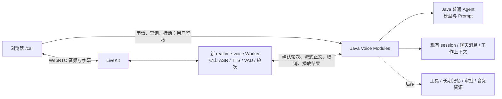
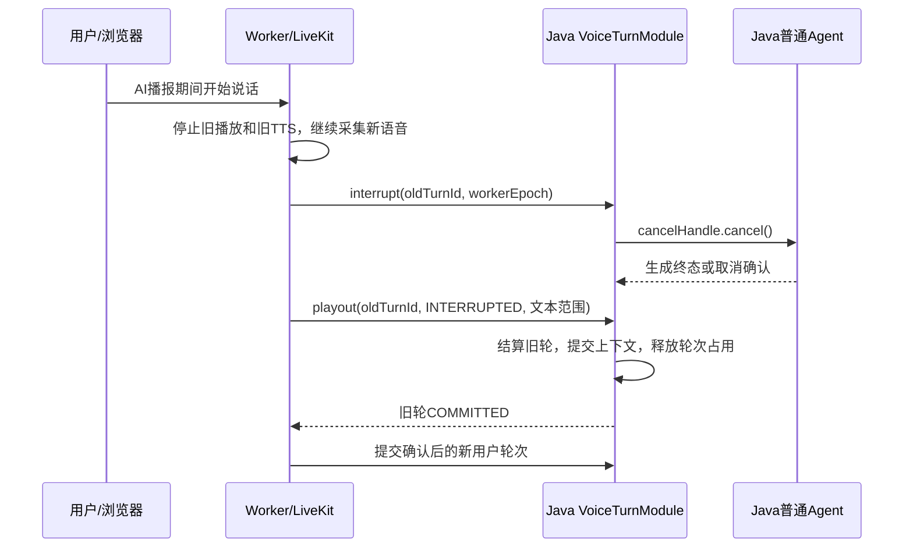

# 站内语音通话：旧实现清除与重新设计

日期：2026-09-10。状态：技术设计草案，待按实施阶段落地。

本文最初用于确认清除逻辑、设计框架和实施思路。设计确认后已经按“清除旧语音实现 → 建立新实现”落地；旧语音数据仍不做兼容或转换，定向历史清理按 runbook 执行。Git 提交历史无需重写。

## 1. 目标与明确取舍

首版完成：**一个已登录用户，在一个已有的普通 Agent 会话中，申请通话 → 加入 LiveKit → 火山 ASR → Java 流式回复 → 火山流式 TTS → 字幕 → 用户插话 → 挂断回原聊天。**

| 决策 | 首版约定 |
| --- | --- |
| 交互范围 | 站内浏览器语音，普通 Agent `standard-chat`，已有且归属当前用户的有效 session |
| 对话执行 | Java；沿用普通 Agent 的模型配置、系统提示词和会话身份，增加语音执行入口 |
| 首版能力 | 文本问答和已有会话上下文；语音运行不暴露工具，不接领域 Agent、Harness、写操作或语音审批 |
| 实时媒体 | LiveKit WebRTC；浏览器持续采集，Worker 负责 ASR、TTS、VAD 和轮次 |
| 供应商 | 火山流式 ASR + 火山双向流式 TTS；一套已开通配置、一个音色，无供应商切换 UI |
| Python 编排 | LiveKit AgentSession + 自定义 `llm_node`；不引入 LangGraph，不在 Python 独立调用 LLM |
| HTTP 控制 | Java 对外提供通话接口、对 Worker 提供内部接口；不另设 Python FastAPI |
| 历史记录 | 复用现有聊天消息存储；被打断的未播出正文不直接成为下一轮上下文 |
| 录音 | 首版不保存通话音频、不提供语音回放；仅保存文本、状态和耗时，资源系统为后续录音能力保留 |
| 故障恢复 | 短暂网络重连可继续同一通话；Worker 崩溃结束通话，不自动恢复正在生成的回复 |
| 预生成 | 关闭 preemptive generation / preemptive TTS；只对确认提交的用户轮次调用 Java |

“普通 Agent”指沿用普通聊天的用户、session、Prompt 和模型选择规则；首版工具关闭是本设计为验证连续语音而作的范围取舍，不声称已经覆盖普通聊天的全部工具能力。图中的工具、长期记忆和审批是共享平台能力，后续分别接入。

此次重建删除的是旧语音功能，包括旧 `realtime-voice` 骨架。登录、普通聊天、Agent 配置、共享资源存储等仍是新系统依赖。允许删除旧语音历史，不等于清空整个应用数据库或删除无关功能。

## 2. 清除旧实现

### 2.1 代码与配置清单

下表是已经用于本次重建的代码清除清单；历史数据清理由独立 runbook 控制。

| 范围 | 清除动作 | 同时处理的引用 |
| --- | --- | --- |
| 旧通话页面 | 删除 `frontend/app/call/page.tsx` | 删除聊天页旧 `buildCallHref` 引用、旧电话按钮事件和旧录音状态；新入口在新页面完成后建立 |
| 旧前端逻辑 | 删除 `frontend/lib/voice.ts`、`call-state.ts` 及各自测试 | 清理 import、路由断言和旧接口测试；新的 `/call` 可复用路径，但文件从零实现 |
| 旧 Java 语音功能 | 删除 `backend/src/main/java/com/h/backend/voice/` 全部现有实现 | 对应 `backend/src/test/java/com/h/backend/voice/` 一并删除；新模块可重新使用 `voice` 包名 |
| 旧聊天专属扩展 | 删除仅为旧语音引入的 `bindStoredAudioResource`、来源校验及专属测试 | `getOwnedMessage` 已被其他能力使用，保留；`assertActiveAgentSession` 按清除后调用图决定是否删除；不按文件整删共享 ChatSessionService |
| 旧 Python 服务 | 删除当前 `realtime-voice/`：源码、LangGraph 图、FastAPI、测试、依赖与锁文件、Dockerfile、环境模板 | 停用其部署命令、Worker 注册与配置；新 Worker 可以同名目录重建，内容与依赖重新生成 |
| 配置 | 删除 `application.yml` 旧 `voice` 配置块和旧专属环境项 | `MINIMAX_API_KEY` 等被图片/视频复用的配置保留；不能因为删除 TTS 而删除全部 MiniMax 集成 |
| 文档 | 删除旧 `2026-06-26-agent-call-design.md`、`2026-06-27-agent-call.md` | 更新中英文 README、资源存储 runbook 中旧语音描述/测试清单/链接；本设计成为新实现依据 |
| 产物 | 清除旧语音临时录音、专属 Python 缓存/虚拟环境和废弃部署项 | 前后端构建产物重新生成，不直接编辑产物里的打包代码 |

普通聊天页面的通用 `<audio>` 资源展示、附件上传、`AUDIO` 类型及资源校验/MinIO 模块保留：这些能力已用于普通文件，不是旧通话专属。之前的两份研究文档作为决策依据保留，实施时注明旧实现已被本设计替代。

`/Users/huajiang/Desktop/ai_learn/VoiceAgent/` 仅作参考，本次清除不删除或修改该独立仓库。后续只提取理解过、确认可使用的 ASR/TTS 协议实现，不带入货运 Prompt、订单、ACC 回调、SIP 开场逻辑、OSS、自制录音器、测试 API 或原仓库凭证。

### 2.2 数据识别与清除单位

已核对的旧实现没有独立持久化 `call_turns` 表：临时录音按文件目录保存，已保存音频落在共享 `chat_message_resources`，文字落在共享 `chat_session_messages`。不得据此删除共享表或所有音频资源。

旧语音资源的主要识别标记是 `metadata_json.source = USER_RECORDING / ASSISTANT_TTS`，用户录音还可能包含 `callTurnId`。临时文件默认位于 `/tmp/h-agent/call-turns`，实施时以实际配置解析出的路径为准。资源表当前已不含 `session_id`，需要通过 `message_id` 关联消息获得会话。

**默认清除单位采用“明确识别出的旧语音测试 session 的完整历史”。** 原语音文字与普通聊天文字共用消息模型，部分语音轮次因录音/TTS 保存失败而没有音频标记，无法可靠逐条还原语音来源。既然旧历史可丢弃，目标 session 内的混合文字历史也一并清除，保留用户和 session 身份，使新功能仍可进入一个已有 session。

目标集合从以下证据建立清单：已标记的资源 → 对应消息 → session；临时目录的 `metadata.properties` → session；部署时明确列出的旧语音测试 session。没有证据的其他 session 不进入清单；不能根据消息文本、日期邻近或文件扩展名猜测。

清单至少包含：`sessionId`、目标消息 ID、运行 ID、记忆 scope、资源 ID、实际存储类型/对象键、临时目录、目标数量与清除状态。若目标为会话树，清单展开相关后代及外键引用；若被自动化等能力引用，停用对这些目标 session 的写入，并解析历史运行/投递引用后按依赖顺序清除，保留无关任务定义和用户配置。该分析属于目标历史清除，不创建长期迁移兼容层。

### 2.3 清除执行顺序

1. **停止旧路径写入。** 下线旧通话入口和 API，停止旧 Worker；目标 session 的聊天、后台任务及延迟记忆写回暂时禁止写入。仅隐藏按钮不足以阻止旧页面或后台任务继续生成数据。
2. **生成可重复执行的清单。** 先读取目标消息、运行、快照、资源和对象键，保存清除进度。清单用于准确删除与中断续跑，不要求旧数据备份或恢复。
3. **清除目标历史。** 按实际外键依赖删除相关运行/投递历史、消息附件关系、消息和持久化记忆快照；清理 session 的摘要、预览、消息数量/序列等派生字段，使保留的 session 成为空会话。旧语音临时轮次全部丢弃，不 finalize 成新消息。
4. **清除目标热状态。** 按目标 session/agent/scope 删除 Redis 与本地缓存中的工作上下文、待刷新记忆及遗留执行状态，阻止旧内容重新落库；禁止对共享 Redis 执行 `FLUSHDB`。用户级长期记忆只有在来源可以明确归属这些目标历史时才随之清理，不清空用户其他记忆。
5. **清除物理对象。** 依据步骤 2 保存的存储位置，重新核对所有仍有效的业务引用；只删除不再被引用的对象。物理对象删除与数据库事务不原子：数据库清理提交后，依据清单逐个删除，失败记录并重试；不能先删除关系再猜对象前缀。MinIO、旧本地文件等按清单中的真实存储后端处理。
6. **清除临时文件和部署残留。** 删除确认属于旧语音配置的目录、关闭已识别的旧房间/Dispatch；不删除共享 bucket、共享 LiveKit 项目或无关运行实例。
7. **核对退出条件。** 目标历史、音频标记、临时文件和延迟写回归零；受共享引用保护的对象单列为保留项；目标 session 能作为空会话正常打开。随后进入新实现阶段。

新 schema 使用新的数据库版本脚本。既有 Flyway 文件中很多是共享消息/资源结构，不改写已应用版本，不删除 Flyway 历史，不要求重建整个数据库。旧数据清除作为一次性受控作业，不成为每次启动的逻辑。

### 2.4 清除完成判定

- 源码、测试、配置和部署引用不再包含旧 `/api/voice/call-turns/*`、`tts/preview`、`tts/message`、浏览器 SpeechRecognition 通话路径和旧 Python 图。
- 旧页面无残留入口；共享聊天、登录、附件上传与资源访问仍能通过各自检查。
- 目标清单内的历史已清理；重复执行清除作业不会扩大集合或误删共享对象。
- 旧语音设计文件退出实现依据；不会出现新旧协议同时存在或自动回退到旧链路。

## 3. 新架构



语音二进制不经过 Next.js/Java 的 HTTP 主链路。Java 不合成 TTS，不代理浏览器音频；Python 不拥有另一套用户、聊天历史或 Agent 业务。LiveKit room 是一次通话的媒体容器，与产品 Agent Session 不是同一身份。

### 3.1 四个 Module

| Module | Interface | 内部 Implementation |
| --- | --- | --- |
| `VoiceCallModule`（Java） | 申请、查询、结束通话；Worker 认领与续租 | 用户/session 校验、room/Dispatch、Token、独占、超时与资源释放 |
| `VoiceTurnModule`（Java） | 提交一轮、读取回复流、打断、提交播放结果 | 幂等接纳、调用普通 Agent、取消、消息提交、工作上下文同步 |
| `RealtimeVoiceWorker`（Python） | 消费通话任务并驱动实时会话 | ASR/TTS、VAD、正文桥接、播放事件、断线退出、旧轮次事件丢弃 |
| `CallClient`（浏览器） | 加入、静音、挂断、展示状态与字幕 | 麦克风/自动播放授权、LiveKit SDK、短暂重连及回原聊天 |

Java→LiveKit 管理接口、Python→Java 通话接口、语音运行→普通 Agent 执行接口是实际跨技术栈的 seam，分别封装 Adapter。首版 ASR/TTS 各只有一个实现，不为未来供应商搭建通用选择框架。

建议目录：

```text
backend/.../voice/
  interfaces/web/          用户接口、Worker 接口、LiveKit webhook
  application/             VoiceCallModule、VoiceTurnModule
  domain/                  通话、轮次、播放结果和状态规则
  infrastructure/          LiveKit、持久化、普通 Agent 执行 Adapter
realtime-voice/
  src/realtime_voice/
    worker.py              Worker 启动与房间任务
    session.py             一次通话的语音生命周期
    java_bridge.py         Java Interface 的唯一客户端
    huoshan_stt.py          固定火山 ASR
    huoshan_tts.py          固定火山流式 TTS
    settings.py            配置校验
  tests/
frontend/app/call/          新通话页面
frontend/lib/voice-call.ts  新通话控制 Interface
```

## 4. 身份、状态与数据所有权

### 4.1 基本身份

| 身份 | 含义与约束 |
| --- | --- |
| `sessionId` | 已存在的产品 Agent Session，由 Java 校验归属与可用性；通话期间不切换 Agent/Prompt |
| `callId` | 一次站内通话，Java 创建；一个用户、一个 session 同时最多一个非终态通话 |
| `roomName` | Java 为 callId 生成的唯一房间名，浏览器不能自选 |
| `workerEpoch` | Worker 本次认领的代次；Java 每次写入校验代次和租约，拒绝旧 Worker 的迟到请求 |
| `turnId` | Worker 为一个已确认用户轮次生成的稳定 UUID；重试不换 ID |
| `runId` | Java 为该轮创建的普通 Agent Run；一个 turn 至多接纳一个 run |
| `utteranceId` | 一次助手播报，首版一 turn 对应一个；关联文本流、TTS、字幕和播放结果 |

建议新增 `voice_calls`、`voice_turns` 两张表。`voice_calls` 保存用户/session/Prompt 快照、房间、Dispatch、状态、Worker 代次、租约与终止原因。`voice_turns` 保存用户正文、消息/run ID、生成正文草稿、生成状态、播放状态、有效播放文本范围、最终消息 ID 及版本。生成正文放草稿字段用于结算与排错，不作为共享模型上下文。

约束至少包括：同一 user 和 session 的非终态 call 唯一；`(userId, requestId)` 创建幂等；`(callId, turnId)` 唯一；每 call 至多一个未完成结算的 turn；同一个 turn 的用户和助手消息只能提交一次。数据库原子检查负责约束，前端禁用按钮只改善交互。

### 4.2 通话状态

```text
PREPARING → CONNECTING → ACTIVE → ENDING → ENDED
任一建立/运行失败 → ENDING（记录原因）→ FAILED
ACTIVE → RECONNECTING → ACTIVE
                    └─ 超时 → ENDING → ENDED
```

Java 是业务状态事实源。`ACTIVE` 要同时满足授权浏览器已加入、当前 Worker 已认领并准备好语音链路；CreateDispatch 成功不代表可开始说话。`ENDING` 在模型执行仍未停止时继续占用 session；达到 ENDED/FAILED 前须确认业务执行已停止并隔离所有旧代次写入。外部房间删除失败可留在清理清单重试，但不得继续服务旧通话。浏览器显示的 listening/thinking/speaking 是交互状态，不另存成一套业务通话状态机。

首版建议参数：连接准备 30 秒；Worker 每 5 秒续租、15 秒失联判定；浏览器重连宽限 10 秒；单次通话上限 30 分钟。数值作为可配置起点，实施测试后固定，不能被客户端随意放大。持续静音是否结束通话留给统一空闲计时，不把麦克风静音当断线。

### 4.3 生成和播放分别终止

生成状态：`ACCEPTED → GENERATING → GENERATED / CANCELLED / FAILED`。

播放状态：`NOT_STARTED → PLAYING → COMPLETED / INTERRUPTED / UNKNOWN`。

轮次状态：`OPEN → FINALIZING → COMMITTED`。一次生成结束并不意味着轮次结束；Java 要等生成与播放都达到可结算条件，再提交助手消息并释放该轮执行权。断线导致播放范围未知时使用 `UNKNOWN`，不得推定生成正文已完整播放。

## 5. Interface 草案

以下是新协议，实施时可细化 DTO，但不复用旧通话请求/事件格式。

### 5.1 浏览器 → Java

| 方法与路径 | 输入/输出 | 规则 |
| --- | --- | --- |
| `POST /api/voice/calls` | `{sessionId, requestId}` → callId、状态、LiveKit URL、roomName、participant identity、短期 room token、返回聊天地址 | 从当前登录主体取 userId；只允许 standard-chat；同 requestId 返回同一通话 |
| `GET /api/voice/calls/{callId}` | 通话业务状态、终止原因、当前 turn 状态 | 必须是所有者；首版用于准备/重连/结束时查询，不传输音频 |
| `POST /api/voice/calls/{callId}/end` | `{requestId, reason}` → 当前结束状态 | 幂等；服务端最终清理不依赖浏览器继续在线 |

浏览器先在明确的开始操作中申请麦克风和音频播放权限，成功后申请通话；授权失败不留房间，申请或连接失败时释放已经取得的媒体轨道。Token 只允许指定 room、固定 participant identity、订阅与发布麦克风音轨，不授予 roomAdmin；元数据不能赋予用户权限。用户身份、Agent、Prompt 和 roomName 都由 Java 派生。短 Token 过期不等于现有连接被断开，结束通话必须执行服务端关闭。

### 5.2 Worker → Java

前缀采用 `/internal/voice/calls/{callId}`，使用独立服务凭证校验，不能作为普通用户接口开放。

| 方法与相对路径 | 作用 |
| --- | --- |
| `POST /claim` | 验证 Java 创建的 call、room 和 dispatch，原子取得 workerEpoch/租约，返回受限 bootstrap |
| `POST /heartbeat` | 续租并读取通话是否要求结束；租约过期的 Worker 不可再次写入 |
| `POST /turns` | 用 turnId 提交完整用户轮次；幂等接纳，返回 runId/utteranceId 和流地址 |
| `GET /turns/{turnId}/stream` | 消费一次已接纳运行的 SSE，不负责创建运行 |
| `POST /turns/{turnId}/interrupt` | 请求停止该轮生成，返回取消状态；可在模型已经生成完毕时幂等调用 |
| `PUT /turns/{turnId}/playout` | 上报单调递增播放进度或最终播放结果，供 Java 结算 |
| `POST /end` | Worker 因用户离开、供应商失败等原因请求结束，与公共 end 进入同一 Module |

所有内部写请求携带 `workerEpoch`，并校验调用主体、通话状态及租约；turnId 必须属于该 call。`claim` 不是信任请求中任意 userId/sessionId，而是通过 Java 已保存的 Dispatch 关联核验。客户端 participant attributes 和普通 DataChannel 消息不具备写业务状态的权限。

SSE 事件最小集合：

```text
accepted       {callId, turnId, runId, utteranceId}
text_delta     {utteranceId, seq, text}
generation_end {utteranceId, status, lastSeq}
error          {code, message}
```

只发送可播正文，不发送 reasoning 或把内部事件序列化后交给 TTS。正文采用纯文本，不含 Markdown 标记；如做文本规范化，生成草稿、字幕与播放范围都必须基于同一份规范化文本。`seq` 对同一 utterance 严格递增，Worker 丢弃重复或旧代次内容。

**提交和消费分开**避免 POST 响应丢失后重新调用模型。Java 在提交返回前登记运行，并为首次流订阅保留有界的事件缓冲，避免 Worker 连接前首 token 丢失。首版已消费的 SSE 断开后不自动重播回复，按失败取消该轮并结算已知播放范围；提交响应超时可以使用相同 turnId 查询/重试接纳，不得创建第二个 run。Java 重启导致缓冲丢失时将对应运行置失败，不伪造可恢复流。

### 5.3 Java → 普通 Agent

语音执行使用一个新 Interface：

```text
startVoiceReply(sessionSnapshot, committedUserText, runId)
    -> { textStream, cancelHandle, terminalResult }
```

该 Adapter 复用 Java 的普通模型/Prompt 选择和推理能力，使用本轮不可变工作上下文快照，不在生成 token 时自动写共享 ChatMemory。VoiceTurnModule 负责用户消息、最终助手消息及工作上下文提交。

不要直接把旧 `/api/chat/messages/stream` 当 Worker 的透明代理：那个入口包含自己的消息落库、run 完成和记忆行为，不能表达“生成结束但尚未播完”。新语音入口直接调用 Java 应用层的新 Interface；这属于接入共享平台能力，不保留旧语音实现或协议。

当前普通流式 executor 没有与语音一致的取消句柄契约。实施阶段要验证所用模型客户端的实际取消能力：调用 cancelHandle 后模型请求终止、回调停止、任务资源释放；仅断开 SSE 或忽略回调不能作为验收。供应商取消确认无法达到要求时，此 Adapter 不满足首版接入条件，不能通过释放业务锁来假装取消成功。

## 6. 关键交互流程

### 6.1 申请与连接

1. Java 校验登录用户、session、standard-chat 和当前是否有未结束运行，冻结本次 Prompt/模型配置。
2. 在事务中创建 PREPARING call 和 session 的通话占用；同 session 的文字发送/后台执行通过共同的会话写入准入检查返回 `SESSION_IN_VOICE_CALL`，避免两套上下文同时写入。建立占用与既有运行检查必须原子协调，不能先查后写。
3. 事务提交后创建唯一 room 并执行显式 Dispatch，metadata 只传 callId 和关联信息；再签发浏览器 room token。外部操作失败时记录建立失败并清理房间/占用。超时后查询同一 room 的 dispatch，核对已创建结果，禁止盲目重复派发。
4. Worker 进入任务后向 Java claim，取得唯一代次，初始化火山 ASR/TTS 和 Silero，加入 room；发现重复任务时只有认领成功者服务，其余退出。
5. 浏览器加入房间，Worker 确认是指定用户音轨；Java 根据 Worker ready 与经签名验证的房间事件推进 ACTIVE。开始前 UI 显示“连接中”，ACTIVE 后才进入持续对话。

建房/Dispatch 与数据库不是一个事务；首版用通话表保存期望状态和外部 ID，由定时清理/对账完成失败收尾即可，不建立独立任务调度平台。

### 6.2 用户说话与回复

1. 浏览器通过 WebRTC 持续发送麦克风音频；LiveKit 管理音频传输和播放，浏览器请求回声消除等采集能力并实测扬声器回授。
2. Worker 持续发送音频到火山 ASR。interim 仅更新字幕；ASR final 可能是一句话中的多个片段，不能每个 final 都直接创建一个 Java run。
3. LiveKit 确认用户轮次完成后，Worker 汇总去重后的完整文本，生成 turnId 提交 Java。空白或纯噪声不提交；关闭预生成防止试探性推理提前写消息。
4. Java 接纳后一次性写入用户消息和 run/turn 关联，读取已提交历史快照开始生成；Worker 消费有序正文并输入火山双向 TTS，音频回到房间，字幕按同一 utterance 关联。
5. `generation_end=GENERATED` 只关闭文本输入。Worker 等待 LiveKit 的播放完成/打断结果，向 Java 提交最终 playout；Java 原子写助手消息、结束轮次并更新工作上下文。

首版固定 ASR 输入与 TTS 输出各自的采样率，明确 LiveKit↔provider 的重采样位置，不直接假定 WebRTC、ASR、TTS 都是相同 PCM 格式。可参考 VoiceAgent 的 ASR 16 kHz、TTS 24 kHz 实现；正式值按开通的火山协议确定并用样本验证。

### 6.3 用户插话



取消生成与停止音频同时推进，停止声音不等待 Java 网络往返。旧轮尚未结算期间继续识别新语音，但最多暂存一个待提交的完整用户轮次；连续说话并入该待提交轮次，避免无限队列。Java 未确认旧轮结束时不启动新 run。

首版不自动恢复已被判定打断的旧音频：误打断后没有有效用户文本则回到 listening。建议先用语音活动持续阈值过滤短噪声，实测中文“嗯”“对”等短反馈后再调整。

以 2 秒作为旧轮取消/结算的初始超时目标；超时则结束本次通话并提示重试。生成任务未停止时保持 session 执行占用，只有确认终止或清理器以代次隔离并确认资源收尾后才释放，防止超时后两轮并行写入。

### 6.4 播放结果与聊天历史

`playout` 包含 utteranceId、单调 revision、最终状态、文本范围、时间和对齐可信度。Java 校验范围属于本轮已发出的规范化正文、不可越界、不可由客户端自填另一段正文；最终结果只能结算一次，冲突重复请求返回状态冲突。

正常播完提交完整助手正文。被打断时，只把有依据的播放文本前缀作为有效回复，并附带“回复已打断”状态；完整生成内容仍是运行草稿。零正文播放时不伪造 assistant 发言；播放范围未知时保存未知状态和最后确认的保守前缀，不把全文当已播放。

参考 VoiceAgent 的火山 TTS 声明 `aligned_transcript=False`，因此首版不能宣称有词级准确对齐。优先使用供应商时间戳；缺失时采用 LiveKit 可提供的进度估计并标记 `ESTIMATED`，不得用“已合成多少音频”代替播放进度。有界进度定期上报，Worker 崩溃时可以用最后确认范围结算。最终声音是否真正被终端用户听见无法由服务端证明，产品描述使用“播放进度”，避免“已听见证明”。

在同一事务内完成 turn 最终状态、助手产品消息与待同步上下文版本。共享热上下文必须在下一轮接纳前达到此版本；未播出的生成尾部不能通过模型客户端自动写回、延迟快照或缓存复活。文字聊天继续同一个 session 时同样读取已提交版本，不只修正通话页面字幕。

### 6.5 挂断、刷新与掉线

显式挂断立即关闭本地麦克风和音频，调用 Java end；Java 标记 ENDING、停止接纳新轮次、取消当前 run、结算已知播放进度、关闭 room/Dispatch、释放 Worker 与 session 占用，再到 ENDED。浏览器返回该 call 绑定的 `/chat?agentId=standard-chat&sessionId=...`；清理未完成时该 session 显示结束处理中，不能提前再发消息。

Java 不依赖页面 unload 请求一定送达。短断网保留同一 call，Worker 暂停新回复并处理当前播报，宽限期内重连同步状态，不重播已消费的音频；超时、刷新造成身份上下文丢失、Worker 崩溃或登录失效时结束通话。首版刷新后回到原聊天并可重新申请 call，不恢复旧生成。

旧 room token 即使尚未过期也不能使已结束 call 恢复业务：Worker claim/turn 写入校验终态，签名 webhook 发现终态房间重新出现的 participant 时移除并清理房间；不依赖单纯删除 room 等同于永久撤销 Token。

## 7. 鉴权、部署与配置

浏览器沿用现有登录机制。内部 Worker Interface 使用独立认证链和服务凭证，限制路径与作用域，不能用 `permitAll` 加裸露自报 userId 的方式接通。LiveKit webhook 单独使用 `POST /internal/livekit/webhook`，通过官方签名校验和原始请求体鉴权，不要求浏览器登录 Cookie 或 Worker 凭证；重复事件幂等。Worker 凭证、浏览器 room token、LiveKit 管理密钥是三个不同用途的凭证。

部署包含现有前后端、LiveKit 和一个新 Python Worker。Worker 主动连接 LiveKit，健康端口不承载用户语音；Java 内部接口不暴露给浏览器。PoC 可连已配置的 LiveKit 环境，生产选自托管时明确 TLS、UDP/TCP、TURN 和防火墙配置，不能仅配置 Nginx HTTP 反向代理就视为完成 WebRTC 部署。

| 配置归属 | 最小配置 |
| --- | --- |
| Java | LiveKit URL/API key/secret、agent dispatch name、Worker 服务认证、连接/租约/结束超时 |
| Worker | LiveKit 注册配置、Java internal URL/服务凭证、火山 ASR key/resource/endpoint、TTS key/resource/model/speaker/endpoint、音频采样率、VAD 参数 |
| 浏览器 | 仅从申请通话响应获取 room token、LiveKit URL 与 callId；不下发供应商密钥或管理权限 |

ASR/TTS 先锁定火山，各自凭证独立声明，不默认推断一把 key 同时具备两项权限。参考仓库的 `seed-icl-2.0`、克隆 speaker 等不能直接复制为本项目可用默认值；实施时使用当前账号已授权的一套模型/音色并冻结配置。缺配置启动失败，不静默切换供应商。

Python 与前端 SDK 使用验证过的确切依赖锁文件；VoiceAgent 现用 LiveKit Agents 1.6.9 可作验证起点。按锁定版本选择统一的 turn handling 配置，不混用不同版本示例。不移植 Qwen 私有 SDK 扩展或另一套 LLM 依赖。

## 8. 实施顺序与验收门槛

| 阶段 | 要完成的工作 | 退出条件 |
| --- | --- | --- |
| 0. 清除 | 执行第 2 节的代码、配置、目标历史和部署清除 | 旧路径归零，共享聊天/鉴权/资源能力正常，无旧数据转换层 |
| 1. Java 控制 | 新表、用户鉴权、call 创建/状态/end、room/Dispatch、Worker claim/租约 | 并发申请只产生一个有效 call，越权拒绝，建立失败能自动收尾 |
| 2. 媒体闭环 | 新 `/call`、Worker、固定火山 ASR/TTS、VAD、字幕；用固定短正文测试媒体 | 正常中文收音播报、持续监听、插话立即停止、挂断释放麦克风；尚不宣称 Agent 闭环 |
| 3. 普通 Agent | 新 Java 执行 Interface、轮次提交/SSE、可取消模型请求 | 已有 session 上下文生效，首正文流式到 TTS，重复提交不重复 run |
| 4. 完整语义 | 取消与下一轮准入、播放范围提交、消息/工作上下文同步、断线清理 | AI 说到一半插话后，新轮不读未播尾部；回原聊天仍保持一致；故障不留下运行占用 |
| 5. 验证与发布准备 | 生命周期、协议、故障和真实浏览器测试；README/配置/部署文档 | 满足下列闭环验收，才恢复主聊天正式通话入口 |

不把工具、Harness、长任务播报、录音存储、SIP 外呼、多供应商配置或独立 Python Agent 混入首版。未来保存录音时，通过正式媒体录制路径和共享资源写入模块单独设计，不恢复旧分句预览 + 完整 TTS 二次合成接口。

### 8.1 必须覆盖的行为测试

- 用户未登录、session 不属于用户、非普通 Agent、session 已有运行：申请被正确拒绝。
- 同 requestId 重试、两标签同时申请、Dispatch 响应超时、重复 Worker 任务：至多一个有效通话/Worker。
- ASR interim/final 重复、多 final 合并、空白输入、长句停顿：每次确认轮次只创建一个用户消息/run。
- 模型已生成完但音频未播完时插话；生成中插话；TTS 首音前插话：都按两个独立终态正确结算。
- 提交响应丢失、首次 SSE 订阅延迟、消费中断流、旧 seq/旧 workerEpoch 迟到：不重复模型请求或播放。
- 普通 Agent 实际取消失败或超时：不会假装释放执行权；后续清理可完成，不污染工作上下文。
- 部分播放、未知播放范围、Worker 崩溃、重复 playout、挂断与 final 同时到达：至多一次消息提交。
- 刷新、弱网、麦克风拒绝、扬声器回声、用户静音、房间 token 重用：退出行为和资源回收符合设计。
- 挂断回原聊天后继续追问：只使用有效提交的历史；现有纯文字聊天、附件和资源功能无回归。

测试通过 Module Interface 验证上述行为，供应商与 RTC 使用可控制的 Adapter；必须另有真实火山 + LiveKit + 浏览器验证，mock 通过不能代替实际取消、播放与重连测试。

### 8.2 体验测量

统一关联 callId/turnId/runId，记录：用户最后语音帧、ASR final、轮次提交、Java 首正文、TTS 首 PCM、浏览器首播放、插话开始、旧音频停止、Java 取消确认。分别报告冷启动与已连接通话，不把供应商 TTFB 当端到端首音延迟。

建议初始探索目标：已连接、无工具的短问答，停说到首音 p50 ≤ 1.5 秒、p95 ≤ 2.5 秒；插话到旧音频停止 p95 ≤ 500ms。数字是验收目标候选，不是现有实测或供应商承诺；结合中文误切轮、误打断和实际网络结果调整。取消/幂等/历史一致性属于正确性要求，不能以体验达标替代。

## 9. 设计依据与待实施时核定事项

已核对的代码依据：

- [旧通话页面](/Users/huajiang/Desktop/h-agent/frontend/app/call/page.tsx)、[旧前端协议](/Users/huajiang/Desktop/h-agent/frontend/lib/voice.ts)、[旧临时录音与绑定](/Users/huajiang/Desktop/h-agent/backend/src/main/java/com/h/backend/voice/application/CallTurnService.java)。这些链接供清除前定位，清除后以 Git 历史查阅。
- [共享资源绑定与来源标记](/Users/huajiang/Desktop/h-agent/backend/src/main/java/com/h/backend/chat/application/impl/ChatSessionServiceImpl.java:514)、[当前资源表查询](/Users/huajiang/Desktop/h-agent/backend/src/main/java/com/h/backend/chat/infrastructure/persistence/mapper/ChatMessageResourceMapper.java)、[工作上下文定义](/Users/huajiang/Desktop/h-agent/CONTEXT.md)。
- [普通 Java 流式 executor](/Users/huajiang/Desktop/h-agent/backend/src/main/java/com/h/backend/chat/domain/agent/HAssistantStreamingExecutor.java)、[火山 ASR 参考](/Users/huajiang/Desktop/ai_learn/VoiceAgent/src/livekit_agent/stt/huoshanASR.py)、[火山流式 TTS 参考](/Users/huajiang/Desktop/ai_learn/VoiceAgent/src/livekit_agent/tts/huoshanTTS/streamTTS.py)。

官方能力依据：LiveKit 支持 [自定义语音节点](https://docs.livekit.io/agents/logic/nodes/) 和 [轮次与打断](https://docs.livekit.io/agents/logic/turns/)；Java 可以通过 [显式 Dispatch](https://docs.livekit.io/agents/server/agent-dispatch/) 管理任务，通过 [Token grants](https://docs.livekit.io/frontends/reference/tokens-grants/) 限制浏览器授权，并验证 [webhook 签名](https://docs.livekit.io/intro/basics/rooms-participants-tracks/webhooks-events/)。火山的 [V3 接入说明](https://www.volcengine.com/docs/6561/2228192?lang=zh) 列出双向 WebSocket 文本输入与音频输出路径。框架能力不代表本项目已完成这些集成。

实施时需要核定三项环境事实：可用的 LiveKit 部署及网络、当前账号可用的火山 ASR/TTS 资源与音色、普通 Agent 模型客户端的取消句柄行为。它们是环境/协议验收项，不改变本文已经选择的供应商和职责划分。

本设计不包含向旧协议过渡的适配计划。执行顺序为先清除旧语音，再按新 Interface 实现并验收；本次只新增本文。
