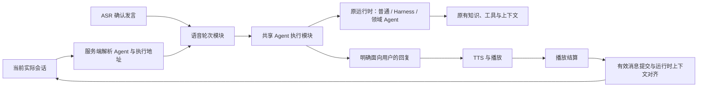

# 从当前会话开启智能语音

日期：2026-09-11  
状态：设计方案，尚未实施。  
关联：[智能语音与智能外呼统一架构设计](../specs/2026-09-11-unified-voice-and-outbound-architecture.md) §5.4、§7。

## 1. 产品决定

**从哪个会话点击“电话”，就与该会话的 Agent 继续交谈，沿用同一个实际 Agent Session 和上下文。** 语音是当前会话的一种交互方式。开启语音不新建聊天会话、不复制历史，也不要求用户再次选择 Agent。

例如，在领域 Agent 的会话中已经讨论了某个订单，点击“电话”后，可以接着问“那它什么时候送到”。由原来的领域 Agent 根据原会话上下文理解订单指代，并按原有权限查询；挂断后回到这个会话，继续文字交流。

本次优先完成浏览器智能语音与完整 Agent 的接入。保留 LiveKit、ASR、TTS 和现有播放结算链路，不依赖 FreeSWITCH 外呼建设。

## 2. 已核实的现状

| 位置 | 当前行为 | 本设计调整 |
| --- | --- | --- |
| `frontend/app/chat/page.tsx` | 电话按钮传当前 `sessionId`，但仅允许普通 Agent | 保留会话入口，按后端能力判断是否可开启 |
| `VoiceCallModule.create()` | 根据会话查归属，但拒绝非 `standard-chat`；保存普通聊天 prompt 和直接模型配置 | 从实际会话解析执行目标，绑定原 Agent |
| `VoiceTurnModule` | 已按播放结果提交消息；上下文重建只有普通聊天 user/assistant 文本 | 保留播放提交，改由对应运行时维护上下文 |
| `AnthropicVoiceReply` | 直接请求模型，明确禁用工具 | 由共享 Agent 执行模块承接语音请求 |
| `ChatServiceImpl` / `HarnessAgentExecutor` | 已有执行寻址、权限、运行记录和 Harness 工具链；聊天执行器生成完成即提交回复 | 提取共享执行准备，分离执行完成与对话提交 |
| `AgenticSyncExecutor` | 领域 Agent 同步执行，完成后提交回复及记忆 capture | 支持语音播放后提交；不假设它支持流式输出或立即取消 |
| `voice-call-url.ts` / `VoiceCallModule.view()` | 返回会话链接写死普通 Agent，通话页自行拼返回地址 | 使用后端解析出的原会话地址，覆盖创建失败时的返回路径 |

以上为代码阅读结论，不代表媒体或完整 Agent 语音链路已通过运行验证。

## 3. 会话决定 Agent 与上下文

创建通话继续只接收 `{ sessionId, requestId }`，用户身份来自登录态。前端不提交历史、Agent 定义、工具列表或系统提示词。服务端解析并保存本次通话绑定：

| 绑定内容 | 规则 |
| --- | --- |
| 实际 `sessionId` | 本次对话、运行记录、上下文与并发控制的身份 |
| `rootSessionId` | 所属顶级会话，用于归属校验和返回界面；不替代实际会话 |
| Agent 身份与运行时 | 由会话记录、Agent 注册信息及 Harness 执行寻址共同解析 |
| 定义绑定 | 保留已有子会话的固定定义版本；顶层定义记录可复现的配置标识或快照，不假定现有顶层记录已有版本字段 |
| 审批模式 | 继承该会话策略，不因语音放宽工具权限 |
| 返回地址与展示信息 | 实际会话标题、Agent 名称，以及可定位原子会话的聊天地址 |

从顶级 Harness 会话进入，就以该 Harness 为本次对话主体；从用户可直接交互的协作 Agent 子会话进入，就沿用其子会话、定义版本和原始委托。子会话的 `agentId` 不能单独充当全部执行地址，应复用现有 `HarnessExecutionSession` 的解析规则。内部后台任务不因此自动获得用户语音入口。

通话存续期间固定目标会话和所选主体定义；通话中新执行的协作 Agent 继续遵循现有每轮 Catalog 快照规则。工具调用仍执行当时有效的鉴权，不因固定配置绕过权限撤销。要更换对话主体，先结束通话，再进入另一个会话开启。

“沿用上下文”包含原运行时允许加载的对话、资源引用、摘要、工具事实及会话状态，继续遵守原来的检索与上下文窗口策略；不保证把全部历史原文无限塞入模型，也不跨父子或兄弟会话拼接历史。

## 4. 界面与开启流程

1. 用户在已有会话点击“电话”。尚未有真实会话身份时，先走现有会话创建流程；已有会话不得重建。
2. 服务端校验会话归属、活跃状态、Agent 可用性及运行时语音能力，并获取实际会话的独占执行权。存在运行中任务或待审批运行时，明确提示先完成或取消该任务。
3. 通话页显示“正在与【Agent 名称】语音交谈”和当前会话标题，按现有流程连接麦克风与 LiveKit。默认等待用户发言，不把旧的最后一条回复自动重播。
4. ASR 确认一句完整发言后，写入同一实际会话并执行对应 Agent；每轮读取上一轮结算后的上下文。
5. 挂断后待当前轮次收尾，返回原会话并刷新有效消息。会话仍可继续文字聊天。

通话能力由共享执行模块返回，例如 `canStartVoice` 和不可用原因；不能仅根据“不是普通 Agent”禁用，也不能删除判断后对尚未适配的运行时静默回退到直接模型。通话前的会话信息和通话创建结果都提供正确返回地址，避免失败时误回普通 Agent。

## 5. 共享执行与播放提交

在现有 Agent 执行模块内部增加“消息提交策略”这个 seam：文字通道采用生成后提交，语音通道采用播放后提交。不同运行时 adapter 封装各自的模型调用、工具执行与状态恢复；语音轮次模块不复制这些细节。

共享模块的 interface 只需表达三类行为：以已验证的会话绑定和轮次身份启动执行；请求取消执行；根据交付结果幂等结算并对齐上下文。对外事件区分可播回复、执行完成、等待审批和失败。工具与推理事件保留到运行记录和授权的界面，不混入可播回复。

执行准备复用 `ChatServiceImpl` 已有的会话寻址、Skill 快照、审批上下文和观测初始化；各轮的用户消息和 Agent Run 只创建一次。共享执行入口接受语音轮次已有的消息与 Run 身份，不再重新写入；Run 的 Agent 字段记录实际 Agent 身份，模型名称单独记录。通话已持有会话执行权时，内部启动每轮 Agent 不重复抢占同一把锁。

不能直接串接现有 `streamChat()`：它既负责抢锁和写入用户消息，也通过执行器在生成结束时提交回复。仅过滤其 SSE 事件无法改变这些行为。

## 6. 什么内容允许播报

可播内容必须是本次直接交谈主体明确面向用户的回复。思考、工具参数与结果、步骤日志、协作 Agent 内部文本及未分类事件一律不进入 TTS。用户直接进入子会话时，该子 Agent 是交谈主体，它进一步调用的协作者仍是内部输出。

现有 Harness 的“父级文本 delta”筛选可复用，但 `source` 为空只证明来自当前执行根，不能单独证明内容是最终对客答复。接入时必须验证运行时是否有明确的对客消息语义：有可靠标记才增量播报；没有标记时，首版等待该主体的最终结果，再分句送入 TTS。领域同步 Agent 同样先取最终答复，不承诺流式首段延迟。

一旦某段文本开始播报，其文本与段落身份固定。最终结果若与此前 delta 不一致，不得用最终全文覆盖已经播放的文本，也不得重复播放整段结果；结算基于真实送播版本。

语音表达约束作为本次交互参数加入，例如简短自然、适合朗读；不能覆盖原 Agent 身份、委托与工具权限。普通 Agent 才按其既有规则使用 `promptId`。

## 7. 上下文与业务事实一致性

每轮明确区分执行结果、生成回复、播放结果和有效对话四种记录。工具已成功但回复被打断时，工具结果仍成功，对话交付则标记部分或未知；不能只用一个 Run 成败值抹掉这些区别。

| 内容 | 保存与进入下一轮的规则 |
| --- | --- |
| ASR 确认的用户发言 | 按轮次身份幂等写入实际会话一次 |
| Agent 生成但未播放的答复 | 保留执行草稿，不作为已经对用户说过的话 |
| 播放确认的答复 | 按播放结果幂等提交；部分播放附中断和置信信息；未知不冒充完整播放 |
| 工具动作、结果与审批状态 | 独立持久化，下一轮可知道已完成动作；结果不明的动作先核实，不能因回复未送达自动重做 |
| 运行时记忆与摘要 | 使用有效对话和独立业务事实，不从未播全文提取“已告知用户”的记忆 |

仅延迟 `appendAssistantMessage()` 不够。Harness 的 AgentState、领域 Agent 的 memory，以及后置摘要或长期记忆 capture 都要遵循同一规则：运行过程中允许暂存完整推理与工具轨迹，播放结算后再形成供后续对话使用的状态。未播内容不得以普通 assistant 发言进入下一轮；工具调用和结果须保留完整关联，不能粗暴替换全部状态为 user/assistant 文本。

各运行时 adapter 应把“本轮待交付答复”与持久业务状态分开，并提供播放结算后的对齐能力。对话提交与待对齐标记需持久化；状态对齐失败时保持不可启动下一轮，通过幂等补偿恢复。记忆提取在此后触发。某运行时尚不能满足这一契约时，其语音能力保持不可用，不能仅隐藏界面的未播文本就宣称已完成接入。

## 8. 打断、并发与审批

沿用当前通话期间占用实际会话执行权的策略，避免另一个标签页或文字请求同时修改上下文。父子和兄弟会话仍按各自身份隔离；任何会回写当前实际会话的后台动作，也须服从同一约束。

插话时立即停止播放、丢弃待播内容，并取消或隔离旧执行。迟到文本与播放回执通过 `callId / turnId / utteranceId` 及执行代次识别。新的发言可以先缓冲，待旧执行终止或已可靠隔离、播放结算与状态对齐完成后才启动下一轮 Agent。

对于不可立即取消的同步 Agent，丢弃旧回复不能算执行已经停止：必须阻止它继续写入当前会话状态或发起新工具动作。若运行时不能可靠隔离，就保持会话占用，显示“正在结束上一轮处理”，等待其收尾；超时结束语音通道，但不能提前释放仍被旧执行写入的会话。

首版遇到需要人工审批的工具，保存审批请求，通话页显示“需要确认，请返回会话处理”，停止接收新轮次并结束语音，完成结算后回到原会话，通过已有审批界面继续同一 Run。待审批工具不执行、不自动批准；若无法保留同一 Run 的恢复状态，该运行时尚未满足接入要求。后续可再设计通话内审批，不在本次引入额外恢复路径。

挂断、Worker 丢失及进程重启时不重放 Agent 请求。保留已知工具事实与交付状态，对未确认工具结果记录未知；完成恢复对齐后才允许原会话继续执行。

## 9. 实施范围与验收

本次工作覆盖会话绑定解析、共享执行准备与提交策略、三种现有运行时适配、原会话返回路径，以及对应的播放和上下文一致性。无需先建设电话名单、营销背景模型或 FreeSWITCH 音频适配。

验收以用户行为和持久化结果为准：

- 在普通、Harness、领域 Agent 会话中先文字交流，再语音追问，仍由原 Agent 使用原上下文回答；挂断后文字追问能接续语音内容。
- 在可交互的协作 Agent 子会话开启语音，使用其既有定义和委托，消息、Run、审批和返回位置都归该实际会话。
- 至少一次真实知识或业务工具调用可核验；推理、工具日志与内部协作者文本均未进入 TTS。
- 工具成功后打断确认播报，下一轮仍知道动作已发生；未播答复不出现在有效对话、运行时对话状态和“已告知”记忆中。
- 部分播放、未知播放、重复回执、状态对齐失败和迟到执行均不引起重复消息、重复执行或新轮次污染。
- 同步 Agent 取消未完成时不能并行启动新轮次；审批能回到原会话继续；第二标签页不能绕过通话占用。
- 定义或能力不可用时明确拒绝，返回原会话；不回退为另一个 Agent。

上述契约验证通过后，才将对应运行时的电话入口设为可用。测试需同时检查会话消息与运行时实际状态，不能仅以接口成功、字幕显示或能听到声音作为完整接入证据。
