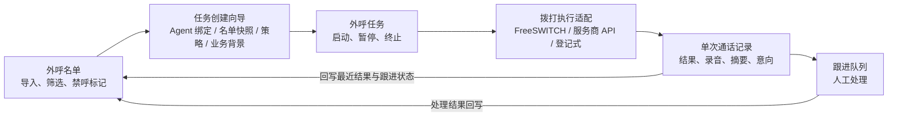

# 外呼管理页面设计

日期：2026-09-20  
状态：设计方案，尚未实施。  
关联：[智能语音与智能外呼统一架构设计](../specs/2026-09-11-unified-voice-and-outbound-architecture.md)、[中国大陆智能营销场景的智能外呼调研](../research/2026-09-11-mainland-intelligent-outbound.md)、[从当前会话开启智能语音](2026-09-11-session-bound-voice-agent-design.md)。

## 1. 设计结论

外呼管理页面（`/outbound`）是智能外呼的运营操作面，回答三个问题：呼给谁（名单）、为什么呼且谁来对话（任务与 Agent 绑定）、呼得怎么样以及接下来做什么（通话记录与跟进）。页面覆盖完整运营闭环：导入名单 → 创建任务并绑定 Agent → 监控执行 → 查看通话结果 → 分配人工跟进。

页面对拨打链路保持无关。任务执行通过「拨打执行适配」接口对接，自建 FreeSWITCH 链路（统一架构文档的路线）与云服务商 API（调研文档的路线）都可插拔。对象模型与状态机以内部事实为准，供应商事件只是事实来源之一。

页面与对象模型可以先于拨打链路建设：先以登记式适配（手动登记通话结果）跑通数据闭环，再接入真实链路。前端工作不被媒体链路阻塞。

## 2. 与现有设计的关系

| 现有文档 | 本设计的处理 |
| --- | --- |
| 统一架构设计 | 架构图中的「营销场景 / 电话表」与「外呼任务与呼叫控制」的运营面在此具体化为一个页面和对应后端模块；媒体链路、共用语音核心与 Agent 执行适配不在本设计范围 |
| 外呼调研 | 采纳五对象建议（名单、任务、单次通话、跟进、禁呼）与第一阶段路径（导入/筛选名单 → 创建任务 → 查看结果 → 分配跟进）；「已接通」与「有意向」分字段、未接听不等同无意向、异步事件不能假设一次到齐等结论直接进入对象模型 |
| 会话绑定语音 | 该设计解决浏览器语音的会话延续；外呼不沿用「从当前会话开启」，每通电话按统一架构 §7.1 建立独立 Agent Session。两者共用同一套播放结算与有效消息提交语义 |

代码现状（2026-09-20 核实）：仓库中只有基于 LiveKit 的浏览器语音通话（`frontend/app/call/page.tsx`、`backend/.../voice` 模块）；外呼名单、任务、管理页面均无实现；营销话术配置也未在代码中定位到，与统一架构文档的判断一致。因此话术与场景配置在本设计中作为任务的输入字段提供，不预设已有配置页面。

## 3. 页面信息架构

单页面、四个视图，页面入口从 `/me` 加入（与 automations 页面一致），页面代码与 API 客户端沿用仓库惯例（`frontend/app/outbound/page.tsx`、`frontend/lib/outbound.ts`）。

| 视图 | 内容 | 主要操作 |
| --- | --- | --- |
| 名单（默认视图） | 号码、姓名、业务变量、来源、授权依据、跟进状态、最近通话结果 | 导入、筛选、标记禁呼、加入任务 |
| 任务 | 任务卡片：名称、Agent、名单规模、进度、接通率、意向数、状态 | 创建向导、启动、暂停/继续、终止、查看明细 |
| 通话记录 | 全部通话流水，按任务、结果、时间筛选 | 查看详情、修正意向、登记跟进 |
| 跟进 | 待人工处理队列：意向待确认、需再呼、预约提醒 | 登记处理结果、改约、转禁呼 |

页面顶部概览条展示今日拨打数、接通率、有意向数、进行中任务数，数据来自后端汇总接口，不做前端跨接口拼装。

## 4. 对象模型与状态机

### 4.1 外呼名单（OutboundContact）

名单对象独立于平台用户体系：客户身份与平台账号身份分别保存，不凭平台 `userId` 决定客户上下文。

| 字段 | 规则 |
| --- | --- |
| 号码、姓名 | 呼叫对象标识；导入时按号码去重 |
| 业务变量 | 键值对（如订单号、预约事项）；拨打时随业务背景注入 Agent 上下文 |
| 来源、授权依据 | 导入时必填；缺少授权依据的条目不允许进入任务 |
| 跟进状态 | 待呼、已接通待判定、有意向、无意向、需再呼、禁呼 |
| 最近通话结果 | 仅展示字段，由通话结果回写，不替代历史记录 |

### 4.2 外呼任务（OutboundTask）

创建任务时生成名单快照（任务条目表），任务可复现；后续名单变化不影响已创建任务的执行范围。

| 字段 | 规则 |
| --- | --- |
| Agent 绑定 | 从用户 Agent 目录选定 Agent 并固定其定义版本；每通电话据此建立独立 Agent Session |
| 名单快照 | 筛选条件或手动勾选在创建时固化为任务条目 |
| 业务背景 | 开场白、沟通目标、话术要点；作为场景配置传入 Agent，不覆盖 Agent 身份与工具权限 |
| 执行策略 | 呼出时段、并发上限、未接听重试次数与间隔 |
| 状态 | 草稿 → 待启动 → 执行中 ⇄ 已暂停 → 已完成、已终止 |

任务条目状态：待呼 → 呼叫中 → 已接通、未接听、呼叫失败、禁呼跳过、已取消。每次拨打产生一行通话记录；条目状态由最新一次拨打结果决定，重试由任务引擎按策略对同一条目再次发起，不覆盖已有通话记录。

### 4.3 单次通话（OutboundCall）

| 字段 | 规则 |
| --- | --- |
| 关联 | 任务条目、名单条目、统一通话 ID、Agent Session |
| 尝试次数 | 同一名单条目可多次拨打，每次一行，不互相覆盖 |
| 接通状态 | 已接通（正常完成、中途挂断）、未接听、忙线、空号、停机、频次限制、禁呼 |
| 结果内容 | 对话转写（取自关联 Agent Session 的有效对话）、录音引用、Agent 摘要、意向判定 |

接通与有意向是两个独立字段；未接听不自动记为无意向。供应商异步事件按通话结束、摘要就绪、录音就绪分别回流，到达顺序不保证，页面据此允许通话详情逐步补全。

### 4.4 跟进记录与禁呼记录

跟进记录：来源通话、业务意向、预约时间、人工负责人、处理结果。禁呼记录：原因、时间、范围、生效状态；任务引擎在每次发起呼叫前再次校验，客户要求停止后立即生效。

## 5. 核心流程



任务创建向导复用 automations 页面已有的 Agent 选择模式，步骤为：选择 Agent → 选择名单（筛选条件或勾选，预览规模）→ 配置执行策略 → 填写业务背景。创建后处于待启动状态，用户显式启动才开始拨打。

通话详情抽屉展示对话转写、录音播放、Agent 摘要与意向判定；意向标签可人工修正并留痕。有意向或需再呼的通话进入跟进队列。

## 6. 拨打执行适配

后端定义统一接口，页面与对象模型不感知具体链路：

| 能力 | 说明 |
| --- | --- |
| 发起拨打 | 对一个任务条目发起一次拨打，返回内部通话标识 |
| 取消 | 取消进行中的拨打 |
| 事件回流 | 异步事件按内部通话标识幂等写入；重复投递不产生重复记录 |
| 主动查询 | 定时或手动补偿查询，覆盖事件丢失 |

三个实现方向按建设顺序排列：登记式适配（手动登记通话结果，用于先落地页面与数据闭环）、FreeSWITCH 适配（ESL 拨号加 WebSocket 媒体，接统一架构的语音核心）、云服务商适配（任务 API 加异步事件）。任务状态机以内部事实为准：条目是否已呼、通话是否接通由本系统记录判定，供应商状态只作为事实来源之一。

## 7. 后端模块与接口概览

模块组织沿用 voice 模块的分层方式：

```
com.h.backend.outbound
├── application/        OutboundContactModule、OutboundTaskModule、OutboundCallModule
├── domain/             OutboundContact、OutboundTask、OutboundTaskItem、OutboundCall、FollowUp、DoNotCallEntry
├── infrastructure/     DialingProvider 接口与各实现、OutboundStore
└── interfaces/web/     OutboundController
```

| 接口分组 | 主要动作 |
| --- | --- |
| `/api/outbound/contacts` | 导入、查询（筛选分页）、标记禁呼 |
| `/api/outbound/tasks` | 创建（含名单快照）、启动、暂停/继续、终止、列表、详情与执行明细 |
| `/api/outbound/calls` | 列表、详情（转写、录音、摘要、意向） |
| `/api/outbound/follow-ups` | 队列查询、登记、处理 |
| `/api/outbound/summary` | 顶部概览统计 |

控制器沿用 `VoiceCallController` 的写法（`ApiResponse` 返回、`AuthUserPrincipal` 鉴权、请求体用 record 定义）。

## 8. 合规内建

名单导入要求授权依据，无授权依据的条目不能进入任务；禁呼记录在每次发起呼叫前校验；呼出时段与频次限制作为任务策略的一部分。这些要求来自调研文档对《消费者权益保护法实施条例》第二十四条与工信部信管〔2020〕81号的分析；具体业务性质与线路资源仍需按调研文档的边界另行核实，页面设计不代替该判断。

## 9. 实施范围与验收

第一阶段覆盖页面四个视图、五个后台对象、任务引擎与一种执行适配实现（真实链路或登记式）。名单导入先支持 CSV 与手动粘贴；并发从低水位开始；结果回流以轮询刷新。跨任务频控、通话实时监听、报表、多服务商路由、通话内审批不在本次范围，单号码试呼可用单条目任务替代。

验收以用户行为和持久化结果为准：

- 导入名单、创建任务选定 Agent、启动、看到通话记录回流、有意向条目进入跟进、标记处理结果，全程在页面完成。
- 同一名单条目多次拨打保留多行通话记录，互不覆盖。
- 供应商事件重复投递不产生重复记录；通话详情在摘要、录音就绪前后均能正确展示。
- 禁呼条目在任务执行中被跳过且有明确记录。
- 意向标签的人工修正留痕；未接听条目不被自动记为无意向。
- 缺少授权依据的名单条目无法进入任务创建向导的名单选择。
