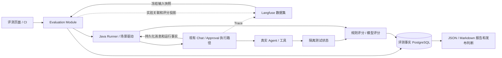

# H Agent 评测平台实施文档

日期：2026-09-21

状态：实施中。本文确定首版设计、编码顺序与验收条件；“当前进度”只记录已经落库并通过测试的部分。

当前进度：已完成评测领域核心状态机、声明式评分器要求和评分门槛、可替换场景 Runner、清理失败与取消/基础设施故障语义、默认关闭的评测配置、评测 profile 启动隔离校验、首版 Flyway 表结构，以及银行工具的可重置/可快照测试接缝。Runner 尚未接入真实 `ChatService`、持久化 Store、Langfuse 投影、管理接口和页面。

依据：[行业调研](../research/2026-09-21-ai-agent-evaluation-industry-research.md)、[观测职责 ADR](../adr/0001-passive-best-effort-agent-observability.md)、[产品领域语言](../../CONTEXT.md)。

## 1. 实施目标与技术选择

首版交付：**选择一份固定数据集 → 运行指定版本的真实 Agent → 验证任务结果 → 对比基线 → 查看失败证据 → 由 CI 判断是否满足发布条件。**

采用适合当前项目的轻量方案：

- Langfuse 管理和审阅数据集，展示实验、评分与 Trace。
- 在 `backend` 新增 `evaluation` Module，Java Runner 复用现有聊天、Agent 执行和审批流程。
- PostgreSQL 独立保存数据集快照、实验、每次尝试与评分；这是评测结果的权威记录。
- 评测运行在独立的 `evaluation` 环境，使用专用数据库、Redis 范围、用户、工作目录和对象存储范围。
- 首版一个评测进程、一个活动实验、一次执行一个 Trial；数据库记录任务，进程内有界执行器调度。
- 提供少量管理 Interface 和一个轻量评测页面，复杂数据集编辑、Trace 查看及交互式实验对比优先复用 Langfuse。
- 同时导出 JSON 和 Markdown 报告；CI 使用本地评测事实，不依赖 Langfuse 是否可查询。

首版不建设消息队列、Kubernetes 调度、多租户平台、任意用户代码评分器、浏览器沙箱、语音媒体评测、自动改 Prompt、自主生成测试用户或自动部署候选版本。长期记忆默认关闭，随后通过专门的数据集验证记忆能力。

平台可以判断某候选版本在约定案例上的表现；不能以几十条案例宣称覆盖全部业务或证明线上总体质量。

## 2. 已核对的代码与必须补齐的能力

下表的“当前事实”来自本次代码阅读；“实施动作”均为待完成事项。

| 当前位置 | 当前事实 | 实施动作 |
| --- | --- | --- |
| `chat/application/ChatService.java` | `streamChat(...)` 返回 `Flux<ChatStreamEvent>` | Runner 调用正式应用路径；不另写一套模型调用循环 |
| `chat/domain/agent/ChatAgentExecutor.java` | `execute(...)` 返回 `void` | 不假定能直接获得完整结果；在应用执行生命周期补齐稳定运行身份和事实采集 |
| `chat/domain/agent/ChatAgentExecutionCommand.java` | 已传递用户、Session、Run、Agent、Observation、批准模式和终结回调 | 复用现有执行身份，避免评测器重复创建消息或 Run |
| `chat/application/impl/ChatServiceImpl.java` | 先建 Run，再开启 Observation，尽力回写 Trace ID | 在 Run 建立后及时关联 Trial；评测关联不得放进观测发送成功回调 |
| `chat/application/AgentRunService.java` | 可按 ID 查 Run；运行成功状态是 `SUCCEEDED` | 从 Run 与持久化消息读取结果；`SUCCEEDED` 不等于评测通过 |
| `AgentRunEntity` / `AgentRunSummary` | 实体保存 `langfuse_trace_id`；当前 Summary 不含该字段 | 通过受控查询返回可选 Trace 引用，不能解析 `trace_parent` 猜链接 |
| `ChatSessionServiceImpl.createSession(...)` | 会归档过期会话；传入当前 Session 会触发切换处理 | 仅使用专用评测用户、全新 Session、`currentSessionId=null`；不调用操作者的 bootstrap/切换路径 |
| `HarnessApprovalService` | `findPending` 和 `decideAndResume` 支持原 Run 续跑 | 场景驱动器按脚本批准或拒绝；SSE `action_required` 不是任务完成 |
| `AgenticSyncExecutor` / `HarnessAgentExecutor` | 同步 Agent 与流式 Harness 的取消机制不同 | 分别验证取消；订阅结束或 Future 取消不能直接证明工具已停止 |
| `chat/infrastructure/ai/Agents.java` | `BankTool` 保存内部 `HashMap`，已有包内清空方法 | 提取可受控重置、读取状态的内部 Seam；不使用反射读取 Map |
| `chat/infrastructure/ai/AgentConfig.java` | `bankerAgent()` 内部直接 `new BankTool()` | 场景 Adapter 必须拿到同一个实际工具状态，不能校验另一个模拟账户 |
| `chat/infrastructure/storage/ResourceStorage.java` | `discard` 只用于未挂接资源的补偿 | 评测产物到期清理走明确生命周期，不能把 discard 当成通用业务删除 |
| `agent-observability` | OTel → Langfuse，观测尽力交付 | 只增加所需评测关联元数据，不承担评测事务与状态推进 |

表中 Java 路径除 `agent-observability` 外，相对 `backend/src/main/java/com/h/backend/`。

## 3. 架构与事实归属



### 3.1 单一事实源

| 数据 | 所有者 | 其他位置的用途 |
| --- | --- | --- |
| 可编辑案例 | Langfuse 数据集 | Git 保存初始案例包、评分规则及场景代码；不与 Langfuse 双向自动覆盖 |
| 本次实际使用的案例 | 本地不可变 Dataset Snapshot | Langfuse 后续编辑不改变历史实验 |
| Agent 产品结果与运行状态 | 现有聊天、Run、工具及业务数据 | Evaluation 读取并保存验收所需证据快照 |
| Trial、分数与发布判断 | Evaluation PostgreSQL | Langfuse 是诊断和展示投影 |
| 大体积评测证据/产物 | 评测范围内的对象存储 | 数据库保存持久引用、摘要和内容摘要值，不保存临时签名 URL |
| Trace / Observation | Langfuse | 可缺失，不能决定 Trial 是否完成 |

数据集通常从 Langfuse 获取；还提供同一 Schema 的本地 JSON 导入，用于启动和 CI。两种输入都先冻结成快照，实验执行期间不再次读取“最新题目”。

### 3.2 不影响正常聊天

`evaluation.enabled=false` 为普通部署默认值，评测调度和管理入口不启用。独立评测进程可以使用同一个 backend 制品，但配置与数据必须隔离。

评测证据持久化故障可以让本次评测失去有效性，不能改变普通聊天的业务行为。评测专用记录不加入生产 Trace 的交付承诺，也不把观测变成可靠日志。

## 4. Module 与 Interface

新增目录建议如下；类名是落点建议，可以合并有重复职责的类，不按每张表建立一整套空壳。

```text
backend/src/main/java/com/h/backend/evaluation/
  application/     EvaluationModule、EvaluationRunner
  domain/          Experiment、Trial、DatasetSnapshot、EvaluationVerdict
  infrastructure/ EvaluationStore、LangfuseEvaluationAdapter
                   ChatEvaluationAdapter、BankScenarioAdapter
                   RuleEvaluator、LlmJudge、EvaluationProperties
  interfaces/web/ EvaluationController

backend/src/main/resources/application-evaluation.yml
backend/src/main/resources/db/migration/<新的唯一版本>__create_evaluation_tables.sql
backend/src/test/java/com/h/backend/evaluation/
evals/datasets/    首批案例 JSON
evals/graders/     版本化评分准则和规则定义
evals/README.md    实施后补齐的实际启动、运行、导出说明
frontend/app/evaluation/page.tsx
frontend/lib/evaluation.ts
```

对外 Interface 保持小：导入快照、创建实验、启动、取消、读取结果、比较、导出。Runner、数据库事务、评分调用与投影由 Module 内部协调。

内部保留确有差异的 Seam：

- 数据来源：Langfuse 与本地 JSON 都产出相同的不可变快照。
- 场景环境：Bank 使用内存账户，Harness 使用工作区/工具状态；每个 Adapter 负责 `prepare → drive → inspect → cleanup` 的完整契约。
- 评分：确定性业务断言和 LLM Judge 接受同一种 Evidence，输出统一 Score。

第一阶段只有少量已注册场景与规则；数据集通过 ID 选择它们，不允许上传 Java、Python、Shell 或任意 URL 作为执行内容。

## 5. 数据集、版本与案例格式

### 5.1 案例最小字段

| 字段 | 含义 |
| --- | --- |
| `caseId`、`schemaVersion` | 稳定用例身份、格式版本 |
| `agentId`、`scenarioId`、`tags` | 被测对象、已注册场景、能力分类 |
| `initialState` | 测试账户、知识文档、工作区等初始状态；只能使用合成或已审阅数据 |
| `input` / `script` | 单轮输入，或有界的多轮用户交互与批准脚本 |
| `expected` | 业务状态、参考答案或明确评分标准 |
| `graders` | 规则 ID、版本、是否必需、阈值 |
| `limits` | 最大轮数、工具次数、执行时限、批准次数等 |
| `source`、`split` | 来源及用途：development、regression、holdout、challenge |

银行案例示意（是待实现 Schema 示例，不是现有命令）：

```json
{
  "schemaVersion": 1,
  "caseId": "bank-withdraw-001",
  "agentId": "banker-agent",
  "scenarioId": "bank-v1",
  "tags": ["tool", "state", "regression"],
  "initialState": {"accounts": {"eval-alice": 100}},
  "input": "从 eval-alice 的账户取出 25 美元，并告诉我余额。",
  "expected": {"accounts": {"eval-alice": 75}, "withdrawCount": 1},
  "graders": [
    {"id": "bank-final-state", "version": "1", "required": true},
    {"id": "bank-no-duplicate-write", "version": "1", "required": true},
    {"id": "reply-state-consistency", "version": "1", "required": true}
  ],
  "limits": {"maxTurns": 3, "maxToolCalls": 10, "timeoutSeconds": 120},
  "source": "manual",
  "split": "regression"
}
```

账户初始化由场景 Adapter 在 Agent 运行前完成，不能偷偷给模型标准答案。读取验收状态不能增加被测工具调用次数。拒绝非法金额等能力若当前演示工具没有实现，应作为挑战集或另立功能需求，不能假定它已提供金融业务校验。

### 5.2 冻结哪些版本

实验清单 `manifest` 必须记录：

- 数据集内容摘要及全部实际案例；存在 Langfuse 历史版本标识时一并记录。
- 代码 Git commit、构建制品摘要；工作区不干净时记录差异摘要，并标为仅开发使用。
- Agent Definition 版本或内置 Agent 的代码版本。
- 实际解析后的 Prompt、模型供应商/模型 ID/参数、各模型角色映射；不能只存 UI 上的模型别名。
- Skill 版本、工具与 MCP/A2A 配置版本、知识文档与索引版本；首版不使用的能力明确标为禁用。
- 场景 Adapter、评分器代码、Judge 模型与 Prompt、门槛策略版本。
- 超时、重复次数、记忆策略及运行环境标识。

冻结配置要真正用于执行；无法固定的远端模型版本或外部数据标为 `uncontrolledDependencies`。只记录一个名字而实际读取最新配置，不能算版本固定。密钥只保存配置引用，不进入清单。

基线与候选默认要求同一快照、评分器、重复策略和门槛。改变评分器时，要对双方证据使用同一新版评分器重新评分，再比较；原分数保留，不覆盖历史。

## 6. 最小数据库设计

首版四张表即可。使用项目既有 PostgreSQL、Flyway 和事务惯例，新增迁移前核对唯一版本，不修改已经执行的迁移。

| 表 | 核心字段与约束 |
| --- | --- |
| `eval_dataset_snapshots` | id、owner_user_id、source、source_version、schema_version、content_hash、items_json、created_at；快照不可编辑；同一所有者和内容可复用 |
| `eval_experiments` | id、owner_user_id、request_id、snapshot_id、name、manifest_json、baseline_id、status、gate_verdict、cancel_requested_at、report_hash、origin、created_at；同用户 request_id 唯一 |
| `eval_trials` | id、experiment_id、case_id、repeat_index、phase、execution_outcome、verdict、session_refs_json、run_refs_json、evidence_json/ref、metrics_json、cleanup_status、error、时间；实验+case+repeat 唯一 |
| `eval_scores` | id、trial_id、grader_id、grader_version、score_revision、status、value、reason、evidence_refs、judge_manifest、created_at；trial+grader+version+revision 唯一 |

约束与约定：

1. 创建实验时，同一事务写实验清单和全部计划 Trial，保证进度分母固定。实验绑定快照后不可变更。
2. 幂等 requestId 内容相同返回原结果；内容不同返回冲突。唯一冲突后在有效事务中重读。
3. 首版活动实验通过数据库约束保证最多一个；取消后的收尾期仍占用。不要只依赖前端按钮或进程锁。
4. 所有查询和关联验证用户归属；提交请求不能指定任意业务 userId 或已有普通聊天 Session。
5. 一个 Trial 可能关联多个用户轮次 Run、多个协作者 Session；审批恢复复用原 Run。不能只设计一个 `run_id` 字段。
6. Run 引用包含运行环境身份和本地 ID；导入历史报告时不能把其他数据库的数字 ID 误关联成本地 Run。
7. 分数为空必须有原因，不能用 0 冒充 Judge 报错，也不能默认通过。
8. 进度由 Trial 聚合，不维护 `completed_count++`；业务执行时间、评测耗时、排队时间分别计算。
9. 证据内容设大小限制。小规模文本首版可以直接存 JSON；超限产物使用评测对象引用。不得静默截断必须参与判定的证据。
10. 原始评分不可覆盖；人工复核和重新评分增加 revision 并保存来源。发布结果引用具体评分 revision。

## 7. 执行生命周期与结果采集

### 7.1 状态分别表达什么

实验状态：`READY → RUNNING → FINISHED`，取消进入 `STOPPING → CANCELLED`；基础设施或恢复问题进入 `BLOCKED`。`FINISHED` 只表示流程结束，是否通过由 `gate_verdict` 表达。

Trial 阶段：`QUEUED → PREPARING → RUNNING ↔ WAITING_INTERACTION → EVALUATING → CLEANING → FINISHED`。准备失败可跳到清理；所有路径都要处理收尾。

- `execution_outcome`：`SUCCEEDED / FAILED / TIMEOUT / CANCELLED / INFRA_ERROR / INTERRUPTED`，尚未确定时为空。
- `verdict`：`PASS / FAIL / INCONCLUSIVE / NOT_EVALUATED`。
- `cleanup_status`：`NOT_STARTED / RUNNING / DONE / FAILED / UNKNOWN`。
- `gate_verdict`：`PASS / FAIL / INCONCLUSIVE`，不与实验完成状态混用。

Agent 正常返回但余额错误：`SUCCEEDED + FAIL`。Judge 不可用且缺少必需评分：`SUCCEEDED + INCONCLUSIVE`。可观测平台故障而业务断言完整：可以得到正常评测结论。

### 7.2 一次 Trial 的正常执行

1. 短事务认领 Trial；保存执行代次与初始时间。
2. 场景 Adapter 验证环境、创建专用用户下的新 Session、初始化状态，保存身份与初始证据。
3. 调用现有 `ChatService.streamChat`，只建立一次订阅；数据集的 expected/graders 不进入模型输入。
4. 在正式应用流程创建 Run 后，及时保存 Trial 与该 Run 的关联；禁止以“最新一条 Run”猜测关联。
5. 收集有界交互事件。`done` 后读取已提交 Run、助手消息和工具最终状态；`error` 结合已存在事实分类。
6. 如果出现 `action_required`，执行第 8 节；普通多轮追问则根据脚本发送下一条用户消息，每条消息只提交一次。
7. 场景终止条件满足后保存 Evidence；确认任务要求的相关执行已经停止。仅根回复结束但相关子任务仍可能写状态时，继续有界等待或判定无法确认。
8. 用确定性规则评分，再运行本场景需要的 Judge。失败评分保留证据，不自动重跑 Agent。
9. 在清理环境前冻结所有必要证据，清理完成后结束 Trial，才开始下一条。
10. 更新本地报告，再异步投影到 Langfuse；投影失败不改变已保存的 verdict。

### 7.3 身份与可靠证据的接入方式

在聊天应用生命周期增加内部、类型化的评测执行关联，明确 `trialId`、当前轮次和执行代次；不依赖 ThreadLocal、Trace Baggage、SSE 文本或模型消息承载评测身份。普通聊天继续调用原路径，评测分支复用相同的身份校验、会话并发控制和结果提交。

优先在应用层统一的 Run 创建接缝报告关联，而不是让每个框架 Executor 各自实现。评测器不预建第二个 Run，也不绕过 `SuccessfulTurnCommitter` 直接写助手消息。

需要硬判定的工具事实在实际工具执行/场景状态接缝采集。例如 Bank Adapter 对真实写操作计数，并在结束后读取余额。不能将产品拓扑事件中的工具节点数当作实际扣款次数。记录错误时保留证据缺口，让 verdict 失去确定性；不得为记录而重新执行工具。

### 7.4 超时、取消和进程重启

- 执行超时是从 Trial 开始算的总时限；模型、工具和批准等待还需要各自有界时限。
- 用户取消后停止派发 QUEUED Trial，并请求终止当前订阅和运行；未运行项以 CANCELLED/NOT_EVALUATED 结案，保持分母可追溯。
- `Future.cancel` 或 Flux dispose 只表示提出取消。旧工具仍可能运行时，禁止清空共享状态或启动下一条。
- 同步 Agent 若不能可靠中断，等待其受控调用时限；仍无法确认则将实验 BLOCKED，终止并重新初始化独立评测进程后处理。不能通过清空 HashMap 冒充取消成功。
- 重启不重放 RUNNING Trial。将其标为 INTERRUPTED，核实进程、工具/远端任务与环境状态并清理；无法确认时保持 BLOCKED。
- 首版不自动续跑剩余实验。清理完成后可以新建实验，原尝试永远保留。仅对已经保存证据的评分和投影允许幂等重试。
- `evaluation.enabled=false` 禁止新任务；停止服务前仍需处理活动任务收尾，不能依靠关开关释放资源。

## 8. 多轮对话、HITL 与环境隔离

### 8.1 脚本化交互

首版使用固定、有界脚本，支持 `send_user_message`、`expect_approval`、`approve`、`reject`、`expect_final`，并给每个步骤定义可验证条件。遇到脚本外批准请求、重复追问或超过轮数，记录失败或无法判定，不无限等待。

HITL 流程：

1. 收到 `action_required` 后，通过 `HarnessApprovalService.findPending` 读取实际待办，验证 Session、Run、操作类型及脚本约束。
2. 保存批准前工具状态，确认动作尚未发生。
3. 对该请求调用 `decideAndResume`，消费新的 Flux；验证前后仍为同一个 Agent Run。
4. 批准后验证效果；拒绝后验证该动作没有副作用，并检查最终回复。
5. 下一次批准可能仍发生在同一 Run；按 approvalId 精确去重，每个请求只决定一次。

父 Agent 转发的协作者批准事件不一定能作为独立批准卡片处理。首版仅纳入现有产品支持的顶级/用户直接寻址 Harness Session；未支持的协作批准组合不能标为已覆盖。

### 8.2 隔离策略

| 资源 | 首版处理 |
| --- | --- |
| 用户与 Session | 独立测试用户，全新 Session；脚本内多轮使用同一 Session，不复用日常聊天 |
| 数据库 | 显式提供评测专用连接；禁止评测 profile 回退到现有开发库默认地址 |
| Redis | 独立实例或明确的数据库/键空间；锁、缓存和事件去重都在评测范围 |
| BankTool | 只在独立评测进程内串行初始化/清理；确认无运行后才清空，读取同一工具实例的实际状态 |
| Harness 工作区 | 每 Trial 独立目录；保留验收证据后清理，路径由服务器生成 |
| 长期记忆 | 第一版关闭读取与写入/后置采集；记录能力差异，后续用独立记忆范围建立专项集 |
| 知识库 | 固定文档与索引版本；禁止使用仍在持续入库的日常知识库 |
| MCP/A2A | 默认不开放真实写能力；适配测试端点、状态重置与执行停止后再纳入集成套件 |
| 自动化、外呼、语音 | 禁止评测环境启用后台自动执行任务；按现有属性实际配置并测试 |
| 对象存储 | 专用 bucket 或前缀和凭据；保留期限只作用于评测所有的对象 |

环境清单中的“禁用”必须经测试确认，不能只增加一项没有消费者的新配置。普通生产配置不随评测 profile 变更。

## 9. 评分、统计与发布门槛

### 9.1 Evidence 与 Score

Evidence 包含输入、运行身份、已持久化回复、初始/最终状态、必要工具和批准事实、产物引用，以及每个证据项的完整性。可选 Trace 引用单独保存。

Score 包含规则身份、版本、执行状态、分数/布尔结果、简短理由与证据定位。评分状态为 `OK / ERROR / INSUFFICIENT_EVIDENCE / NOT_APPLICABLE`；是否适用在实验计划中声明，不能因为某条失败就临时改成不适用。

- 硬断言先运行；业务状态和副作用优先使用代码检查。
- LLM Judge 使用明确 rubric 和结构化输出，将待评文本作为数据，不执行其中指令；不提供工具写权限。
- 对缺少状态证据的任务，Judge 不能凭回复“推断已成功”。
- Judge 模型错误可有界重试并记录尝试；这不触发 Agent 重跑。
- 必需断言明确失败则 verdict=FAIL；无明确失败但存在必需证据/评分缺口则 INCONCLUSIVE；全部必需项满足才 PASS。
- 人工先标注一小组代表性正例、反例和模糊例，检查 Judge 的误报/漏报；不一致的评分器先作辅助指标，不直接成为发布硬门槛。

### 9.2 统计口径

报告明确列出计划 Trial 数 N、实际运行数、有效评分数、PASS/FAIL/INCONCLUSIVE/CANCELLED 数和每类错误。

- 全计划通过比例：PASS/N，未执行和未知不会消失。
- 有效判定通过率：PASS/(PASS+FAIL)，必须同时显示判定覆盖率 (PASS+FAIL)/N。
- 逐例比较按 caseId 配对，显示基线和候选各次尝试，不只给平均分。
- 不同重复次数先按 case 汇总再比较，不能让重复更多的简单案例主导总体成绩。
- 首版关键/易波动案例建议重复 3 次，作为发现波动的起点；不宣称可凭此识别很小的质量差异。
- 延迟区分 Agent 执行、Judge、清理和总墙钟时间。Token/费用缺失记 unknown，不能记为零。
- 费用记录 Agent、Judge、工具成本及估算依据。估算预算用于准入/停止继续派发，不能承诺第三方在途请求绝不超支。

### 9.3 首版发布策略

门槛策略保存在实验清单中，默认采用明确的回归检查：

1. 只有受控配置、干净构建且报告完整的实验可用于发布。
2. 核心集的关键业务状态、重复副作用、批准约束必须全部通过。
3. 核心集不能出现未解释的 INFRA_ERROR、评分缺口或清理未完成；否则 INCONCLUSIVE，CI 不通过。
4. 相同回归用例出现基线通过、候选失败时阻止自动放行，允许人工审阅后另行作出发布决定并保存理由。
5. 软性 Judge 分数和挑战集先展示趋势；完成校准和稳定性验证后再制定具体门槛。
6. 延迟/成本硬门槛仅在计量覆盖完整、基线可比时启用；缺失数据不能自动放行这些指标。

已观察到明确关键失败时 gate=FAIL；没有明确失败但证据不足时 INCONCLUSIVE。两者都不能自动发布。挑战集单独报告，不混入稳定回归集的通过率。

## 10. Langfuse 集成与报告

### 10.1 复用方式

通过 Langfuse 官方数据集、实验与评分能力接入，具体传输和字段固定在 `LangfuseEvaluationAdapter`。Java 可通过官方 OpenTelemetry 实验元数据归组，不要求迁移主系统到 Python。[实验接入](https://langfuse.com/docs/evaluation/experiments/experiments-via-opentelemetry)、[数据集](https://langfuse.com/docs/evaluation/experiments/datasets)

实施前进行一次兼容性探针：记录实际 Langfuse 版本，创建合成数据集、写入一条实验关联和评分、查询并展示。只核验测试项目，不假定线上文档能力已经存在于当前部署。

评测关联至少表达实验、用例、重复序号、Trial 与版本。若目标版本不能在同一数据集条目下保留多个 repeat，则每个重复批次使用独立远端实验名称，并通过本地 experimentId 归组；不能让后一次结果覆盖前一次。

完整 Agent 评测由 Runner 执行。Langfuse 的 Prompt 实验界面不能替代本项目的工具执行、HITL 与环境重置。[SDK 实验执行说明](https://langfuse.com/docs/evaluation/experiments/experiments-via-sdk)

### 10.2 投影失败与缺失 Trace

- 先保存本地结果，再发送评分及关联。使用目标版本支持的稳定身份幂等写入，探针必须验证重复发送不产生双份结果。
- 本地记录每个可投影结果的状态、最近错误和重试次数；首版通过手动“重试同步”触发，不建设通用 Outbox。
- Trace 缺失时本地报告仍展示证据，远端标记不可用；不得伪造一条历史业务 Trace。
- 已发送 Span 不因应用重启而重放；“重试同步”只重试可幂等的元数据/评分，不能保证恢复丢失的 Trace。
- UI 展示计划数量和已同步数量，说明 Langfuse 投影可能不完整；CI 只使用本地报告。
- 对未有 Trace 的 Trial 保留本地结果；不能为获得 Trace 而重新运行有副作用的 Agent。

### 10.3 跨代码版本比较

首版不做 JVM 内切换 Git commit，也不做平台自动部署。基线与候选各在独立部署和数据环境执行相同快照，导出带 Schema 版本、来源环境、清单和内容摘要的报告。

当前评测环境可导入基线 JSON 为只读 `origin=IMPORTED` 实验，重建试验和评分记录供比较；禁止修改或再次运行导入实验。服务端校验 Schema、大小、计数与内容摘要，相同报告幂等导入。摘要检查用于内容一致性，不构成来源认证；只有可信 CI 制品或受控导入可作为发布基线。

两边评分、快照或门槛不一致时，明确显示不可直接比较。首版不降级成只比较两份均分。

## 11. 管理入口与页面

以下为待实现 Interface，均使用现有登录身份、`ApiResponse` 和归属校验；仅在评测部署开放，凭据不返回前端。

| 方法与路径 | 用途 |
| --- | --- |
| `POST /api/evaluation/dataset-snapshots` | 从受配置的 Langfuse 数据集或上传 JSON 冻结快照；不接受任意下载 URL |
| `GET /api/evaluation/dataset-snapshots` | 列出可运行快照和覆盖场景 |
| `POST /api/evaluation/experiments` | 绑定快照、重复策略和基线，保存不可变实验计划 |
| `POST /api/evaluation/experiments/{id}/start` | 异步启动；忙或状态冲突返回明确结果 |
| `POST /api/evaluation/experiments/{id}/cancel` | 请求停止，返回收尾状态 |
| `GET /api/evaluation/experiments` | 列表及进度 |
| `GET /api/evaluation/experiments/{id}` | 清单、Trial、评分、证据与可选 Trace 链接 |
| `GET /api/evaluation/experiments/{id}/comparison` | 与所绑定基线的逐例对比和可比性判断 |
| `GET /api/evaluation/experiments/{id}/report` | 导出 JSON 或 Markdown |
| `POST /api/evaluation/reports/import` | 导入只读基线报告 |
| `POST /api/evaluation/experiments/{id}/sync` | 幂等重试可同步的 Langfuse 投影 |

页面放在 `/evaluation`，首版一个页面即可：

- 顶部选择数据集快照、当前运行版本、重复策略、基线，展示预计执行数与限制。
- 实验列表显示执行状态、已完成/计划数、gate、时间；“执行完成”和“质量通过”分别展示。
- 详情提供用例、输出、业务验收、评分理由、失败归类、Trace 跳转和 JSON/Markdown 导出。
- 数据集编辑与高级对比通过链接进入 Langfuse；本地保留逐例对比和完整报告，以应对投影缺失。
- 首版无需 WebSocket/SSE 刷新进度，使用有界轮询，终态后停止。取消后的收尾状态持续可见。

前端实施前阅读 [frontend/AGENTS.md](../../frontend/AGENTS.md) 与项目安装的 Next.js 文档；不在本文预设未经核实的新框架写法。

## 12. 分期编码任务与验收

每一步完成一个可运行闭环。核心生命周期、隔离、幂等和结果语义先写行为测试，再实现；不为简单字段映射或样式堆叠测试。

| 步骤 | 代码落点 / 产物 | 实现内容 | 通过条件 |
| --- | --- | --- | --- |
| **0. 固定环境和契约** | `application-evaluation.yml`、`evals/README.md`、兼容性探针 | 核对 Java 26、Maven reactor、数据库迁移；准备专用环境；验证 Langfuse 实际版本；固定案例 Schema | 错配日常数据库时评测拒绝启动；一条合成实验能展示；普通环境未启用评测 |
| **1. 单案例真实执行** | EvaluationRunner、ChatEvaluationAdapter、BankScenarioAdapter；必要的 BankTool 构建接缝 | 本地 JSON 导入一条银行案例；重置同一真实工具状态；走正式聊天路径；读取最终余额和实际写次数 | 100 取 25 得到 75；人为制造重复写或错误状态时断言失败；连续两次互不污染 |
| **2. 可靠实验记录** | 四表迁移、EvaluationStore、EvaluationModule | 冻结快照和 manifest；预建 Trial；单活动实验；稳定关联 Run；取消、错误分类、重启收尾 | 重复 start 不重复执行；未知停止状态不释放环境；重启不重新扣款；Langfuse 关闭仍有完整本地结果 |
| **3. 流式和审批场景** | 场景脚本、Chat/Approval Adapter；Harness 相关契约测试 | 增加问答、固定知识库、追问、批准、拒绝与同 Run 续跑；验证记忆关闭 | SSE 暂停不误结案；拒绝无副作用；多轮与批准身份准确；未知批准有界结束 |
| **4. 评分与版本比较** | RuleEvaluator、LlmJudge、报告导入/导出、compare | 规则/Judge 版本管理、人工校准、同条件比较、门槛判定、错误覆盖率 | 已知有缺陷候选被门槛拦截；Judge 报错不通过；新评分不覆盖旧评分；不可比基线被标识 |
| **5. Langfuse 与页面** | LangfuseEvaluationAdapter、Controller、前端页面 | 数据集冻结、实验/评分投影、重复运行映射、同步重试、页面进度与证据 | 重复同步无重复结果；多 repeat 不覆盖；投影不全可识别；可从失败用例到达证据/现存 Trace |
| **6. 首版案例集与 CI** | `evals/datasets`、`evals/graders`、CI 调用脚本及 runbook | 精选 50–60 条首版案例；核心集/完整集分层；输出制品和退出码 | 一个干净候选跑完整闭环；刻意退化被检出；关闭 Langfuse、故障 Judge、取消、重启均得到正确结论 |

先完成步骤 1 的单案例演示，再铺数据库和页面；步骤 2 的取消与隔离不通过，不扩充案例规模。50–60 条是工作量规划，最终数量由实际覆盖的行为决定。

建议首版分配：银行状态/工具约 15 条，问答与固定 RAG 约 15 条，多轮与 HITL 约 15 条，异常与取消约 10 条。每条必须有明确成功标准；某能力暂未接通时报告“未覆盖”，不以重复简单题填数。

多 Agent、MCP/A2A 真实集成和记忆专项放在首版闭环之后扩展，分别先验证环境与事实采集，再加入发布套件。

## 13. 测试与 CI 执行方式

### 13.1 三层验证

| 层次 | 验证什么 | 运行时机 |
| --- | --- | --- |
| 无真实模型的契约测试 | 状态机、取消、审批脚本、规则断言、计数、幂等、错误分类 | 每次相关代码改动 |
| PostgreSQL/适配集成测试 | 事务、唯一约束、身份关联、报告导入、实际 Langfuse 契约探针 | 改动持久化或集成时 |
| 真实模型 Agent 评测 | 完整 Agent、工具、HITL 与业务结果 | PR 受控核心集、发布前完整集、模型/Prompt/Skill 变更 |

模拟模型测试通过不能冒充真实 Agent 评测通过。Langfuse 未配置时，相关联调可明确跳过，但交付记录必须说明未验证。

### 13.2 构建和脚本

沿用根 reactor：`mvn -pl backend -am verify`；修改共享观测或 other-agents 接入后补 `mvn -pl other-agents -am verify`。新增评测测试放入现有 JUnit 体系，不让普通测试默认发起付费模型请求。

前端发生改动时运行 `npm run lint`、`npm test`、`npm run build`，并实际检查创建、取消、详情和基线比较流程。当前仓库尚无根 `.github` 工作流和通用 `scripts` 目录；CI 接入遵循实际托管平台，新建必要脚本即可，不假定使用 GitHub Actions。

待实现的 CI 客户端仅负责调用受鉴权的评测入口、等待有界完成、下载报告并转换退出码：`0=PASS`、`1=FAIL`、`2=INCONCLUSIVE/执行故障`。超时客户端不得返回成功；凭据经环境注入，不跳过现有鉴权。本文不提供尚不存在的可执行脚本命令。

不同代码版本按第 10.3 节分别部署。发布检查绑定 CI 提供的真实构建身份，不能允许客户端把任意 commit 字符串伪装成当前制品。

## 14. 配置、预算与运维

以下为建议配置语义，实施时创建对应 Properties 并编写校验，不能把它们当作仓库已有配置：

| 配置 | 初始建议 |
| --- | --- |
| `evaluation.enabled` | 默认 false；独立评测部署显式开启 |
| `evaluation.max-concurrent-trials` | 首版固定 1；不开放 UI 自定义并发 |
| `evaluation.max-trials-per-experiment` | 首版设上限，例如 300，超出拒绝创建 |
| `evaluation.default-trial-timeout` | 120 秒起步，按场景显式覆盖；另设服务端硬上限 |
| `evaluation.max-interaction-turns` | 例如 8；批准次数单独限制 |
| `evaluation.max-tool-calls` | 例如 20；记录超限前的副作用，不能视为回滚 |
| `evaluation.judge-timeout` | 单独有界，例如 60 秒，不占 Agent 耗时 |
| `evaluation.judge-max-attempts` | 例如 2 次，保留错误与计费信息 |
| `evaluation.max-evidence-bytes` | 显式限制，超限转对象引用或判证据不足 |

具体数值是工程起点，在首批真实实验后调整。模型单次输出上限、工具调用时限也要在实际客户端生效；仅 Runner 上设置总超时不够。

准入展示：计划执行量 = 用例数 × 重复次数；比较两个版本需分别执行。费用估算包括 Agent、Judge 和收费工具，缺少历史数据时显示未知/估算范围，不给虚假的固定费用。

独立记录调度错误、Trial 结果、Judge 失败、环境清理失败和投影失败；指标标签只保留有界类别，trialId/userId 放结构化日志或事实表。不得输出模型密钥、连接凭据或完整敏感输入。

保留策略在 runbook 写明：案例快照和报告保留到基线不再被使用；原始大体积证据可单独设置期限。清理顺序先检查实验终态和引用，再删评测自有产物，最后标记证据过期；不能删除原用户资源或仍被基线引用的快照。

回滚先停止新评测，再等待/终止活动执行并保存报告，最后关闭独立部署。普通聊天无需回退观测设计；数据库迁移使用向前修正，不通过降级代码撤销已经执行的迁移。

## 15. 最终交付清单

- [ ] 评测部署能独立启动，配置缺失不会连到日常业务数据库。
- [ ] 数据集、Agent 配置、环境和评分器均有可追溯快照。
- [ ] 同一用例可以独立重复运行，状态、会话和记忆不串扰。
- [ ] 真正调用现有 Agent；业务结果从实际状态读取。
- [ ] 多轮有多个 Run 引用；批准恢复仍为原 Run。
- [ ] 超时、取消和重启不会自动重复有副作用的操作。
- [ ] Judge 错误、证据不足、未执行案例在报告中完整可见。
- [ ] 基线/候选同条件逐例比较，关键退步能被检出。
- [ ] Langfuse 关闭或缺 Trace 不影响已保存评测事实。
- [ ] 页面可创建、运行、取消、查看证据及导出报告。
- [ ] CI 退出码准确，未完成或无法判定不能显示通过。
- [ ] README/runbook 记录实际验证环境、运行方式、未覆盖项和清理方式。

首版完成后，按实际需求扩展：先加线上案例审阅与回流，再加多 Agent/记忆/外部工具专项；只有出现并发需求和可验证隔离策略后才增加 Worker、队列与配额。平台化扩展不改变现有快照、Trial、Evidence 和评分契约。
