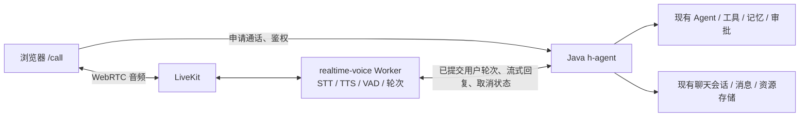

# h-agent 语音通话方案与 VoiceAgent 对比

日期：2026-09-10。代码基线：h-agent `249090d`，VoiceAgent `08a6a13`。本文是方案探索与建议，不代表已批准迁移或已完成联调。按现有 `/call` 的站内 AI 通话分析，真实手机号外呼另列边界。未使用真实密钥进行通话、性能或成本测试。

**结论：继续使用 STT → Agent → TTS，但把实时音频和轮次管理交给 LiveKit；在现有 `realtime-voice` 内推进，优先复用 Java Agent。借鉴 VoiceAgent 的语音适配器，不整库搬入货运外呼业务。**

STT 是语音转文字，TTS 是文字转语音。VoiceAgent 自身也是这条链路，LiveKit 并不替代 STT/TTS。因此这次选择有两个独立维度：音频由浏览器手工拼接还是 LiveKit 管理；对话由现有 Java Agent 还是 Python 内的新 Agent 执行。

**一、原方案与实际代码，必须分开看**

| 对象 | 原设计或当前实现 | 尚缺什么 / 需要注意什么 |
|---|---|---|
| 2026-06 原 `/call` 设计 | 浏览器识别，3 秒没有新增识别文字即提交；复用 Java chat SSE；按句 HTTP TTS；最终整条回复再合成保存 | 文档的 3 秒规则是按识别文本更新时间判断，不是音频 VAD；打断只停播放，原回复继续生成 |
| 当前 `/call` 代码 | 已有浏览器 SpeechRecognition、录音上传绑定、Java SSE、分句 TTS 和完整回复音频保存 | 实际是点击“开始录音/结束录音”提交；生成中禁止开始下一次录音；不能按设计文档宣称已实现自然打断 |
| h-agent `realtime-voice` | 已有 LiveKit Worker + Silero + STT/TTS + LangGraph LLMAdapter；图只有 START → assistant → END | 未接通浏览器 Token、用户/房间/会话关联、聊天持久化、Java 工具；不是可用成品 |
| 外部 VoiceAgent | 已有火山流式 ASR、Silero、独立文本 LLM、流式 TTS、货运 Prompt、Java 回调、录音逻辑 | 针对另一套外呼系统；不包含完整 Room 创建、拨号、Dispatch 调度业务，也未对接 h-agent |

依据：[原设计](/Users/huajiang/Desktop/h-agent/docs/superpowers/specs/2026-06-26-agent-call-design.md:23)、[当前提交录音逻辑](/Users/huajiang/Desktop/h-agent/frontend/app/call/page.tsx:703)、[按钮与禁用条件](/Users/huajiang/Desktop/h-agent/frontend/app/call/page.tsx:1019)、[realtime-voice 入口](/Users/huajiang/Desktop/h-agent/realtime-voice/src/realtime_voice/agent.py:37)、[图定义](/Users/huajiang/Desktop/h-agent/realtime-voice/src/realtime_voice/graph.py:20)、[项目对语音状态的说明](/Users/huajiang/Desktop/h-agent/README_zh.md:441)、[VoiceAgent README](/Users/huajiang/Desktop/ai_learn/VoiceAgent/README.md)。以上代码存在不等于端到端测试通过。

VoiceAgent 的 README 还存在配置漂移：文档主推 Qwen TTS，但 `config.py` 当前默认 `TTS_PROVIDER=huoshan`，工厂同时支持 `huoshan` 和 `dashscope`。应称为“火山 ASR + 可选火山/Qwen 流式 TTS”，不能把 README 的默认值当实际部署配置。本次未读取私有环境文件。[配置](/Users/huajiang/Desktop/ai_learn/VoiceAgent/src/livekit_agent/config.py:376)、[工厂](/Users/huajiang/Desktop/ai_learn/VoiceAgent/src/livekit_agent/tts/__init__.py:9)

**二、对继续开发最有影响的差别**

| 维度 | 浏览器识别 + HTTP TTS 原路线 | LiveKit 路线 | 对 h-agent 的判断 |
|---|---|---|---|
| 说话结束判定 | 原设计等 3 秒；当前手动结束 | VoiceAgent 配 VAD/STT 切轮、可配置端点检测 | 自然通话应采用服务端切轮；VAD 判断声音活动，不能独自理解语义是否说完 |
| 首次出声 | 当前需提交/上传录音、等待 Agent 文本成句、整句 TTS 返回，再播放 | 可并行处理输入音频，文本增量进入流式 TTS | LiveKit 路线具备更好的流水线条件；实际快多少必须测量 |
| 打断 | 原设计清播放队列但保留生成；当前界面生成中还禁用录音入口 | 框架提供轮次/播放打断机制 | 仍需把打断传到 Java；仅停止声音不等于旧业务运行已停止 |
| 语音供应商 | STT 依赖浏览器能力，TTS 实现固定 MiniMax HTTP | 独立 STT/TTS 适配器可替换 | 适合中文供应商选型，但不自动保证中文识别更准 |
| 既有 Agent | 直接使用 h-agent 的会话、工具、记忆和审批流程 | 外部 VoiceAgent 自己调用 LLM；现有 Python 图也是独立 LLM | 原样接入会形成第二套对话执行逻辑，需要明确共享边界 |
| 保存音频 | 分句试听后，又将整条助手文字合成一次存档 | 可从媒体路径录音或导出 | 有机会消除重复合成；必须明确保存“生成内容”还是“实际播出内容” |
| 部署 | 现有前后端基础上增加语音 API | 多出 RTC 服务、Worker、Token/调度和网络配置 | 初期运维工作增加，减少自行维护实时媒体状态的工作 |

当前 MiniMax 请求明确为 `stream=false`；前端先按标点或长度分段请求 preview，再对最终消息调用 message TTS。若整条文字既完成预览又完整保存，会重复进行对应文本的语音合成；不能在没有实际计费数据时直接断言总成本翻倍。[MiniMax 实现](/Users/huajiang/Desktop/h-agent/backend/src/main/java/com/h/backend/voice/infrastructure/tts/MiniMaxHttpTtsClient.java:42)、[分句](/Users/huajiang/Desktop/h-agent/frontend/lib/call-state.ts:10)、[预览与保存调用](/Users/huajiang/Desktop/h-agent/frontend/app/call/page.tsx:536)、[保存再次合成](/Users/huajiang/Desktop/h-agent/backend/src/main/java/com/h/backend/voice/application/VoiceTtsService.java:58)

浏览器 SpeechRecognition 的兼容性有限，部分浏览器依赖服务端识别，不能把它视为各端一致、可离线运行的本地 STT。[MDN](https://developer.mozilla.org/en-US/docs/Web/API/SpeechRecognition)

VoiceAgent 配置的 VAD 静默默认是 0.55 秒，并将额外 endpointing min_delay 设为 0，启用预生成和预合成。这只是配置，不是端到端延迟实测值；真正等待时间还涉及 ASR final、调度、LLM、TTS、网络和播放缓冲。Qwen `server_commit` 接收增量文本、由服务端决定合成时机，也不代表每个 token 都立即产生可听音频。[本地 session](/Users/huajiang/Desktop/ai_learn/VoiceAgent/src/livekit_agent/session.py:120)、[VAD](/Users/huajiang/Desktop/ai_learn/VoiceAgent/src/livekit_agent/vad/silero.py:7)、[Qwen 实现](/Users/huajiang/Desktop/ai_learn/VoiceAgent/src/livekit_agent/tts/qwen_realtime.py:23)、[阿里云事件协议](https://www.alibabacloud.com/help/en/model-studio/qwen-tts-realtime-client-events)

**三、VoiceAgent 值得借鉴和需要重新设计的部分**

值得借鉴：火山 ASR 的 LiveKit 事件适配、音频分块与热词配置、流式 TTS provider 工厂、VAD/切轮参数、连接预热与阶段耗时记录，以及 Python 与 Java 协作的接口边界。[ASR](/Users/huajiang/Desktop/ai_learn/VoiceAgent/src/livekit_agent/stt/huoshanASR.py)、[session](/Users/huajiang/Desktop/ai_learn/VoiceAgent/src/livekit_agent/session.py)、[TTS](/Users/huajiang/Desktop/ai_learn/VoiceAgent/src/livekit_agent/tts/__init__.py)

需要重新设计的四点：

1. **货运业务不能直接作为通用 Agent。** FreightAgent 将历史和订单相关 Prompt 重组后调用 LLM，Java bootstrap/turns/hangup 是另一套 ai-call-center 接口。它不会自动获得 h-agent 现有工具、知识库、Harness、记忆和审批能力。[FreightAgent](/Users/huajiang/Desktop/ai_learn/VoiceAgent/src/livekit_agent/freight/agent.py:98)、[协作接口说明](/Users/huajiang/Desktop/ai_learn/VoiceAgent/README.md:74)
2. **生成文字与已播内容要分开。** 当前 coordinator 在 LLM 解析完成时上报 AI 正文，并非以播放完成事件更新“用户听到哪儿”。被中断时，两者可能不一致。上报异常主要写日志，也需要为 h-agent 增加持久化重试和幂等语义。[coordinator](/Users/huajiang/Desktop/ai_learn/VoiceAgent/src/livekit_agent/acc/call_control.py:45)
3. **生成 PCM 录音不能视为实际通话原声。** 当前在 `tts_node` 复制合成帧，录音器按用户音频帧消费 TTS 队列，结束时还会冲刷剩余 TTS。它可能包含未播出的内容，缺少与客户端实际播放相对应的截断语义。语音回放若要代表通话过程，应改用合适的媒体录制路径并记录中断/播放时间；服务端录音仍不能证明终端扬声器确实发声。[TTS tee](/Users/huajiang/Desktop/ai_learn/VoiceAgent/src/livekit_agent/freight/agent.py:73)、[录音 finish](/Users/huajiang/Desktop/ai_learn/VoiceAgent/src/livekit_agent/recording/stereo_recorder.py:103)
4. **供应商 SDK 的内部扩展存在升级耦合。** Qwen 包装访问 `_AttemptState`、`_input_ch` 等内部成员，并替换 emitter 的 push 行为；应锁定并验证依赖组合，优先评估官方公开接口能否满足需求。[Qwen 包装](/Users/huajiang/Desktop/ai_learn/VoiceAgent/src/livekit_agent/tts/qwen_realtime.py:23)、[依赖声明](/Users/huajiang/Desktop/ai_learn/VoiceAgent/pyproject.toml:10)

**四、建议采用的结构**

这是建议结构，尚未实现。Java 继续掌握用户权限、会话和业务执行；Python 负责实时声音。Token 签发可以放 Java，也可以由鉴权后的 FastAPI 承接，避免让浏览器提交的 userId 或任意 sessionId 直接成为授权事实。浏览器不拿 LiveKit API Secret。

LiveKit 支持自定义 `llm_node`，可把 Java 流式正文适配为 LiveKit 可消费的文本，因此采用 LiveKit 不要求把 Java Agent 重写成 LangGraph。官方能力与版本核验见 [LiveKit 研究](/Users/huajiang/Desktop/h-agent/docs/research/2026-09-10-livekit-official-capabilities.md)。

现有 LangGraph 骨架可以保留为实验入口。第一版不建议同时扩展 Python 业务图、改造 Java Agent 和更换音频协议。只有当产品明确需要独立语音 Agent，或实测表明现有 Java Agent 的调度/编排成为主要延迟来源，再决定把哪些语音对话逻辑移到 Python；工具调用仍可复用 Java 业务接口。

桥接时需要先定义这些行为，不能只把 SSE 文本转发给 TTS：

- 以 `callId + turnId` 标识一轮，映射 `sessionId/agentId/messageId/runId`；重连、事件重试、ASR 多段 final 不能重复创建业务轮次。
- 只播用户可见正文；`reasoning` 不播，工具过程与 `action_required` 映射为适合语音的等待/确认提示。Java 保留审批权，语音确认不能自行绕开原规则。
- 用户插话时立即停止当前播放，并处理旧运行取消、并发许可释放和新轮次提交。不同 Java runtime 的取消能力要逐一核实：Harness 已注册 sink onCancel，普通 HAssistant streaming 路径没有同等显式取消桥接。断开 SSE 不应被假定为所有 Agent 都停止。
- 区分完整生成文字、估计已播文字、被打断标记与业务工具结果。LiveKit 内存历史和 Java 持久化历史须有明确的主从关系；不能让 Java 下一轮误认为用户听完了全部回复。
- 第一轮集成关闭会触发有副作用 Java 请求的预生成。VoiceAgent 的 preemptive generation 适合可取消/可丢弃的推理；直接投到现有 chat API 会提前写用户消息、创建 run，甚至调用工具。完成幂等、推测与正式提交隔离后再评估开启。

依据：[Java 事件终态](/Users/huajiang/Desktop/h-agent/backend/src/main/java/com/h/backend/chat/interfaces/web/ChatController.java:79)、[创建消息与 run](/Users/huajiang/Desktop/h-agent/backend/src/main/java/com/h/backend/chat/application/impl/ChatServiceImpl.java:391)、[Harness 取消](/Users/huajiang/Desktop/h-agent/backend/src/main/java/com/h/backend/chat/domain/agent/HarnessAgentExecutor.java:678)、[普通流式 executor](/Users/huajiang/Desktop/h-agent/backend/src/main/java/com/h/backend/chat/domain/agent/HAssistantStreamingExecutor.java:75)。

**五、候选路线的取舍**

| 路线 | 适合什么目标 | 当前建议 |
|---|---|---|
| 继续修旧浏览器 STT + HTTP TTS | 快速提供点击录音、生成后播报 | 可作过渡；对自然连续通话不作为主要投入方向 |
| LiveKit + Python 语音层 + Java Agent | 在原 h-agent 会话里自然说话，并保留业务能力 | 主选，集成重点是轮次、取消、持久化 |
| LiveKit + Python/LangGraph 独立 Agent | 独立语音产品或专用短流程 | 备选；需承担上下文和业务编排迁移，不因用了 LiveKit 就默认采用 |
| 自建 WebSocket 音频协议 + Java | 部署约束不允许引入 RTC，且场景很受限 | 可探索；需要自己维护采集、播放、缓冲、打断、重连和状态同步，当前没有证据值得放弃已有 LiveKit 骨架 |
| 原生 speech-to-speech 模型 | 优先探索语气、韵律和直接音频理解 | 可另做小实验；本次两个仓库主路线都是文本级联，尚无同条件实测支持主线迁移 |

这些是针对本项目的工程判断，不是框架性能排名。STT→文本会丢失部分声学信息，但文本链路便于复用既有 Agent、检索、工具、审计和供应商适配；当前项目优先级更支持继续级联路线。

**六、下一步最值得写的最小闭环**

先完成一个普通 Agent、一个已登录用户、一个现有 session 的站内语音闭环：申请通话 → 加入 LiveKit → 火山 ASR → Java 流式回复 → 一个流式 TTS → 字幕 → 用户插话 → 挂断回原聊天。ASR/TTS 可以借鉴 VoiceAgent，供应商先固定一套，避免同时比较所有组合。

实现顺序建议：

1. 先测语音底座：房间/Token/Worker/浏览器麦克风和播放，用无副作用短回复验证中文切轮和打断；接入现有 `realtime-voice`，不新开第三套语音服务。
2. 再桥接 Java 普通 Agent：明确提交、流式事件、取消和 session 并发约束；字幕和聊天消息一致，避免 Python 重复写入 Java 已生成的消息。
3. 再完成中断后的历史语义、录音资源保存、掉线重连，最后才扩展到工具、Harness 和审批。涉及较慢任务时先反馈状态，不能承诺一句话立即做完。

用同一组中文素材在真实浏览器和目标部署区域进行对照：短问句、带思考停顿的长句、数字/地址/专有词、纠正上一句、AI 说到一半插话、背景噪声、长工具调用及断网重连。分开记录最后一个语音帧、ASR final、LLM 首正文、TTS 首 PCM、客户端首个播放采样，以及插话后旧音频停止时间。供应商 TTFB 不能当用户听到声音的延迟。

可以先设探索门槛：简单无工具问答，用户停说到首音 p50 ≤ 1.5 秒、p95 ≤ 2.5 秒，插话到旧声音停止 p95 ≤ 500ms；这些是建议目标，不是测量结果，也不是 LiveKit 的性能承诺。达不到时根据阶段耗时定位，而不是先换整套架构。另记录识别关键字段错误、误切轮、误打断、重复消息、取消后旧任务继续执行、录音与字幕错位及各项真实用量。

如果 Java 模型/工具是主要慢点，先优化回复长度、模型、工具调用和等待反馈。若 ASR/TTS/网络是主要慢点，先优化供应商、地域、端点参数和缓冲。没有实测数据前，不给出“新方案快几倍”或每分钟成本结论。

真实手机号外呼是额外一层：需要号码/线路、SIP trunk、拨号与调度，并补齐接通/拒接/超时/挂断事件。VoiceAgent 中等待 SIP 接听的逻辑不等于这些基础设施都已提供。站内 WebRTC 通话无需为了未来外呼先接 SIP；详见 [LiveKit 官方能力与部署边界研究](/Users/huajiang/Desktop/h-agent/docs/research/2026-09-10-livekit-official-capabilities.md)。

本次仅分析本地源码、设计资料与官方文档，新增研究材料；没有修改实现、启动服务、拨打电话或运行真实音频基准测试。
