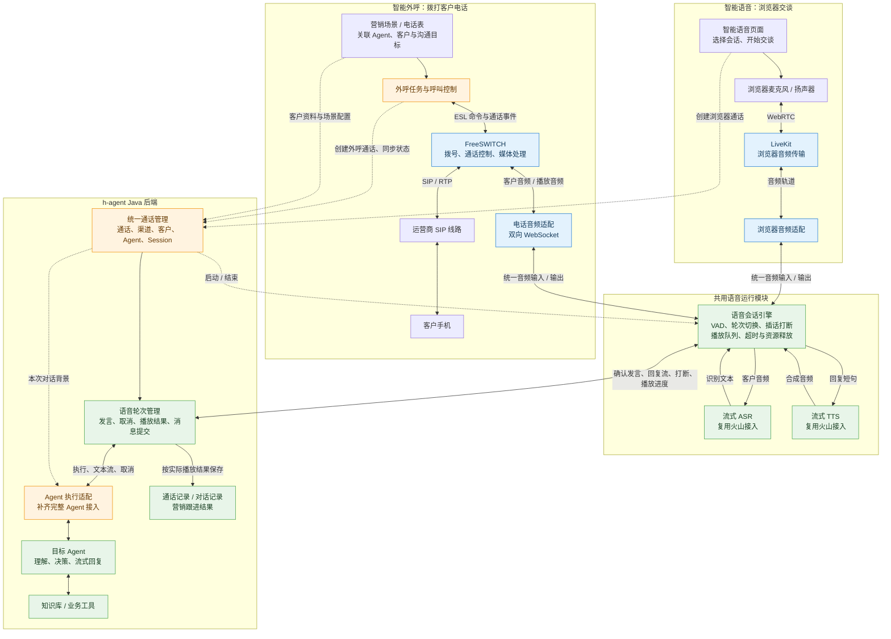

# 智能语音与智能外呼统一架构设计

日期：2026-09-11  
状态：建议设计，尚未实施或完成电话链路验证。  
文档性质：架构与产品能力设计，说明技术路线、模块职责、复用关系和取舍；不包含开发任务、实施顺序、接口清单、数据库迁移或部署操作。

## 1. 设计结论

智能语音和智能外呼采用不同的音频接入方式，共用语音运行核心和 h-agent 的 Agent 能力：

- **智能语音**：浏览器 → LiveKit → 浏览器音频适配 → 共用语音运行核心。
- **智能外呼**：客户手机 → 运营商 SIP 线路 → FreeSWITCH → 双向 WebSocket → 电话音频适配 → 共用语音运行核心。
- **共同大脑**：h-agent 根据绑定的 Agent 定义和本次通话背景，完成理解、知识查询、业务工具调用及回复生成。

本设计选择 FreeSWITCH WebSocket 作为外呼媒体入口，不将 LiveKit SIP 放入目标外呼链路。浏览器继续使用已有 LiveKit 传输能力。

建议对现有智能语音做适度结构调整，形成两个音频适配和一个语音运行核心。现有 ASR、TTS、语音轮次、播放结算和 Java 会话能力优先复用。完整 Agent 接入作为两种渠道的共同能力补齐。

## 2. 全景图

下图是目标架构，不能理解为所有模块均已实现。绿色表示共享能力，蓝色表示渠道适配，橙色表示新增或需要调整的能力。

图中的模块表示职责，不要求一一部署成独立进程。ASR 与 TTS 是现有语音提供方接入；h-agent Java 后端和 Python 语音运行进程的现有分工可以延续。

## 3. 需求背景与范围

用户已有营销场景的话术配置等人工操作，后续会加入需要外呼的电话表。这次的核心诉求是让营销场景关联 h-agent 的 Agent，使 Agent 与客户直接进行多轮语音对话。

智能语音和智能外呼均未上线，可以调整共享职责与通话模型。设计重点是语音与 Agent 链路，而非重新建设营销配置、CRM、复杂外呼调度或报表系统。

电话表是外呼对象来源；营销场景提供沟通目的和业务背景；Agent 负责对话决策。电话通道的建立、播放、打断及生命周期由确定的运行逻辑管理。

## 4. 当前实现与目标能力的区别

以下结论基于当前工作区代码阅读，不代表生产验证结果。

| 现有位置 | 已有能力 | 与目标设计的差距 |
| --- | --- | --- |
| `realtime-voice/src/realtime_voice/worker.py` | LiveKit 房间接入、火山 ASR/TTS、Silero VAD、轮次检测、回复流接收、打断与播放结算回传 | 房间分发、参与者身份、播放句柄和业务轮次集中在同一入口，需要分离渠道职责 |
| `backend/.../voice/application/VoiceCallModule.java` | 通话创建、Worker 认领与租约、状态管理、结束清理 | 直接依赖 LiveKit 房间和参与者，且仅支持已有 `standard-chat` 会话 |
| `backend/.../voice/application/VoiceTurnModule.java` | 发言入库、Agent Run 记录、取消、播放结果结算、有效对话同步 | 当前回复来源为 `VoiceReply`，还没有完整 Agent 执行能力 |
| `backend/.../voice/infrastructure/AnthropicVoiceReply.java` | 使用已配置模型进行可取消的流式生成 | 直接调用模型，明确不启用工具；不能等同于已复用完整 Harness/领域 Agent |
| `backend/.../chat/domain/agent/HarnessAgentExecutor.java` | Agent 流式执行、工具事件、运行状态和结果持久化 | 当前按聊天生成结果提交消息；语音需要保留播放后提交的语义 |

当前 Python 依赖固定为 `livekit-agents==1.6.9`。现有 Java 语音实现有单后端运行和进程重启后终止未完成通话的约束；引入 FreeSWITCH 不会自动消除这些限制。

用户已有营销配置尚未在本次检出的代码中定位到，因此其具体入口与字段不作为已核实事实。设计保留其能力和关联方式，不预设重建页面。

## 5. 模块职责与复用关系

### 5.1 两个音频适配

浏览器音频适配拥有 LiveKit 的房间、轨道、参与者和音频播放衔接；电话音频适配拥有 FreeSWITCH 媒体会话、WebSocket 音频流及对应播放控制。

两者对语音运行核心提供一致的能力：接收音频、发送音频、停止并清空播放、报告播放状态、通知通道关闭。音频格式转换、采样率和渠道缓冲在适配内部处理。

统一接口还必须表达身份、顺序和失败语义：播放结果属于哪次播报，停止后是否可能继续出现旧音频，连接关闭是否意味着仍有缓存未播放。只有方法名一致不足以保证可替换。

### 5.2 共用语音运行核心

核心负责听说过程：VAD、ASR 结果确认、轮次切换、Agent 回复消费、短句合成、播放队列、插话打断及通道资源释放。

ASR 的临时识别结果可用于展示或检测，但不应将每次中间变化都提交成新的业务发言。确认客户完成一轮表达后，才进入 Java 轮次管理。

语音运行核心不拥有营销名单和业务会话的持久化真相，也不自行运行另一套业务 Agent。

### 5.3 Java 通话与轮次管理

Java 拥有通话身份、渠道、所属用户、客户、Agent 绑定、Agent Session、轮次状态和有效对话记录。

浏览器断开与电话挂断转换成统一的生命周期事件，但保留原因差异。电话振铃、忙线、无人接听属于呼叫状态，不能简单等同于 LiveKit 参与者是否存在。

现有消息写入、取消、播报结算和幂等处理是重要复用资产。营销结果可以关联到同一通话，但通话接通、Agent 执行成功和业务转化是不同事实。

### 5.4 Agent 执行适配

浏览器智能语音采用“从当前会话开启”的绑定方式：点击会话中的“电话”后，后端根据实际 `sessionId` 解析原 Agent、定义绑定、审批策略与上下文，继续同一个 Agent Session，不再次选择 Agent 或复制聊天历史。从可交互的协作 Agent 子会话开启时，继续该子会话，不替换为父会话。此能力可先于外呼媒体接入实施，具体设计见[从当前会话开启智能语音](../design/2026-09-11-session-bound-voice-agent-design.md)。

Agent 根据选定定义、当前对话和本次业务背景进行推理，使用其被允许的知识与工具能力。语音通道只接收明确面向客户的回复文本；思考、工具日志和协作 Agent 的内部输出不进入 TTS。

现有营销话术可作为目标、开场白、业务事实和表达约束，不直接覆盖 Agent 的身份与工具权限。当前 Harness/领域 Agent 由其定义驱动，不将标准聊天的 `promptId` 当成通用 Agent 配置入口。

完整 Agent 接入需要协调生成、工具执行与播放后的消息提交。直接串接现有 `streamChat()` 不能保证这些语义：聊天执行器可能已持久化整段生成结果，语音侧却只播放了一部分。

## 6. 语音运行核心的技术选择

### 6.1 选择：优先复用现有流水线，分离媒体入口

现有 LiveKit Agents SDK 已承担语音流水线、VAD、打断和播报句柄等工作。建议优先保留这些能力，通过自定义音频输入输出适配 FreeSWITCH，而浏览器继续使用 RoomIO。

需要区分三个概念：

| 概念 | 本设计中的位置 |
| --- | --- |
| LiveKit Server / 房间媒体传输 | 浏览器语音继续使用 |
| LiveKit SIP | 不进入目标外呼链路 |
| LiveKit Agents SDK | 作为共用语音运行核心的优先复用基础，电话音频通过自定义 I/O 接入 |

官方当前源码存在自定义音频 I/O 及可选房间的接入位置。这支持上述设计方向，但不能直接证明项目固定版本、所选 FreeSWITCH 媒体模块以及现有播放结算能够原样组合。尤其不能将“创建自定义 RoomIO”误认为已经完成无房间的 FreeSWITCH 接入。[AgentSession 源码](https://github.com/livekit/agents/blob/main/livekit-agents/livekit/agents/voice/agent_session.py)

保留 SDK 是优先选择，不是已验证承诺。若其播放完成、打断或生命周期语义无法适配，则调整语音核心内部的相关实现；对 Java 的通话、轮次及有效消息语义保持一致。

### 6.2 FreeSWITCH 的控制与媒体分离

ESL 负责拨号、挂断、通话事件和播放控制等；双向 WebSocket 负责媒体交换。ESL 连接成功并不代表音频链路已经成立。[FreeSWITCH Event Socket](https://developer.signalwire.com/freeswitch/integration/event-socket/)

双向媒体需要明确选择支持音频抽取与回灌的模块。以 `mod_audio_stream` 为例，作者当前区分社区版与具备自动双向播放能力的商业版本，后者说明允许免费使用至 10 路并发。不能将仓库许可、社区版功能和双向版本条件混为一谈。本设计不锁定这一模块。[模块说明](https://github.com/amigniter/mod_audio_stream)

## 7. 对话与播放的一致性

### 7.1 会话归属

浏览器语音直接继续点击“电话”时所在的实际 Agent Session，由该会话决定 Agent 与上下文；挂断后回到原会话继续文字交流。外呼默认为每通电话建立独立 Agent Session，并绑定客户与 Agent 定义版本，通话中持续使用该会话。

同一客户的历史事实可以经明确授权的业务查询进入本次上下文，不把所有客户共用的运营人员聊天、用户长期记忆或全部工具权限直接带入电话。客户身份和平台账号身份分别保存，不能仅凭平台 `userId` 决定客户上下文。

同一 Agent Session 内的业务写入与轮次执行保持串行，不同通话可以并行。电话过程中若另有操作者向该会话发送消息，也要服从同一并发约束。

### 7.2 生成结果与播放结果

一轮回复至少包含三种不同事实：模型已生成、音频已送入播放通道、通道报告已播放。发送完成不能直接算作客户听完。

Java 根据最终播放结果提交对客户有效的回复。播放位置只能估计时明确标记估计；位置未知时保留未知，不将完整生成文本写成已完整播报。渠道播放回执也不代表客户一定理解了内容。

### 7.3 插话与取消

客户插话时，共用核心协调停止播放、清空待播内容、停止或隔离旧轮次生成和 TTS 输出，然后处理新的客户发言。迟到的音频、文本和回执必须能识别其所属轮次与播报，不能污染新轮次。

取消语音生成不等于撤销已经完成的业务工具动作。工具执行结果独立保存；客户没有听到确认，也不能导致业务动作自动再做一次。

### 7.4 挂断与异常

挂断结束音频流和新的对话输入，并使运行中的回复进入取消或收尾。媒体连接重建、Webhook 重复投递或状态恢复，不应盲目重放 Agent 请求和业务工具调用。

需要人工批准的工具继续遵守 Agent 的权限策略，不能因电话渠道没有聊天确认弹窗而自动批准。等待批准期间的可播回复、转人工或结束方式属于通话体验策略，应显式定义。

## 8. 方案取舍

| 方案 | 优点 | 代价 | 本次决定 |
| --- | --- | --- | --- |
| FreeSWITCH WebSocket + 共享语音核心 | 外呼通信与媒体控制明确；符合用户选择；两种语音场景仍能共用运行规则 | 需要双向媒体适配、播放进度对齐及渠道生命周期适配 | 采用 |
| LiveKit SIP + 现有 worker | 当前房间与 worker 复用较直接 | 引入 SIP 到房间桥接；实际线路兼容性需验证 | 保留为对照，不进入目标外呼链路 |
| 浏览器与外呼各维护一套完整语音流水线 | 两侧可独立演进 | 打断、结算、Agent 对接与错误处理长期重复 | 不选择 |
| 全部语音运行能力重新自研 | 实现可完全自行控制 | 放弃现有流水线复用，扩大尚未上线项目的维护范围 | 不作为当前选择 |

LiveKit SIP 官方提供外呼与第三方 SIP 接入，但当前兼容性验证列表主要为海外供应商，并明确列出不支持 SIP REGISTER。FreeSWITCH 路线也不意味着无需线路适配。本次选择依据是用户确定的外呼方向和项目维护结构，不依据未经证实的市场占有率。[LiveKit 电话能力与限制](https://docs.livekit.io/telephony/)

## 9. 设计成立所需的验证证据

本节描述架构尚待证实的假设，不构成实施计划或测试任务清单。

| 待验证事项 | 对设计的影响 |
| --- | --- |
| 项目固定 SDK 版本支持无房间的音频输入输出，且可替换当前房间分发入口 | 决定共用语音核心能保留多少现有 SDK 编排能力 |
| 所选 FreeSWITCH 媒体模块支持持续双向音频、停止和清空播放，并能提供足够的播放状态 | 决定电话适配能否满足打断和有效对话提交语义 |
| 线路的编码、采样率、网络与模块组合能够稳定互通 | 决定实际双向音频质量；不能把 8kHz 当成所有环节的固定格式 |
| 完整 Agent 执行允许语音侧控制有效消息提交，同时保留工具结果与运行记录 | 决定现有语音结算与 Agent 上下文是否能够一致 |
| 电话条件下 VAD、短句 TTS、Agent 首段输出和缓冲能够形成可接受的响应体验 | 决定是否需要调整核心内部策略；目前不承诺固定延迟或并发指标 |

两种渠道应能完成连续对话、可解释的插话处理、挂断收尾和真实业务工具调用，并能把结果关联到正确会话。这是目标能力描述，不代表已通过验证。

## 10. 代码与资料依据

- [现有语音 worker](/Users/huajiang/Desktop/h-agent/realtime-voice/src/realtime_voice/worker.py)
- [语音 worker 说明](/Users/huajiang/Desktop/h-agent/realtime-voice/README.md)
- [语音依赖版本](/Users/huajiang/Desktop/h-agent/realtime-voice/pyproject.toml)
- [Java 通话管理](/Users/huajiang/Desktop/h-agent/backend/src/main/java/com/h/backend/voice/application/VoiceCallModule.java)
- [Java 语音轮次管理](/Users/huajiang/Desktop/h-agent/backend/src/main/java/com/h/backend/voice/application/VoiceTurnModule.java)
- [当前模型回复实现](/Users/huajiang/Desktop/h-agent/backend/src/main/java/com/h/backend/voice/infrastructure/AnthropicVoiceReply.java)
- [Harness 执行器](/Users/huajiang/Desktop/h-agent/backend/src/main/java/com/h/backend/chat/domain/agent/HarnessAgentExecutor.java)
- [用户提供的级联外呼参考图](/Users/huajiang/Downloads/outbound_call_architecture.html)

外部能力与授权描述按 2026-09-11 查阅资料记录。参考图用于讨论技术路线，其“生产主流”“防封号”等标签不作为已核实的架构结论。
