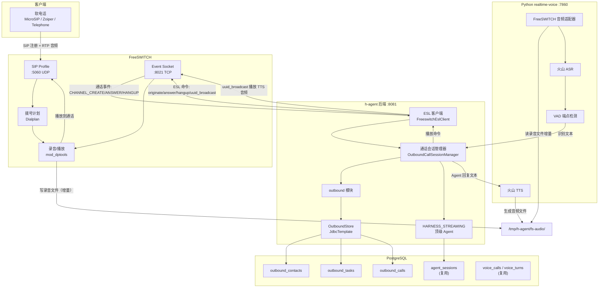
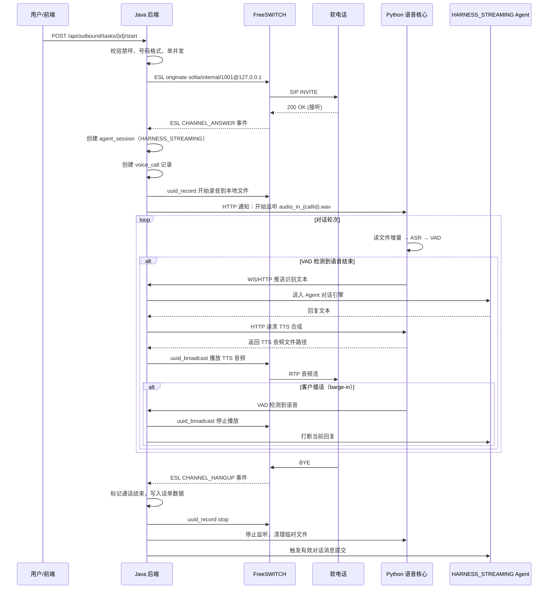

# 智能外呼系统实施规格

日期：2026-09-20
状态：设计修订版，尚未实施。首版基于 FreeSWITCH + 软电话做实时 Agent 对话。
文档性质：前后端模块设计、数据库 schema、API 契约、FreeSWITCH 呼叫控制与音频桥接、分步骤实施与验收标准。
关联：[统一架构设计](../specs/2026-09-11-unified-voice-and-outbound-architecture.md)、[会话绑定语音设计](../design/2026-09-11-session-bound-voice-agent-design.md)、[外呼管理页面设计](../design/2026-09-20-outbound-management-page-design.md)、[外呼调研](../research/2026-09-11-mainland-intelligent-outbound.md)。

## 1. 实施结论

首版闭环：**导入号码 → 选择 Agent、填写沟通目标 → 手动启动 → 软电话接听并与 Agent 多轮交谈、可插话 → 挂断 → 查看结果及有效对话**。

实时对话属于首版必需能力。仅能打通电话、播放固定录音或接收话单，不作为完成标准。

技术路线与范围控制：

- 呼叫控制使用 FreeSWITCH ESL（Event Socket Library），客户对话由现有 Java HARNESS_STREAMING 顶级 Agent 执行。
- 不部署容联云通讯，也不自建 SIP 网关到真实 PSTN。首版用软电话模拟客户，验证完整的实时对话链路。
- 音频桥接：FreeSWITCH 通话音频通过本地文件增量读写送入 Python 语音核心（ASR/VAD/TTS），Agent 回复音频通过 `uuid_broadcast` 播放回通话。
- 全局最多一通外呼（单并发）。一批最多 100 个号码，每个号码在一批中只拨打一次，无自动重试。重拨需用户另建任务；历史不覆盖。
- 三张新增业务表、两个页面视图。复用现有会话、语音通话、轮次和 Run 记录，不复制一套对话历史。
- 保留最小禁呼、号码格式校验、请求幂等、未知结果处理和挂断清理。

## 2. 代码现状与惯例

以下结论基于 2026-09-20 代码库阅读。

### 2.1 后端分层

现有 `voice` 模块是参照：

| 层 | 职责 | 代表类 |
| --- | --- | --- |
| `domain/` | 纯数据类，Lombok `@Data`，含业务判定方法 | `VoiceCall.java` |
| `application/` | 业务逻辑，编排 domain 和 infrastructure | `VoiceCallModule.java`、`VoiceTurnModule.java` |
| `infrastructure/` | 数据访问、外部网关、配置 | `VoiceStore.java`（JdbcTemplate）、`LiveKitGateway.java`、`VoiceProperties.java` |
| `interfaces/web/` | REST 控制器 | `VoiceCallController.java` |

数据库访问使用 `JdbcTemplate` + `NamedParameterJdbcTemplate`。事务通过 `TransactionTemplate` 显式管理。行级锁通过 `SELECT ... FOR UPDATE` 实现。

### 2.2 API 与配置惯例

所有 API 返回 `ApiResponse<T>` record（`code`/`message`/`data`），成功时 `code=0`。控制器使用 `@AuthenticationPrincipal AuthUserPrincipal` 获取用户身份，请求体用 `record` 定义并加 `@Valid` 验证。

配置通过 `@ConfigurationProperties(prefix = "xxx")` + `application.yml`，环境变量以 `${VAR:default}` 形式注入，`.env` 文件通过 `spring.config.import` 加载。

Flyway 迁移文件命名 `V{YYYYMMDD}_{NN}__{description}.sql`，放在 `classpath:db/migration`。数据库 schema 为 `skill_platform,public`。

### 2.3 前端惯例

Next.js App Router，页面在 `frontend/app/{route}/page.tsx`。API 客户端在 `frontend/lib/`，使用 `apiFetch<T>` 调用后端。类型定义与后端 record 字段名对齐（camelCase）。

### 2.4 现有基础设施

- 后端端口 8081，PostgreSQL 在 169.254.210.181:5432（h_agent_db），Redis 在 169.254.210.181:6379
- 前端开发端口 3000
- Python realtime-voice 服务已验证火山 ASR/TTS 可用
- LiveKit 浏览器语音链路已验证可用

## 3. 系统架构



### 3.1 通话流程时序



### 3.2 关键设计决策

**为什么用文件增量读写做音频桥接，而不是 RTP 直连：**

- FreeSWITCH 录音文件（`uuid_record`）持续写入本地磁盘，Python 以 `tail -f` 方式增量读取，送入 ASR。延迟约 200-500ms，对电话对话可接受。
- Agent 回复用 `uuid_broadcast` 播放 TTS 生成的 wav 文件。播放是串行的，但 VAD 检测到客户说话时可立即中断（通过 `uuid_broadcast` stop 或 `uuid_kill`）。
- 这种方案实现复杂度远低于 RTP 级别的媒体流桥接，不需要处理 SIP SDP 协商、编解码转换、Jitter Buffer 等问题。
- 单通电话 + 单并发的场景下，本地文件 I/O 完全不是瓶颈。

**为什么不复用 LiveKit 链路：**

LiveKit 是为浏览器 WebRTC 设计的，FreeSWITCH 走 SIP/RTP，两者信令协议和媒体传输都不同。强行桥接 LiveKit 和 FreeSWITCH 的媒体需要额外的网关（如 mod_verto 或 WebRTC 网关），复杂度更高。文件桥接虽然不优雅，但对首版验证最直接。

**后续演进路径：**

验证完对话逻辑和用户体验后，音频桥接可以逐步升级：文件增量 → WebSocket 音频流 → RTP 直连。上层业务逻辑（Agent、任务引擎、页面）不受影响。

## 4. 对象模型

### 4.1 外呼名单（outbound_contacts）

| 字段 | 类型 | 约束 | 说明 |
| --- | --- | --- | --- |
| id | varchar(64) | PK | UUID |
| user_id | bigint | NOT NULL | 所属用户 |
| phone | varchar(20) | NOT NULL | 号码（软电话场景下为分机号或 SIP URI） |
| name | varchar(64) | | 姓名 |
| variables | jsonb | DEFAULT '{}' | 业务变量键值对 |
| source | varchar(64) | NOT NULL | 来源 |
| consent_basis | varchar(256) | NOT NULL | 授权依据，空值不允许进入任务 |
| dnc | boolean | NOT NULL DEFAULT false | 禁呼标记 |
| dnc_reason | varchar(256) | | 禁呼原因 |
| dnc_at | timestamp | | 禁呼时间 |
| created_at | timestamp | NOT NULL DEFAULT NOW() | |
| updated_at | timestamp | NOT NULL DEFAULT NOW() | |

唯一索引：`(user_id, phone) WHERE dnc = false`。

跟进状态不单独存字段，由 `outbound_calls` 关联的最近通话结果推导。名单只保留禁呼这一个持久化状态标记，其余状态通过通话历史查询得到，避免数据冗余。

### 4.2 外呼任务（outbound_tasks）

| 字段 | 类型 | 约束 | 说明 |
| --- | --- | --- | --- |
| id | varchar(64) | PK | UUID |
| user_id | bigint | NOT NULL | |
| name | varchar(120) | NOT NULL | |
| agent_id | varchar(128) | NOT NULL | 绑定 Agent（首版固定为 HARNESS_STREAMING 顶级 Agent） |
| scenario_text | text | | 沟通目标 / 业务背景，作为 Agent system prompt 的一部分 |
| contact_ids | text[] | NOT NULL DEFAULT '{}' | 名单条目 ID 列表（一批最多 100 个） |
| status | varchar(32) | NOT NULL DEFAULT 'DRAFT' | DRAFT / RUNNING / COMPLETED / TERMINATED |
| total_count | int | NOT NULL DEFAULT 0 | 号码总数 |
| completed_count | int | NOT NULL DEFAULT 0 | 已完成数（含接通、未接、失败） |
| connected_count | int | NOT NULL DEFAULT 0 | 接通数 |
| started_at | timestamp | | |
| finished_at | timestamp | | |
| created_at | timestamp | NOT NULL DEFAULT NOW() | |
| updated_at | timestamp | NOT NULL DEFAULT NOW() | |

不单独建 `outbound_task_items` 表。一批 100 个号码且每号只打一次的场景下，`contact_ids` 数组足够表达，拨打进度通过 `outbound_calls` 表的记录数统计。减少一张表和对应的快照逻辑，降低复杂度。

### 4.3 单次通话（outbound_calls）

每次拨打一行，不覆盖历史。

| 字段 | 类型 | 约束 | 说明 |
| --- | --- | --- | --- |
| id | varchar(64) | PK | UUID，内部通话标识 |
| task_id | varchar(64) | NOT NULL FK → outbound_tasks | |
| contact_id | varchar(64) | NOT NULL FK → outbound_contacts | |
| user_id | bigint | NOT NULL | |
| phone | varchar(20) | NOT NULL | 快照号码 |
| agent_session_id | varchar(64) | | 关联 Agent Session（复用 agent_sessions 表） |
| voice_call_id | varchar(64) | | 关联语音通话 ID（复用 voice_calls 表） |
| freeswitch_uuid | varchar(64) | | FreeSWITCH Channel UUID |
| status | varchar(32) | NOT NULL DEFAULT 'INITIATED' | INITIATED / RINGING / CONNECTED / HANGUP / FAILED / NO_ANSWER / BUSY |
| direction | varchar(16) | NOT NULL DEFAULT 'OUTBOUND' | |
| duration_sec | int | | 通话时长（秒） |
| recording_path | varchar(512) | | 录音文件本地路径 |
| intent_label | varchar(32) | | 意向判定（由 Agent 对话结束时产出） |
| intent_overridden | boolean | NOT NULL DEFAULT false | 人工修正标记 |
| hangup_cause | varchar(64) | | 挂断原因（FreeSWITCH hangup_cause） |
| started_at | timestamp | NOT NULL DEFAULT NOW() | |
| connected_at | timestamp | | |
| ended_at | timestamp | | |
| created_at | timestamp | NOT NULL DEFAULT NOW() | |
| updated_at | timestamp | NOT NULL DEFAULT NOW() | |

索引：`(task_id, status)` 任务进度统计；`(freeswitch_uuid)` ESL 事件幂等定位；`(agent_session_id)` 关联对话历史。

对话历史（转写、轮次、Agent 消息）不复刻，直接通过 `agent_session_id` 和 `voice_call_id` 查现有表。通话详情页面展示的转写、有效对话等数据，从 `agent_sessions` → `voice_calls` → `voice_turns` 关联查询得到。

## 5. 状态机

### 5.1 任务状态

```
DRAFT → RUNNING → COMPLETED
           ↘ TERMINATED
```

去掉 PENDING 和 PAUSED。个人项目单并发，启动即执行，不需要排队和暂停。完成条件：所有号码均已拨打（`completed_count = total_count`）。

### 5.2 通话状态

```
INITIATED → RINGING → CONNECTED → HANGUP
                     ↘ NO_ANSWER
                     ↘ BUSY
                     ↘ FAILED
```

状态由 FreeSWITCH ESL 事件驱动：

| ESL 事件 | 状态转换 | 说明 |
| --- | --- | --- |
| `CHANNEL_CREATE` | → RINGING | 发起外呼，FreeSWITCH 收到创建响应 |
| `CHANNEL_ANSWER` | → CONNECTED | 对方接听 |
| `CHANNEL_HANGUP` | → HANGUP | 正常挂断 |
| `CHANNEL_HANGUP` + cause=NO_ANSWER | → NO_ANSWER | 无人接听 |
| `CHANNEL_HANGUP` + cause=USER_BUSY | → BUSY | 占线 |
| `CHANNEL_HANGUP` + cause 其他异常 | → FAILED | 其他失败 |

`hangup_cause` 字段保存 FreeSWITCH 原始挂断原因字符串，便于排查问题。

## 6. 后端模块设计

### 6.1 包结构

```
com.h.backend.outbound
├── domain/
│   ├── OutboundContact.java
│   ├── OutboundTask.java
│   └── OutboundCall.java
├── application/
│   ├── OutboundContactModule.java    // 名单导入、查询、禁呼
│   ├── OutboundTaskModule.java        // 任务创建、启动、终止、进度
│   ├── OutboundCallModule.java        // 通话记录查询、意向修正
│   └── OutboundCallSessionManager.java // 通话会话管理：ESL 事件分发、Agent 对话编排
├── infrastructure/
│   ├── OutboundStore.java             // JdbcTemplate 数据访问
│   ├── OutboundProperties.java        // @ConfigurationProperties(prefix = "outbound")
│   ├── FreeswitchEslClient.java       // FreeSWITCH ESL 客户端封装
│   ├── FreeswitchAudioBridge.java     // 音频桥接：录音监听 + TTS 播放协调
│   └── VoiceServiceClient.java        // Python 语音服务 HTTP 客户端
└── interfaces/web/
    ├── OutboundContactController.java
    ├── OutboundTaskController.java
    └── OutboundCallController.java
```

### 6.2 FreeswitchEslClient

封装 FreeSWITCH ESL 连接与命令调用。使用 Java ESL 客户端库（`org.freeswitch.esl.client` 或直接用 Netty 实现简单 ESL 协议）。

核心方法：

| 方法 | ESL 命令 | 用途 |
| --- | --- | --- |
| `originate(callId, destination, dialplanExt)` | `originate {options} {destination} {dialplan}` | 发起外呼 |
| `hangup(callId)` | `uuid_kill {uuid}` | 挂断通话 |
| `playAudio(callId, filePath)` | `uuid_broadcast {uuid} {filePath}` | 播放音频到通话 |
| `stopPlayback(callId)` | `uuid_broadcast {uuid} stop` | 停止播放（用于插话打断） |
| `startRecording(callId, filePath)` | `uuid_record {uuid} start {filePath}` | 开始录音 |
| `stopRecording(callId)` | `uuid_record {uuid} stop {filePath}` | 停止录音 |
| `getVar(callId, varName)` | `uuid_getvar {uuid} {var}` | 获取通道变量 |
| `setVar(callId, varName, value)` | `uuid_setvar {uuid} {var} {val}` | 设置通道变量 |

连接方式：入站 ESL 模式，Java 后端作为 client 连接到 FreeSWITCH 的 `event_socket.conf.xml` 配置的 8021 端口。启动时建立长连接，订阅 `CHANNEL_CREATE`、`CHANNEL_ANSWER`、`CHANNEL_HANGUP`、`DTMF` 等事件。

事件处理通过回调注册：`FreeswitchEslClient.onEvent(eventName, handler)`，`OutboundCallSessionManager` 注册处理器。

### 6.3 OutboundCallSessionManager

通话会话管理器是核心编排类，每通电话一个 `CallSession` 实例，维护通话生命周期内的所有状态。

启动通话流程：

1. 接收 `OutboundTaskModule` 发来的拨打请求
2. 校验单并发全局锁（Redis key `outbound:active_call`），获取失败则排队
3. 校验禁呼：查 `outbound_contacts.dnc = true`，命中则直接标记 FAILED + DNC_SKIP 原因
4. 校验号码格式：正则验证（软电话分机号 10xx / 真实手机号 1xxxxxxxxxx）
5. 创建 `OutboundCall` 记录，status = INITIATED
6. 调用 `FreeswitchEslClient.originate()` 发起呼叫
7. 更新 status = RINGING，记录 `freeswitch_uuid`

ESL 事件处理：

- **CHANNEL_ANSWER**：更新 status = CONNECTED，记录 `connected_at`
  - 启动录音：`startRecording(callId, "/tmp/h-agent/fs-audio/in_{callId}.wav")`
  - 创建 Agent Session（HARNESS_STREAMING 模式，system prompt 含 scenario_text）
  - 创建 voice_call 记录（复用现有 `VoiceCallModule`）
  - 通知 Python 语音核心开始监听录音文件
  - 发送欢迎语（TTS 合成 + playAudio）
- **CHANNEL_HANGUP**：更新 status 和 hangup_cause，记录 `ended_at`、`duration_sec`
  - 停止录音
  - 通知 Python 停止监听
  - 结束 Agent Session，提交有效对话
  - 释放全局并发锁
  - 更新任务进度（completed_count++，如果是接通则 connected_count++）
  - 触发任务下一个号码的拨打

### 6.4 对话循环（Agent Turn 编排）

`OutboundCallSessionManager` 管理每通电话的对话轮次：

1. Python 语音核心通过 VAD 检测到一段客户语音结束，将识别文本通过 HTTP POST 推送到后端
2. 后端将文本送入 HARNESS_STREAMING Agent 的对话引擎（`AgentSession` + harness stream）
3. Agent 产生回复文本
4. 后端调用 Python TTS 接口合成音频（wav 文件）
5. 后端调用 `FreeswitchEslClient.playAudio()` 播放回复
6. 播放期间持续监听 VAD 事件，若检测到客户说话（barge-in）：
   - 调用 `stopPlayback()` 打断当前播放
   - 通知 Agent 当前回复被打断
   - 等待下一段完整语音

播放结算与有效消息提交的语义一致性：Agent 回复播放完成后才将该回复消息标记为已提交；被打断的回复不提交为有效消息。

### 6.5 VoiceServiceClient

Python 语音服务 HTTP 客户端，封装三个接口：

| 方法 | Python 端点 | 用途 |
| --- | --- | --- |
| `startListening(callId, audioPath)` | `POST /outbound/listen` | 通知 Python 开始监听指定录音文件 |
| `stopListening(callId)` | `POST /outbound/stop` | 停止监听 |
| `synthesize(callId, text)` | `POST /outbound/tts` | TTS 合成，返回音频文件路径 |

Python 端的识别结果通过 `POST /api/outbound/calls/{id}/transcript` 推送到 Java 后端（见 §9.4）。

### 6.6 任务调度与单并发

全局单并发通过 Redis 分布式锁控制：`SET outbound:active_call {taskId}:{callId} NX EX 3600`。任务启动时，从 `contact_ids` 中逐个取出号码拨打，上一通结束后自动开始下一通。

任务调度不使用 `@Scheduled` 定时轮询，改为**事件驱动**：通话结束（CHANNEL_HANGUP 事件）时触发下一个号码的拨打。减少不必要的数据库轮询，响应更及时。

任务启动后立即开始第一通拨打。若当前已有进行中的通话，则新任务等待（不排队，直接返回"系统繁忙"，首版不做任务队列）。

### 6.7 号码格式校验

导入名单时校验号码格式：
- 软电话分机号：`^10\d{2}$`（1000-1099）
- 真实手机号：`^1[3-9]\d{9}$`
- SIP URI：`^sip:.+@.+$`（预留）

任务启动时再次校验（避免导入后格式规则变更）。不做号码归属地查询，首版不引入第三方号码归属 API。

### 6.8 挂断清理

通话结束后必须执行的清理动作：
1. 停止录音（`uuid_record stop`）
2. 停止 Python 监听
3. 释放 Redis 并发锁
4. 关闭 Agent Session
5. 更新通话终态
6. 触发下一通拨打（如任务未完成）

清理逻辑放在 `finally` 块中，确保即使异常也能释放锁和资源。同时有一个兜底的定时检查：每 60 秒扫描 `status IN ('INITIATED','RINGING','CONNECTED')` 且 `updated_at < NOW() - INTERVAL '5 minutes'` 的通话，强制标记为 FAILED 并清理资源。

## 7. Python 语音核心扩展

### 7.1 新增模块

在 `realtime-voice/` 下新增 `outbound/` 目录：

```
realtime-voice/
├── outbound/
│   ├── __init__.py
│   ├── main.py              # FastAPI 子应用，挂载到 /outbound
│   ├── audio_listener.py    # 录音文件增量读取器
│   ├── vad_processor.py     # VAD + ASR 处理
│   ├── tts_service.py       # TTS 合成封装
│   └── session_manager.py   # 通话会话管理（Python 侧）
```

### 7.2 音频监听（audio_listener.py）

使用 `tail -f` 风格的增量文件读取：

1. 以二进制方式打开 wav 文件
2. 跳过 WAV header（44 字节）
3. 每 50ms 读取一次新增数据
4. 将 PCM 数据分块送入 VAD + ASR 流水线
5. 维护读指针位置，避免重复读取

文件格式：16kHz 采样率、16bit 单声道 PCM WAV（与火山 ASR 要求一致）。FreeSWITCH 录音参数通过 `uuid_record` 命令指定。

### 7.3 VAD 与 ASR 处理（vad_processor.py）

复用现有 VAD 和 ASR 模块：

- 输入：PCM 音频块（16kHz, 16bit, mono）
- VAD 检测语音起点和终点
- 检测到一段完整语音后，调用火山 ASR 识别
- 识别结果通过 HTTP POST 推送到 Java 后端：`POST /api/outbound/calls/{callId}/transcript`
- 请求体：`{"text": "...", "duration_ms": 1500, "is_final": true}`

### 7.4 TTS 合成（tts_service.py）

复用现有火山 TTS：

- 接收 Java 后端的 TTS 请求：`POST /outbound/tts`
- 调用火山 TTS WebSocket 接口合成音频
- 保存为 wav 文件到 `/tmp/h-agent/fs-audio/out_{callId}_{seq}.wav`
- 返回文件路径

### 7.5 会话管理（session_manager.py）

维护活跃通话列表，每通电话对应：
- `audio_path`: 录音文件路径
- `listener_thread`: 监听线程
- `vad_state`: VAD 状态机
- `call_id`: 通话 ID

### 7.6 FastAPI 端点

| 方法 | 路径 | 说明 |
| --- | --- | --- |
| POST | `/outbound/listen` | 开始监听指定通话的录音文件 |
| POST | `/outbound/stop` | 停止监听 |
| POST | `/outbound/tts` | TTS 合成，返回音频文件路径 |

## 8. FreeSWITCH 配置

### 8.1 安装

macOS 安装：

```bash
brew install freeswitch
```

或使用 Docker（推荐，隔离性好）：

```bash
docker run -d --name freeswitch \
  -p 5060:5060/udp \
  -p 5060:5060/tcp \
  -p 8021:8021 \
  -p 16384-16394:16384-16394/udp \
  -v /tmp/h-agent/fs-audio:/tmp/h-agent/fs-audio \
  safarov/freeswitch
```

录音文件目录挂载到宿主机，Python 和 FreeSWITCH 共享。

### 8.2 核心配置文件

**`event_socket.conf.xml`** — 启用 ESL：

```xml
<configuration name="event_socket.conf" description="Socket Client">
  <settings>
    <param name="nat-map" value="false"/>
    <param name="listen-ip" value="0.0.0.0"/>
    <param name="listen-port" value="8021"/>
    <param name="password" value="ClueCon"/>
    <param name="apply-inbound-acl" value="loopback.auto"/>
  </settings>
</configuration>
```

**`sip_profiles/internal.xml`** — SIP 配置：

```xml
<profile name="internal">
  <settings>
    <param name="sip-ip" value="$${local_ip_v4}"/>
    <param name="sip-port" value="5060"/>
    <param name="rtp-ip" value="$${local_ip_v4}"/>
    <param name="rtp-port-range" value="16384-16394"/>
    <param name="codec-prefs" value="PCMU,PCMA"/>
  </settings>
</profile>
```

使用 PCMU/PCMA（G.711）编码，与文件录音格式兼容，避免编解码转换。

**`directory/default/1000.xml`** — 软电话分机账号（示例）：

```xml
<user id="1000">
  <params>
    <param name="password" value="1234"/>
  </params>
  <variables>
    <variable name="user_context" value="default"/>
  </variables>
</user>
```

创建 10 个分机（1000-1009）供测试。

**`dialplan/default/outbound.xml`** — 拨号计划：

```xml
<extension name="outbound-agent">
  <condition field="destination_number" expression="^agent_(\w+)$">
    <action application="answer"/>
    <action application="set" data="call_id=$1"/>
    <action application="set" data="recording_fifo=/tmp/h-agent/fs-audio/in_$1.wav"/>
    <action application="uuid_record" data="${uuid} start /tmp/h-agent/fs-audio/in_$1.wav"/>
  </condition>
</extension>
```

这是呼入拨号计划（软电话呼入时触发）。外呼场景下，录音通过 Java 端的 `uuid_record` 命令启动，不依赖拨号计划。

### 8.3 软电话配置

以 Mac 上的 Telephone.app 为例：

- 服务器：`127.0.0.1`（或 Docker 宿主机 IP）
- 端口：`5060`
- 用户名：`1000`
- 密码：`1234`
- 传输方式：UDP

注册成功后，可以用另一个分机号（如 `1001`）互相拨打测试。

## 9. 数据库迁移

文件：`V20260920_01__create_outbound_tables.sql`

```sql
-- 外呼名单
CREATE TABLE IF NOT EXISTS outbound_contacts (
    id VARCHAR(64) PRIMARY KEY,
    user_id BIGINT NOT NULL,
    phone VARCHAR(20) NOT NULL,
    name VARCHAR(64),
    variables JSONB DEFAULT '{}',
    source VARCHAR(64) NOT NULL,
    consent_basis VARCHAR(256) NOT NULL,
    dnc BOOLEAN NOT NULL DEFAULT FALSE,
    dnc_reason VARCHAR(256),
    dnc_at TIMESTAMP,
    created_at TIMESTAMP NOT NULL DEFAULT NOW(),
    updated_at TIMESTAMP NOT NULL DEFAULT NOW()
);

CREATE UNIQUE INDEX IF NOT EXISTS idx_outbound_contacts_user_phone
    ON outbound_contacts(user_id, phone) WHERE dnc = FALSE;

CREATE INDEX IF NOT EXISTS idx_outbound_contacts_owner
    ON outbound_contacts(user_id, created_at DESC);

-- 外呼任务
CREATE TABLE IF NOT EXISTS outbound_tasks (
    id VARCHAR(64) PRIMARY KEY,
    user_id BIGINT NOT NULL,
    name VARCHAR(120) NOT NULL,
    agent_id VARCHAR(128) NOT NULL,
    scenario_text TEXT,
    contact_ids TEXT[] NOT NULL DEFAULT '{}',
    status VARCHAR(32) NOT NULL DEFAULT 'DRAFT',
    total_count INT NOT NULL DEFAULT 0,
    completed_count INT NOT NULL DEFAULT 0,
    connected_count INT NOT NULL DEFAULT 0,
    started_at TIMESTAMP,
    finished_at TIMESTAMP,
    created_at TIMESTAMP NOT NULL DEFAULT NOW(),
    updated_at TIMESTAMP NOT NULL DEFAULT NOW()
);

CREATE INDEX IF NOT EXISTS idx_outbound_tasks_owner
    ON outbound_tasks(user_id, created_at DESC);

CREATE INDEX IF NOT EXISTS idx_outbound_tasks_running
    ON outbound_tasks(status) WHERE status = 'RUNNING';

-- 单次通话
CREATE TABLE IF NOT EXISTS outbound_calls (
    id VARCHAR(64) PRIMARY KEY,
    task_id VARCHAR(64) NOT NULL REFERENCES outbound_tasks(id),
    contact_id VARCHAR(64) NOT NULL REFERENCES outbound_contacts(id),
    user_id BIGINT NOT NULL,
    phone VARCHAR(20) NOT NULL,
    agent_session_id VARCHAR(64),
    voice_call_id VARCHAR(64),
    freeswitch_uuid VARCHAR(64),
    status VARCHAR(32) NOT NULL DEFAULT 'INITIATED',
    direction VARCHAR(16) NOT NULL DEFAULT 'OUTBOUND',
    duration_sec INT,
    recording_path VARCHAR(512),
    intent_label VARCHAR(32),
    intent_overridden BOOLEAN NOT NULL DEFAULT FALSE,
    hangup_cause VARCHAR(64),
    started_at TIMESTAMP NOT NULL DEFAULT NOW(),
    connected_at TIMESTAMP,
    ended_at TIMESTAMP,
    created_at TIMESTAMP NOT NULL DEFAULT NOW(),
    updated_at TIMESTAMP NOT NULL DEFAULT NOW()
);

CREATE INDEX IF NOT EXISTS idx_outbound_calls_task
    ON outbound_calls(task_id, started_at DESC);

CREATE INDEX IF NOT EXISTS idx_outbound_calls_fs_uuid
    ON outbound_calls(freeswitch_uuid);

CREATE INDEX IF NOT EXISTS idx_outbound_calls_agent_session
    ON outbound_calls(agent_session_id);

CREATE INDEX IF NOT EXISTS idx_outbound_calls_active
    ON outbound_calls(status, updated_at)
    WHERE status IN ('INITIATED', 'RINGING', 'CONNECTED');
```

## 10. 配置

### 10.1 application.yml 新增

```yaml
outbound:
  enabled: ${OUTBOUND_ENABLED:false}
  freeswitch:
    host: ${FREESWITCH_HOST:127.0.0.1}
    port: ${FREESWITCH_PORT:8021}
    password: ${FREESWITCH_PASSWORD:ClueCon}
    dialplan-context: ${FREESWITCH_DIALPLAN_CONTEXT:default}
    originate-timeout: ${FREESWITCH_ORIGINATE_TIMEOUT:30s}
    audio-dir: ${FREESWITCH_AUDIO_DIR:/tmp/h-agent/fs-audio}
    max-call-seconds: ${FREESWITCH_MAX_CALL_SECONDS:300}
  voice-service:
    base-url: ${VOICE_SERVICE_BASE_URL:http://127.0.0.1:7860}
    connect-timeout: ${VOICE_SERVICE_CONNECT_TIMEOUT:5s}
    read-timeout: ${VOICE_SERVICE_READ_TIMEOUT:30s}
  single-concurrent-lock:
    key: ${OUTBOUND_LOCK_KEY:outbound:active_call}
    ttl: ${OUTBOUND_LOCK_TTL:3600s}
  task:
    max-batch-size: ${OUTBOUND_MAX_BATCH_SIZE:100}
    stale-call-check-interval: ${OUTBOUND_STALE_CALL_CHECK_INTERVAL:60s}
    stale-call-threshold: ${OUTBOUND_STALE_CALL_THRESHOLD:5m}
```

### 10.2 .env 新增

```env
OUTBOUND_ENABLED=true
FREESWITCH_HOST=127.0.0.1
FREESWITCH_PORT=8021
FREESWITCH_PASSWORD=ClueCon
FREESWITCH_AUDIO_DIR=/tmp/h-agent/fs-audio
VOICE_SERVICE_BASE_URL=http://127.0.0.1:7860
```

### 10.3 Python 侧配置

在 `realtime-voice/.env` 新增：

```env
OUTBOUND_ENABLED=true
OUTBOUND_BACKEND_URL=http://127.0.0.1:8081
OUTBOUND_AUDIO_DIR=/tmp/h-agent/fs-audio
OUTBOUND_ASR_SAMPLE_RATE=16000
```

## 11. API 契约

所有接口前缀 `/api/outbound`，除语音服务回调外均需登录鉴权。

### 11.1 名单接口

| 方法 | 路径 | 说明 |
| --- | --- | --- |
| POST | `/api/outbound/contacts/import` | 导入名单（JSON 数组） |
| GET | `/api/outbound/contacts` | 分页查询，支持按禁呼筛选 |
| PUT | `/api/outbound/contacts/{id}/dnc` | 标记禁呼 |
| DELETE | `/api/outbound/contacts/{id}` | 删除名单条目 |

导入请求体：

```java
public record ImportContacts(
    @NotBlank String source,
    @NotBlank String consentBasis,
    @NotEmpty List<ContactInput> contacts
) {}

public record ContactInput(
    @NotBlank String phone,
    String name,
    Map<String, String> variables
) {}
```

导入时校验：`contacts.size() <= 100`（单批上限），每个 `phone` 通过格式校验（号码格式正则，允许软电话分机号）。

### 11.2 任务接口

| 方法 | 路径 | 说明 |
| --- | --- | --- |
| POST | `/api/outbound/tasks` | 创建任务 |
| GET | `/api/outbound/tasks` | 列表，支持按状态筛选 |
| GET | `/api/outbound/tasks/{id}` | 详情（含进度统计和通话列表） |
| POST | `/api/outbound/tasks/{id}/start` | 启动任务 |
| POST | `/api/outbound/tasks/{id}/terminate` | 终止任务 |

创建请求体：

```java
public record CreateTask(
    @NotBlank String name,
    @NotBlank String agentId,
    String scenarioText,
    @NotEmpty List<String> contactIds
) {}
```

`contactIds` 来自名单，最多 100 个。`agentId` 首版固定为 HARNESS_STREAMING 顶级 Agent ID，前端选择器只展示通过电话能力验证的 Agent。

### 11.3 通话接口

| 方法 | 路径 | 说明 |
| --- | --- | --- |
| GET | `/api/outbound/calls` | 通话列表，支持按任务、状态、时间筛选 |
| GET | `/api/outbound/calls/{id}` | 通话详情：基本信息 + 录音 + 转写（关联 voice_turns）+ 意向 |
| PUT | `/api/outbound/calls/{id}/intent` | 修正意向标签 |

通话详情中的转写和对话历史，通过 `agent_session_id` 关联查询 `voice_turns` 和 Agent 消息表得到，不额外存储。

### 11.4 语音服务回调（内部）

| 方法 | 路径 | 说明 |
| --- | --- | --- |
| POST | `/api/outbound/calls/{id}/transcript` | Python 推送识别结果 |
| POST | `/api/outbound/calls/{id}/vad-event` | Python 推送 VAD 事件（用于 barge-in） |

这两个端点由 Python 语音服务调用，使用内部 token 鉴权（配置 `voice-service.api-key`，请求头 `X-Internal-Key`），不走用户登录鉴权。

```java
public record TranscriptInput(
    @NotBlank String text,
    @NotNull Long durationMs,
    @NotNull Boolean isFinal
) {}

public record VadEventInput(
    @NotBlank String eventType,  // SPEECH_START / SPEECH_END
    @NotNull Long timestampMs
) {}
```

## 12. 前端页面设计

### 12.1 路由与文件

| 文件 | 用途 |
| --- | --- |
| `frontend/app/outbound/page.tsx` | 外呼管理主页面 |
| `frontend/lib/outbound.ts` | API 客户端 |

从 `/me` 页面增加入口链接（与 automations 一致）。

### 12.2 页面视图

单页面、两个 tab，顶部概览条。

概览条：今日拨打数、接通率、进行中任务数。数据来自任务列表聚合。

**任务 tab**（默认）：

- 任务卡片列表：名称、Agent、进度（已呼/总数）、接通数、状态徽章
- 创建按钮：弹出对话框
  - 步骤 1：填写任务名称、选择 Agent（下拉，仅展示通过电话验证的 Agent）
  - 步骤 2：填写沟通目标（textarea，作为 Agent 的 scenario_text）
  - 步骤 3：选择名单条目（复选框列表，最多 100 个，显示已选计数）
- 操作：启动、终止、查看详情
- 任务详情抽屉：
  - 基本信息（名称、Agent、沟通目标、状态、进度）
  - 号码列表（号码、姓名、状态、通话时长）
  - 通话记录时间线（时间、号码、状态、时长、意向）

**通话记录 tab**：

- 列表：时间、号码、任务名、状态、时长、意向标签
- 详情抽屉：
  - 基本信息（号码、任务、状态、时间、时长、挂断原因）
  - 录音播放器（播放本地录音文件）
  - 对话转写（左右气泡，关联 voice_turns）
  - 意向标签（可下拉修改，留痕 intent_overridden）
- 筛选：按任务、状态、时间范围

### 12.3 API 客户端

`frontend/lib/outbound.ts`：

```typescript
import { apiFetch } from "./http";

export type OutboundContact = {
  id: string;
  phone: string;
  name: string | null;
  variables: Record<string, string>;
  source: string;
  consentBasis: string;
  dnc: boolean;
  createdAt: string;
  updatedAt: string;
};

export type OutboundTask = {
  id: string;
  name: string;
  agentId: string;
  scenarioText: string | null;
  status: string;
  totalCount: number;
  completedCount: number;
  connectedCount: number;
  startedAt: string | null;
  finishedAt: string | null;
  createdAt: string;
};

export type OutboundCall = {
  id: string;
  taskId: string;
  contactId: string;
  phone: string;
  status: string;
  durationSec: number | null;
  intentLabel: string | null;
  intentOverridden: boolean;
  hangupCause: string | null;
  startedAt: string;
  connectedAt: string | null;
  endedAt: string | null;
  agentSessionId: string | null;
};

export type VoiceTurn = {
  id: string;
  role: "user" | "assistant";
  text: string;
  startedAt: string;
  durationMs: number | null;
};

export async function listContacts(params?: URLSearchParams): Promise<PageResult<OutboundContact>> { ... }
export async function importContacts(input: ImportContactsInput): Promise<void> { ... }
export async function markDnc(id: string, reason: string): Promise<void> { ... }
export async function listTasks(params?: URLSearchParams): Promise<PageResult<OutboundTask>> { ... }
export async function getTask(id: string): Promise<OutboundTaskDetail> { ... }
export async function createTask(input: CreateTaskInput): Promise<OutboundTask> { ... }
export async function startTask(id: string): Promise<void> { ... }
export async function terminateTask(id: string): Promise<void> { ... }
export async function listCalls(params?: URLSearchParams): Promise<PageResult<OutboundCall>> { ... }
export async function getCall(id: string): Promise<OutboundCallDetail> { ... }
export async function updateIntent(id: string, intentLabel: string): Promise<void> { ... }
```

## 13. 实施步骤

按依赖顺序排列，每步可独立验证。

### 步骤 1：FreeSWITCH 安装与基础验证

安装 FreeSWITCH（Docker 或 brew），配置 internal SIP profile 和 ESL。创建 2 个测试分机（1000、1001）。

验证：
- 软电话注册到 FreeSWITCH 成功
- 两个软电话互打，能通话
- ESL 客户端能连接 8021 端口，执行 `status` 命令返回正常

### 步骤 2：数据库迁移

创建 `V20260920_01__create_outbound_tables.sql`（见 §9），放入 `backend/src/main/resources/db/migration/`。

验证：启动后端，Flyway 自动执行，三张表创建成功。`psql -h 169.254.210.181 -U h_agent -d h_agent_db -c "\dt outbound_*"` 看到三张表。

### 步骤 3：后端 domain 与 infrastructure

创建 `outbound/domain/` 三个数据类。创建 `OutboundStore.java`，封装三张表的 CRUD，使用 `JdbcTemplate` + `NamedParameterJdbcTemplate`，参照 `VoiceStore`。

创建 `OutboundProperties.java`。在 `application.yml` 追加 `outbound` 配置块。

创建 `FreeswitchEslClient.java`：ESL 连接管理、事件订阅、核心命令封装（originate / hangup / playAudio / startRecording / stopRecording）。

验证：后端启动无报错，ESL 连接成功，能发起 originate 呼叫软电话。

### 步骤 4：Python 音频适配器

创建 `realtime-voice/outbound/` 模块。实现 `audio_listener.py`（文件增量读取）、`vad_processor.py`（VAD + ASR）、`tts_service.py`（TTS 合成）、`main.py`（FastAPI 端点）。

验证：
- 手动放一个 wav 文件到音频目录，调用 `startListening`，能增量读取并识别
- 调用 `tts` 接口，能生成 wav 文件
- 识别结果能推送到后端的 transcript 端点

### 步骤 5：通话会话管理器

创建 `OutboundCallSessionManager.java`，实现：
- 拨打发起与单并发锁
- ESL 事件处理（CHANNEL_ANSWER / CHANNEL_HANGUP）
- Agent Session 创建与对话编排
- 音频桥接协调（启动录音 → 通知 Python → 接收转写 → TTS → 播放）
- 挂断清理与资源释放
- 兜底 stale call 检查

创建 `VoiceServiceClient.java`，封装 Python 语音服务调用。

验证：用软电话手动接听一通外呼，能听到欢迎语，说话后能得到 Agent 回复，挂断后通话记录状态正确。

### 步骤 6：业务模块与控制器

创建 `OutboundContactModule`、`OutboundTaskModule`、`OutboundCallModule`。创建三个 REST 控制器。

验证：用 curl 调用每个端点，返回符合 `ApiResponse` 格式，数据正确写入数据库。

### 步骤 7：前端页面

创建 `frontend/lib/outbound.ts`。创建 `frontend/app/outbound/page.tsx`，实现两个 tab 的列表、创建对话框、详情抽屉。在 `/me` 页面增加入口链接。

验证：浏览器访问 `/outbound`，能导入名单、创建任务、启动、查看通话详情。

### 步骤 8：端到端验证

完整跑一次：导入 3 个测试号码 → 创建任务选 Agent 填沟通目标 → 启动 → 软电话接听 → 多轮对话 → 挂断 → 下一个号码自动拨打 → 全部完成 → 通话记录有转写和录音 → 可修改意向标签。

## 14. 验收标准

以用户行为和持久化结果为准：

- 导入名单超过 100 个号码被拒绝，返回明确错误
- 导入名单缺少 `consentBasis` 的条目被拒绝
- 号码格式不合法（不符合分机号/手机号/SIP URI 任一格式）被拒绝
- 任务启动后，立即开始拨打第一个号码，日志可见
- 单并发：第二通在第一通结束后才开始，不会同时有两通进行中
- 禁呼号码在任务执行中被跳过，通话记录 status 为 FAILED + 原因 DNC
- 软电话接听后，能听到欢迎语，说话后 Agent 回复，支持多轮对话
- 客户在 Agent 说话时插话，Agent 被打断，转为听客户说
- 挂断后通话记录状态正确，duration_sec 与实际通话时长一致
- 通话详情能看到完整转写（左右气泡）、录音可播放
- 意向标签人工修改后 `intent_overridden = true`
- 所有号码拨打完成后，任务自动标记 COMPLETED
- 手动终止任务，正在进行的通话被挂断，剩余号码不再拨打
- 异常崩溃后重启，stale call 检查能清理卡死的通话记录并释放锁
- 对话历史通过 agent_session_id 关联查询，数据来自现有 voice_turns 表，无冗余存储

## 15. 已知限制

- 首版仅支持软电话，不拨打真实手机号。真实 PSTN 线路需后续接入 SIP 中继或云服务商
- 单并发全局锁，同一时间只能有一通外呼
- 每批最多 100 个号码，每个号码只拨打一次，无自动重试
- 音频桥接采用文件增量读写，延迟约 200-500ms，不是严格实时全双工
- 仅适配 HARNESS_STREAMING 顶级 Agent，不支持子 Agent 选择
- 录音文件存储在本地磁盘（`/tmp/h-agent/fs-audio/`），不做持久化归档
- FreeSWITCH 运行在本地/Docker，不做高可用
- barge-in 打断通过停止当前播放实现，打断后剩余 TTS 音频丢弃，不做续播
