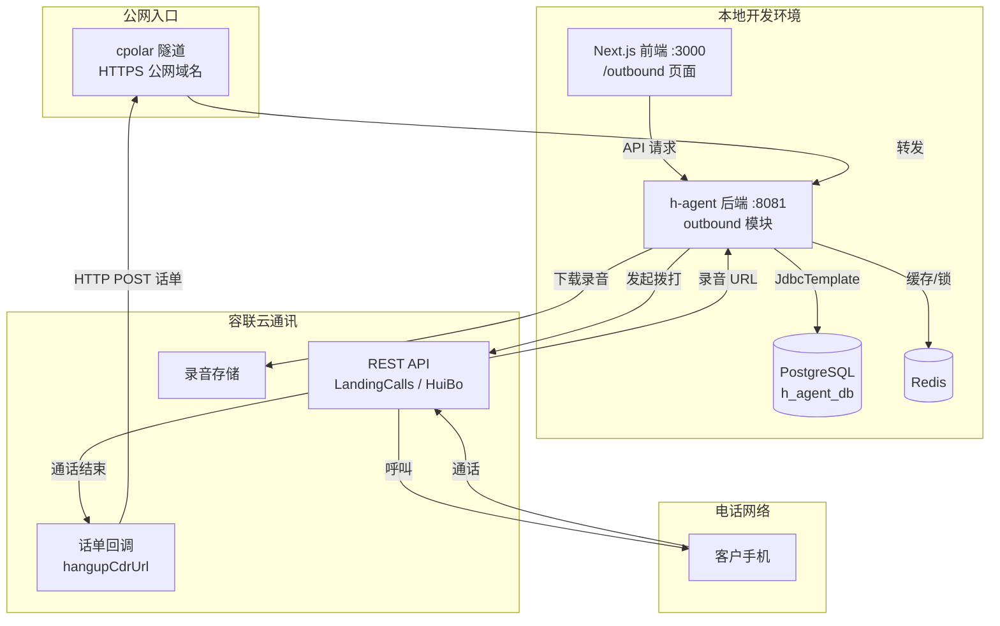

# 智能外呼系统设计与实施规格

日期：2026-09-20  
状态：技术规格，尚未实施。  
文档性质：前后端模块设计、数据库 schema、API 契约、容联云通讯适配实现、分阶段实施步骤与验收标准。  
关联：[统一架构设计](../specs/2026-09-11-unified-voice-and-outbound-architecture.md)、[外呼调研](../research/2026-09-11-mainland-intelligent-outbound.md)、[外呼管理页面设计](../design/2026-09-20-outbound-management-page-design.md)、[会话绑定语音](../design/2026-09-11-session-bound-voice-agent-design.md)。

## 1. 设计结论

智能外呼系统作为 h-agent 后端的新增 `outbound` 模块实施，不引入独立进程。前端在现有 Next.js 应用中新增 `/outbound` 页面。拨打链路对接容联云通讯 REST API，通话结果通过 HTTP 回调接收，公网入口由 cpolar 隧道提供。

第一阶段交付「拨打 → 话单 → 录音 → 管理页面展示」的完整数据闭环。Agent 实时语音对话能力不在第一阶段范围；通话过程中的双向实时音频桥接需要容联呼叫中心 WebSocket SDK 或 FreeSWITCH 媒体网关，属第二阶段。

## 2. 代码现状与惯例

以下结论基于 2026-09-20 代码库阅读。

### 2.1 后端分层

现有 `voice` 模块是最佳参照：

| 层 | 职责 | 代表类 |
| --- | --- | --- |
| `domain/` | 纯数据类，Lombok `@Data`，含业务判定方法 | `VoiceCall.java` |
| `application/` | 业务逻辑，编排 domain 和 infrastructure | `VoiceCallModule.java`、`VoiceTurnModule.java` |
| `infrastructure/` | 数据访问、外部网关、配置 | `VoiceStore.java`（JdbcTemplate）、`LiveKitGateway.java`、`VoiceProperties.java` |
| `interfaces/web/` | REST 控制器 | `VoiceCallController.java` |

数据库访问使用 `JdbcTemplate` + `NamedParameterJdbcTemplate`，不使用 MyBatis-Plus 写新模块。事务通过 `TransactionTemplate` 显式管理。行级锁通过 `SELECT ... FOR UPDATE` 实现。

### 2.2 API 与配置惯例

所有 API 返回 `ApiResponse<T>` record（`code`/`message`/`data`），成功时 `code=0`。控制器使用 `@AuthenticationPrincipal AuthUserPrincipal` 获取用户身份，请求体用 `record` 定义并加 `@Valid` 验证。

配置通过 `@ConfigurationProperties(prefix = "xxx")` + `application.yml`，环境变量以 `${VAR:default}` 形式注入，`.env` 文件通过 `spring.config.import` 加载。

Flyway 迁移文件命名 `V{YYYYMMDD}_{NN}__{description}.sql`，放在 `classpath:db/migration`。数据库 schema 为 `skill_platform,public`。

### 2.3 前端惯例

Next.js App Router，页面在 `frontend/app/{route}/page.tsx`。API 客户端在 `frontend/lib/`，使用 `apiFetch<T>` 调用后端。类型定义与后端 record 字段名对齐（camelCase）。

### 2.4 现有基础设施

- 后端端口 8081，PostgreSQL 在 169.254.210.181:5432（h_agent_db），Redis 在 169.254.210.181:6379
- 前端开发端口 3000
- 已有 nginx SSE 代理经验（`docs/specs/2026-08-08-nginx-sse-proxy-timeout-design.md`）
- 语音模块（LiveKit + 火山 ASR/TTS）已验证可用

## 3. 系统架构



cpolar 将本地 8081 端口映射为一个 `https://{random}.cpolar.top` 公网 HTTPS 地址。该地址写入容联控制台的回调配置，容联在通话结束时 POST 话单到此地址，cpolar 转发到本地后端。

第一阶段不使用 nginx——cpolar 直接映射后端端口，容联回调直达 Spring Boot 控制器。当后续需要从外部访问前端管理页面时，再加 nginx 做路径分流。

## 4. 对象模型

### 4.1 外呼名单（outbound_contacts）

| 字段 | 类型 | 约束 | 说明 |
| --- | --- | --- | --- |
| id | varchar(64) | PK | UUID |
| user_id | bigint | NOT NULL | 所属用户 |
| phone | varchar(20) | NOT NULL | 号码 |
| name | varchar(64) | | 姓名 |
| variables | jsonb | DEFAULT '{}' | 业务变量键值对 |
| source | varchar(64) | NOT NULL | 来源 |
| consent_basis | varchar(256) | NOT NULL | 授权依据，空值不允许进入任务 |
| follow_up_status | varchar(32) | NOT NULL DEFAULT 'PENDING' | PENDING / CONTACTED / INTERESTED / NOT_INTERESTED / RECALL / DNC |
| last_call_id | varchar(64) | | 最近通话 ID，由通话结果回写 |
| last_call_outcome | varchar(32) | | 最近通话结果 |
| dnc | boolean | NOT NULL DEFAULT false | 禁呼标记 |
| dnc_reason | varchar(256) | | 禁呼原因 |
| dnc_at | timestamp | | 禁呼时间 |
| created_at | timestamp | NOT NULL DEFAULT NOW() | |
| updated_at | timestamp | NOT NULL DEFAULT NOW() | |

唯一索引：`(user_id, phone) WHERE dnc = false`，防止同号码重复入库。

### 4.2 外呼任务（outbound_tasks）

| 字段 | 类型 | 约束 | 说明 |
| --- | --- | --- | --- |
| id | varchar(64) | PK | UUID |
| user_id | bigint | NOT NULL | |
| name | varchar(120) | NOT NULL | |
| agent_id | varchar(128) | NOT NULL | 绑定 Agent |
| agent_definition_version | varchar(64) | | 创建时固化的定义版本 |
| scenario_text | text | | 业务背景 / 话术要点 |
| concurrency | int | NOT NULL DEFAULT 1 | 并发上限 |
| time_window_start | time | | 呼出时段开始 |
| time_window_end | time | | 呼出时段结束 |
| max_retry | int | NOT NULL DEFAULT 3 | 未接听重试次数 |
| retry_interval_min | int | NOT NULL DEFAULT 30 | 重试间隔（分钟） |
| status | varchar(32) | NOT NULL DEFAULT 'DRAFT' | DRAFT / PENDING / RUNNING / PAUSED / COMPLETED / TERMINATED |
| started_at | timestamp | | |
| finished_at | timestamp | | |
| created_at | timestamp | NOT NULL DEFAULT NOW() | |
| updated_at | timestamp | NOT NULL DEFAULT NOW() | |

### 4.3 任务条目（outbound_task_items）

名单快照。任务创建时从名单筛选条件固化为条目，后续名单变化不影响已创建任务的执行范围。

| 字段 | 类型 | 约束 | 说明 |
| --- | --- | --- | --- |
| id | varchar(64) | PK | UUID |
| task_id | varchar(64) | NOT NULL FK → outbound_tasks | |
| contact_id | varchar(64) | NOT NULL FK → outbound_contacts | |
| phone | varchar(20) | NOT NULL | 快照号码 |
| name | varchar(64) | | 快照姓名 |
| variables | jsonb | DEFAULT '{}' | 快照业务变量 |
| status | varchar(32) | NOT NULL DEFAULT 'PENDING' | PENDING / DIALING / CONNECTED / NO_ANSWER / FAILED / DNC_SKIP / CANCELLED |
| attempt_count | int | NOT NULL DEFAULT 0 | 已拨打次数 |
| last_call_id | varchar(64) | | 最近通话 ID |
| next_attempt_at | timestamp | | 下次可拨打时间（重试间隔） |
| created_at | timestamp | NOT NULL DEFAULT NOW() | |
| updated_at | timestamp | NOT NULL DEFAULT NOW() | |

索引：`(task_id, status)` 用于任务引擎轮询待呼条目；`(task_id, next_attempt_at)` 用于重试调度。

### 4.4 单次通话（outbound_calls）

每次拨打一行，不覆盖历史。

| 字段 | 类型 | 约束 | 说明 |
| --- | --- | --- | --- |
| id | varchar(64) | PK | UUID，内部通话标识 |
| task_id | varchar(64) | FK → outbound_tasks | |
| task_item_id | varchar(64) | FK → outbound_task_items | |
| contact_id | varchar(64) | FK → outbound_contacts | |
| user_id | bigint | NOT NULL | |
| agent_session_id | varchar(64) | | 关联 Agent Session（第二阶段） |
| yuntongxun_call_sid | varchar(64) | | 容联 callSid |
| attempt_number | int | NOT NULL | 第几次拨打 |
| status | varchar(32) | NOT NULL DEFAULT 'INITIATED' | INITIATED / RINGING / CONNECTED / HANGUP / FAILED / TIMEOUT |
| connect_status | varchar(32) | | CONNECTED / NO_ANSWER / BUSY / INVALID_NUMBER / DNC_BLOCKED / FREQ_LIMIT |
| direction | varchar(16) | NOT NULL DEFAULT 'OUTBOUND' | |
| duration_sec | int | | 通话时长（秒），来自话单 |
| recording_url | varchar(512) | | 录音下载 URL |
| transcript | text | | 对话转写（第二阶段） |
| agent_summary | text | | Agent 摘要（第二阶段） |
| intent_label | varchar(32) | | 意向判定 |
| intent_overridden | boolean | NOT NULL DEFAULT false | 人工修正标记 |
| started_at | timestamp | NOT NULL DEFAULT NOW() | |
| connected_at | timestamp | | |
| ended_at | timestamp | | |
| callback_raw | jsonb | | 原始回调数据，留痕 |
| created_at | timestamp | NOT NULL DEFAULT NOW() | |
| updated_at | timestamp | NOT NULL DEFAULT NOW() | |

索引：`(task_item_id, attempt_number)` 查某条目的拨打历史；`(yuntongxun_call_sid)` 回调幂等去重。

### 4.5 跟进记录（outbound_follow_ups）

| 字段 | 类型 | 约束 | 说明 |
| --- | --- | --- | --- |
| id | varchar(64) | PK | |
| call_id | varchar(64) | FK → outbound_calls | |
| contact_id | varchar(64) | FK → outbound_contacts | |
| user_id | bigint | NOT NULL | |
| intent | varchar(32) | | 意向标签 |
| appointment_time | timestamp | | 预约时间 |
| assignee | varchar(64) | | 人工负责人 |
| result | text | | 处理结果 |
| resolved | boolean | NOT NULL DEFAULT false | |
| created_at | timestamp | NOT NULL DEFAULT NOW() | |
| updated_at | timestamp | NOT NULL DEFAULT NOW() | |

### 4.6 禁呼记录（outbound_dnc_entries）

| 字段 | 类型 | 约束 | 说明 |
| --- | --- | --- | --- |
| id | varchar(64) | PK | |
| contact_id | varchar(64) | FK → outbound_contacts | |
| phone | varchar(20) | NOT NULL | |
| user_id | bigint | NOT NULL | |
| reason | varchar(256) | NOT NULL | 禁呼原因 |
| scope | varchar(16) | NOT NULL DEFAULT 'USER' | USER / GLOBAL |
| active | boolean | NOT NULL DEFAULT true | |
| created_at | timestamp | NOT NULL DEFAULT NOW() | |

任务引擎在每次发起拨打前查询此表：`SELECT EXISTS(SELECT 1 FROM outbound_dnc_entries WHERE phone=? AND user_id=? AND active=true)`。

## 5. 状态机

### 5.1 任务状态

```
DRAFT → PENDING → RUNNING ⇄ PAUSED → COMPLETED
                              ↘ TERMINATED
```

- DRAFT：创建后默认状态，用户可编辑
- PENDING：用户点击启动，任务引擎尚未开始调度
- RUNNING：任务引擎正在轮询待呼条目并发起拨打
- PAUSED：用户暂停，已有拨打出让完成，不发起新拨打
- COMPLETED：所有条目终态（非 PENDING/DIALING），任务自动完成
- TERMINATED：用户手动终止，所有进行中条目标记 CANCELLED

### 5.2 任务条目状态

```
PENDING → DIALING → CONNECTED → (通话结束回写)
                     ↘ NO_ANSWER → (attempt < max_retry ? PENDING : 终态)
                     ↘ FAILED → (attempt < max_retry ? PENDING : 终态)
DNC_SKIP（拨打前校验发现禁呼）
CANCELLED（任务被终止时）
```

条目从 PENDING 到 DIALING 的转换由任务引擎在 `SELECT ... FOR UPDATE SKIP LOCKED` 下完成，保证并发安全。NO_ANSWER 和 FAILED 在重试次数未用尽时回退为 PENDING，并设置 `next_attempt_at = NOW() + retry_interval_min`。

### 5.3 通话状态

```
INITIATED → RINGING → CONNECTED → HANGUP
                     ↘ FAILED
                     ↘ TIMEOUT
```

通话状态由容联回调驱动更新。`connect_status` 独立于 `status`，记录接通结果分类。接通与有意向是两个独立字段。

## 6. 后端模块设计

### 6.1 包结构

```
com.h.backend.outbound
├── domain/
│   ├── OutboundContact.java
│   ├── OutboundTask.java
│   ├── OutboundTaskItem.java
│   ├── OutboundCall.java
│   ├── OutboundFollowUp.java
│   └── OutboundDncEntry.java
├── application/
│   ├── OutboundContactModule.java    // 名单导入、查询、禁呼
│   ├── OutboundTaskModule.java        // 任务创建、启动、暂停、终止
│   ├── OutboundCallModule.java        // 通话记录查询、意向修正
│   ├── OutboundFollowUpModule.java    // 跟进队列
│   └── OutboundTaskEngine.java        // 任务引擎：轮询、调度拨打
├── infrastructure/
│   ├── OutboundStore.java             // JdbcTemplate 数据访问
│   ├── OutboundProperties.java        // @ConfigurationProperties(prefix = "outbound")
│   ├── YuntongxunClient.java          // 容联 REST API 客户端
│   ├── YuntongxunCallbackParser.java  // 回调数据解析与验证
│   └── DialingProvider.java           // 拨打执行适配接口
└── interfaces/web/
    ├── OutboundContactController.java
    ├── OutboundTaskController.java
    ├── OutboundCallController.java
    ├── OutboundFollowUpController.java
    └── OutboundCallbackController.java  // 容联回调入口，无需登录鉴权
```

### 6.2 DialingProvider 接口

```java
public interface DialingProvider {
    DialResult dial(OutboundTaskItem item, OutboundTask task);
    void cancel(String callId);
    CallStatusResult queryStatus(String yuntongxunCallSid);
}
```

`DialResult` 包含内部 `callId` 和容联 `callSid`。`queryStatus` 用于主动查询补偿回调丢失。第一阶段实现 `YuntongxunDialingProvider`，后续可替换为其他服务商或 FreeSWITCH 适配。

### 6.3 YuntongxunClient

封装容联 REST API 调用。容联 API 认证通过 `sig` 参数（MD5(AccountSid + AccountToken + Timestamp)），非 Bearer Token。

核心方法：

| 方法 | 容联 API | 用途 |
| --- | --- | --- |
| `dialOut(taskItem, task)` | `POST /2013-12-26/Accounts/{sid}/Calls/HuiBo` | 电话回拨，先呼主叫再呼被叫，支持录音 |
| `dialLanding(taskItem, task)` | `POST /2013-12-26/Accounts/{sid}/Calls/LandingCalls` | 语音通知，单向放音 |
| `queryCallStatus(callSid)` | `POST /2013-12-26/Accounts/{sid}/Call/QueryCallStatus` | 查询通话状态 |
| `queryCallDetail(callSid)` | `POST /2013-12-26/Accounts/{sid}/Call/QueryCallDetail` | 查询话单详情 |
| `downloadRecording(url)` | GET 录音 URL | 下载录音文件 |

`HuiBo` 接口的 `hangupCdrUrl` 参数填写 cpolar 公网地址 + `/api/outbound/callbacks/yuntongxun`。`needRecord` 设为 true 以获取录音。

容联 API 使用 `RestClient`（Spring 6 HTTP 客户端）调用，与项目中 `GiteeRestSkillRepository` 的惯例一致。认证参数 `sig` 在每次请求前计算。

### 6.4 OutboundTaskEngine

任务引擎是一个 `@Scheduled` 定时任务，每 10 秒执行一次（可配置），逻辑：

1. 查询 `status = 'RUNNING'` 的任务（`FOR UPDATE SKIP LOCKED`）
2. 对每个任务，检查并发数：`SELECT count(*) FROM outbound_task_items WHERE task_id=? AND status='DIALING'`
3. 若并发未满，查询待呼条目：`SELECT * FROM outbound_task_items WHERE task_id=? AND status='PENDING' AND (next_attempt_at IS NULL OR next_attempt_at <= NOW()) ORDER BY created_at LIMIT ?`
4. 对每个待呼条目，先查禁呼记录，命中则标记 `DNC_SKIP`，跳过
5. 检查呼出时段：当前时间不在 `[time_window_start, time_window_end]` 内则跳过
6. 原子转换条目状态为 `DIALING`（`UPDATE ... SET status='DIALING' WHERE id=? AND status='PENDING'`，检查 affected rows）
7. 调用 `DialingProvider.dial()`，成功后创建 `OutboundCall` 记录；失败后条目回退为 `PENDING`
8. 检查任务是否全部条目终态，若是则标记 `COMPLETED`

引擎使用 Redis 分布式锁保证单实例执行（key: `outbound:engine:lock`，TTL 30s），避免多实例重复调度。

### 6.5 回调处理

`OutboundCallbackController` 不需要登录鉴权，但需要验证请求来源合法性。容联回调验签方式：回调 URL 带带 `sig` 参数，后端用相同算法重新计算并比对。

回调处理流程：

1. 接收 `POST /api/outbound/callbacks/yuntongxun`，解析回调 JSON
2. 提取 `callSid`，查询 `outbound_calls` 表按 `yuntongxun_call_sid` 定位通话记录
3. 若已存在且 `status` 已为终态，直接返回成功（幂等）
4. 更新通话状态：`status` → HANGUP/FAILED/TIMEOUT，`connect_status` → 对应值，`duration_sec`、`recording_url`、`callback_raw` 写入
5. 回写任务条目状态：CONNECTED → 条目标记已接通；NO_ANSWER → `attempt_count++`，若未超 `max_retry` 则回退 `PENDING` 并设 `next_attempt_at`，否则标记终态
6. 回写名单的 `last_call_id`、`last_call_outcome`、`follow_up_status`
7. 异步下载录音（不阻塞回调响应，2 秒内返回 200）

回调可能分多次到达（通话结束、录音就绪、摘要就绪等不同事件），按 `callSid` 幂等处理，每次只更新对应字段。

## 7. 配置

### 7.1 application.yml 新增

```yaml
outbound:
  enabled: ${OUTBOUND_ENABLED:false}
  task-engine:
    interval: ${OUTBOUND_ENGINE_INTERVAL:10s}
    batch-size: ${OUTBOUND_ENGINE_BATCH_SIZE:5}
  yuntongxun:
    base-url: ${YUNTONGXUN_BASE_URL:https://app.cloopen.com}
    account-sid: ${YUNTONGXUN_ACCOUNT_SID:}
    account-token: ${YUNTONGXUN_ACCOUNT_TOKEN:}
    app-id: ${YUNTONGXUN_APP_ID:}
    rest-port: ${YUNTONGXUN_REST_PORT:8883}
    callback-base-url: ${OUTBOUND_CALLBACK_BASE_URL:}
    max-call-seconds: ${OUTBOUND_MAX_CALL_SECONDS:180}
    connect-timeout: ${YUNTONGXUN_CONNECT_TIMEOUT:5s}
    read-timeout: ${YUNTONGXUN_READ_TIMEOUT:30s}
```

`callback-base-url` 填写 cpolar 公网地址，如 `https://abc123.cpolar.top`。容器云通讯 API 的 base-url 和 rest-port 与 REST API 版本有关，需要在容联控制台确认。

### 7.2 .env 新增

```env
OUTBOUND_ENABLED=true
YUNTONGXUN_ACCOUNT_SID=your-account-sid
YUNTONGXUN_ACCOUNT_TOKEN=your-account-token
YUNTONGXUN_APP_ID=your-app-id
OUTBOUND_CALLBACK_BASE_URL=https://your-tunnel.cpolar.top
```

## 8. 数据库迁移

文件：`V20260920_01__create_outbound_tables.sql`

```sql
-- 外呼名单
CREATE TABLE IF NOT EXISTS outbound_contacts (
    id VARCHAR(64) PRIMARY KEY,
    user_id BIGINT NOT NULL,
    phone VARCHAR(20) NOT NULL,
    name VARCHAR(64),
    variables JSONB DEFAULT '{}',
    source VARCHAR(64) NOT NULL,
    consent_basis VARCHAR(256) NOT NULL,
    follow_up_status VARCHAR(32) NOT NULL DEFAULT 'PENDING',
    last_call_id VARCHAR(64),
    last_call_outcome VARCHAR(32),
    dnc BOOLEAN NOT NULL DEFAULT FALSE,
    dnc_reason VARCHAR(256),
    dnc_at TIMESTAMP,
    created_at TIMESTAMP NOT NULL DEFAULT NOW(),
    updated_at TIMESTAMP NOT NULL DEFAULT NOW()
);

CREATE UNIQUE INDEX IF NOT EXISTS idx_outbound_contacts_user_phone
    ON outbound_contacts(user_id, phone) WHERE dnc = FALSE;

CREATE INDEX IF NOT EXISTS idx_outbound_contacts_owner
    ON outbound_contacts(user_id, created_at DESC);

-- 外呼任务
CREATE TABLE IF NOT EXISTS outbound_tasks (
    id VARCHAR(64) PRIMARY KEY,
    user_id BIGINT NOT NULL,
    name VARCHAR(120) NOT NULL,
    agent_id VARCHAR(128) NOT NULL,
    agent_definition_version VARCHAR(64),
    scenario_text TEXT,
    concurrency INT NOT NULL DEFAULT 1,
    time_window_start TIME,
    time_window_end TIME,
    max_retry INT NOT NULL DEFAULT 3,
    retry_interval_min INT NOT NULL DEFAULT 30,
    status VARCHAR(32) NOT NULL DEFAULT 'DRAFT',
    started_at TIMESTAMP,
    finished_at TIMESTAMP,
    created_at TIMESTAMP NOT NULL DEFAULT NOW(),
    updated_at TIMESTAMP NOT NULL DEFAULT NOW()
);

CREATE INDEX IF NOT EXISTS idx_outbound_tasks_status
    ON outbound_tasks(status, updated_at)
    WHERE status IN ('PENDING', 'RUNNING');

CREATE INDEX IF NOT EXISTS idx_outbound_tasks_owner
    ON outbound_tasks(user_id, created_at DESC);

-- 任务条目
CREATE TABLE IF NOT EXISTS outbound_task_items (
    id VARCHAR(64) PRIMARY KEY,
    task_id VARCHAR(64) NOT NULL REFERENCES outbound_tasks(id),
    contact_id VARCHAR(64) NOT NULL REFERENCES outbound_contacts(id),
    phone VARCHAR(20) NOT NULL,
    name VARCHAR(64),
    variables JSONB DEFAULT '{}',
    status VARCHAR(32) NOT NULL DEFAULT 'PENDING',
    attempt_count INT NOT NULL DEFAULT 0,
    last_call_id VARCHAR(64),
    next_attempt_at TIMESTAMP,
    created_at TIMESTAMP NOT NULL DEFAULT NOW(),
    updated_at TIMESTAMP NOT NULL DEFAULT NOW()
);

CREATE INDEX IF NOT EXISTS idx_outbound_task_items_pending
    ON outbound_task_items(task_id, status, next_attempt_at)
    WHERE status = 'PENDING';

CREATE INDEX IF NOT EXISTS idx_outbound_task_items_task
    ON outbound_task_items(task_id, status);

-- 单次通话
CREATE TABLE IF NOT EXISTS outbound_calls (
    id VARCHAR(64) PRIMARY KEY,
    task_id VARCHAR(64) REFERENCES outbound_tasks(id),
    task_item_id VARCHAR(64) REFERENCES outbound_task_items(id),
    contact_id VARCHAR(64) REFERENCES outbound_contacts(id),
    user_id BIGINT NOT NULL,
    agent_session_id VARCHAR(64),
    yuntongxun_call_sid VARCHAR(64),
    attempt_number INT NOT NULL,
    status VARCHAR(32) NOT NULL DEFAULT 'INITIATED',
    connect_status VARCHAR(32),
    direction VARCHAR(16) NOT NULL DEFAULT 'OUTBOUND',
    duration_sec INT,
    recording_url VARCHAR(512),
    transcript TEXT,
    agent_summary TEXT,
    intent_label VARCHAR(32),
    intent_overridden BOOLEAN NOT NULL DEFAULT FALSE,
    started_at TIMESTAMP NOT NULL DEFAULT NOW(),
    connected_at TIMESTAMP,
    ended_at TIMESTAMP,
    callback_raw JSONB,
    created_at TIMESTAMP NOT NULL DEFAULT NOW(),
    updated_at TIMESTAMP NOT NULL DEFAULT NOW()
);

CREATE INDEX IF NOT EXISTS idx_outbound_calls_ytx_sid
    ON outbound_calls(yuntongxun_call_sid);

CREATE INDEX IF NOT EXISTS idx_outbound_calls_task_item
    ON outbound_calls(task_item_id, attempt_number);

CREATE INDEX IF NOT EXISTS idx_outbound_calls_task
    ON outbound_calls(task_id, started_at DESC);

-- 跟进记录
CREATE TABLE IF NOT EXISTS outbound_follow_ups (
    id VARCHAR(64) PRIMARY KEY,
    call_id VARCHAR(64) REFERENCES outbound_calls(id),
    contact_id VARCHAR(64) REFERENCES outbound_contacts(id),
    user_id BIGINT NOT NULL,
    intent VARCHAR(32),
    appointment_time TIMESTAMP,
    assignee VARCHAR(64),
    result TEXT,
    resolved BOOLEAN NOT NULL DEFAULT FALSE,
    created_at TIMESTAMP NOT NULL DEFAULT NOW(),
    updated_at TIMESTAMP NOT NULL DEFAULT NOW()
);

CREATE INDEX IF NOT EXISTS idx_outbound_follow_ups_unresolved
    ON outbound_follow_ups(user_id, created_at)
    WHERE resolved = FALSE;

-- 禁呼记录
CREATE TABLE IF NOT EXISTS outbound_dnc_entries (
    id VARCHAR(64) PRIMARY KEY,
    contact_id VARCHAR(64) REFERENCES outbound_contacts(id),
    phone VARCHAR(20) NOT NULL,
    user_id BIGINT NOT NULL,
    reason VARCHAR(256) NOT NULL,
    scope VARCHAR(16) NOT NULL DEFAULT 'USER',
    active BOOLEAN NOT NULL DEFAULT TRUE,
    created_at TIMESTAMP NOT NULL DEFAULT NOW()
);

CREATE INDEX IF NOT EXISTS idx_outbound_dnc_phone_user
    ON outbound_dnc_entries(phone, user_id) WHERE active = TRUE;
```

## 9. API 契约

所有接口前缀 `/api/outbound`，除回调控制器外均需登录鉴权。请求体和响应体字段使用 camelCase，与现有 `VoiceCallController` 一致。

### 9.1 名单接口

| 方法 | 路径 | 说明 |
| --- | --- | --- |
| POST | `/api/outbound/contacts/import` | 导入名单（CSV 文本或 JSON 数组） |
| GET | `/api/outbound/contacts` | 分页查询，支持按状态、来源、禁呼筛选 |
| PUT | `/api/outbound/contacts/{id}/dnc` | 标记禁呼 |

导入请求体：

```java
public record ImportContacts(
    @NotBlank String source,
    @NotBlank String consentBasis,
    @NotEmpty List<ContactInput> contacts
) {}

public record ContactInput(
    @NotBlank String phone,
    String name,
    Map<String, String> variables
) {}
```

### 9.2 任务接口

| 方法 | 路径 | 说明 |
| --- | --- | --- |
| POST | `/api/outbound/tasks` | 创建任务 |
| GET | `/api/outbound/tasks` | 列表，支持按状态筛选 |
| GET | `/api/outbound/tasks/{id}` | 详情含执行明细 |
| POST | `/api/outbound/tasks/{id}/start` | 启动 |
| POST | `/api/outbound/tasks/{id}/pause` | 暂停 |
| POST | `/api/outbound/tasks/{id}/terminate` | 终止 |

创建请求体：

```java
public record CreateTask(
    @NotBlank String name,
    @NotBlank String agentId,
    String scenarioText,
    @NotNull List<String> contactIds,
    Integer concurrency,
    LocalTime timeWindowStart,
    LocalTime timeWindowEnd,
    Integer maxRetry,
    Integer retryIntervalMin
) {}
```

`contactIds` 为用户已选择的名单条目 ID 列表。创建时后端生成名单快照写入 `outbound_task_items`。

### 9.3 通话接口

| 方法 | 路径 | 说明 |
| --- | --- | --- |
| GET | `/api/outbound/calls` | 通话流水，支持按任务、结果、时间筛选 |
| GET | `/api/outbound/calls/{id}` | 通话详情：转写、录音、摘要、意向 |
| PUT | `/api/outbound/calls/{id}/intent` | 修正意向标签 |

### 9.4 跟进接口

| 方法 | 路径 | 说明 |
| --- | --- | --- |
| GET | `/api/outbound/follow-ups` | 待处理队列，支持筛选 |
| PUT | `/api/outbound/follow-ups/{id}` | 登记处理结果 |

### 9.5 概览接口

| 方法 | 路径 | 说明 |
| --- | --- | --- |
| GET | `/api/outbound/summary` | 今日拨打数、接通率、有意向数、进行中任务数 |

### 9.6 回调接口

| 方法 | 路径 | 说明 |
| --- | --- | --- |
| POST | `/api/outbound/callbacks/yuntongxun` | 容联回调入口，无需登录鉴权，需验签 |

## 10. 前端页面设计

### 10.1 路由与文件

| 文件 | 用途 |
| --- | --- |
| `frontend/app/outbound/page.tsx` | 外呼管理主页面 |
| `frontend/lib/outbound.ts` | API 客户端 |

从 `/me` 页面增加入口链接（与 automations 一致）。

### 10.2 页面视图

单页面、四个 tab，顶部概览条。

概览条：今日拨打数、接通率、有意向数、进行中任务数。数据来自 `GET /api/outbound/summary`。

**名单 tab**（默认）：
- 列表：号码、姓名、来源、跟进状态、最近通话结果、禁呼标记
- 导入按钮：弹出对话框，粘贴 CSV 文本（`phone,name,source`），填写来源和授权依据
- 筛选：按状态、来源、禁呼
- 操作：标记禁呼

**任务 tab**：
- 卡片列表：名称、Agent、进度（已呼/总数）、接通率、有意向数、状态徽章
- 创建向导：选择 Agent（复用 `listAgents`）→ 勾选名单条目 → 配置执行策略 → 填写业务背景
- 操作：启动、暂停、终止、查看明细

任务明细抽屉：条目列表（号码、状态、尝试次数、最近结果）、通话记录时间线。

**通话记录 tab**：
- 列表：时间、号码、任务名、接通状态、时长、意向
- 详情抽屉：录音播放器、转写（第二阶段）、摘要、意向标签可修正
- 筛选：按任务、结果、时间范围

**跟进 tab**：
- 列表：号码、意向、预约时间、负责人、处理状态
- 操作：登记处理结果、改约、转禁呼

### 10.3 API 客户端

`frontend/lib/outbound.ts` 导出类型和请求函数，与 `automations.ts` 风格一致：

```typescript
import { apiFetch } from "./http";

export type OutboundContact = {
  id: string;
  phone: string;
  name: string | null;
  variables: Record<string, string>;
  source: string;
  consentBasis: string;
  followUpStatus: string;
  lastCallId: string | null;
  lastCallOutcome: string | null;
  dnc: boolean;
  createdAt: string;
  updatedAt: string;
};

export type OutboundTask = {
  id: string;
  name: string;
  agentId: string;
  scenarioText: string | null;
  concurrency: number;
  status: string;
  // ...
};

export async function listContacts(params?: URLSearchParams): Promise<PageResult<OutboundContact>> { ... }
export async function importContacts(input: ImportContactsInput): Promise<void> { ... }
export async function createTask(input: CreateTaskInput): Promise<OutboundTask> { ... }
export async function startTask(id: string): Promise<void> { ... }
// ...
```

## 11. cpolar 配置

### 11.1 安装与启动

macOS 安装：`brew install cpolar`（或从 [cpolar.com](https://www.cpolar.com) 下载）。

认证：注册 cpolar 账号后在控制台获取 authtoken，执行 `cpolar authtoken YOUR_TOKEN`。

启动隧道：

```bash
cpolar http 8081
```

输出一个 `https://{random}.cpolar.top` 公网 HTTPS 地址。固定域名需要付费（专业版 149 元/年起）。

### 11.2 容联控制台配置

登录容联云通讯控制台（[console.yuntongxun.com](https://console.yuntongxun.com)）：

1. 创建应用，获取 `AccountSid`、`AuthToken`、`AppId`
2. 配置回调地址：`https://{your-tunnel}.cpolar.top/api/outbound/callbacks/yuntongxun`
3. 绑定测试号码（测试阶段只能拨打已绑定的号码）
4. 记录凭据写入 `.env`

### 11.3 稳定性考量

cpolar 免费版地址随机变化，每次重启获得新域名。建议购买专业版（149 元/年）获取固定二级域名，避免每次重启后重新配置容联回调地址。

cpolar 断线时容联回调无法到达，但通话仍会正常执行。恢复后可通过 `YuntongxunClient.queryCallDetail()` 主动查询补偿丢失的话单。任务引擎的主动查询补偿逻辑每 60 秒扫描 `status IN ('INITIATED','RINGING','CONNECTED')` 且 `updated_at < NOW() - INTERVAL '5 minutes'` 的通话记录，主动向容联查询状态。

## 12. 实施步骤

### 第一阶段：数据闭环与容联对接

以下步骤按依赖顺序排列，每步可独立验证。

**步骤 1：数据库迁移**

创建 `V20260920_01__create_outbound_tables.sql`（见第 8 节），放入 `backend/src/main/resources/db/migration/`。启动后端验证 Flyway 自动执行、六张表创建成功。

验证：`psql -h 169.254.210.181 -U h_agent -d h_agent_db -c "\dt outbound_*"`

**步骤 2：后端 domain 与 infrastructure**

创建 `outbound/domain/` 下六个数据类（Lombok `@Data`，字段与表对齐）。创建 `OutboundStore.java`，封装六张表的 CRUD，使用 `JdbcTemplate` + `NamedParameterJdbcTemplate`，参照 `VoiceStore` 的 `locked()` 和 `transaction()` 模式。

创建 `OutboundProperties.java`（`@ConfigurationProperties(prefix = "outbound")`），字段见第 7 节。在 `application.yml` 末尾追加 `outbound` 配置块。

验证：后端启动无报错，`OutboundStore` 能插入和查询测试数据。

**步骤 3：容联客户端**

创建 `YuntongxunClient.java`，封装 `sig` 计算、REST 调用、录音下载。使用 Spring `RestClient`。先实现 `dialOut`（HuiBo 回拨）和 `queryCallDetail`。

创建 `DialingProvider` 接口和 `YuntongxunDialingProvider` 实现类。

验证：用测试号码调用 `dialOut`，手机能接到电话；`queryCallDetail` 能返回通话状态。

**步骤 4：回调控制器**

创建 `OutboundCallbackController.java`，实现 `POST /api/outbound/callbacks/yuntongxun`。解析回调 JSON，按 `callSid` 幂等更新 `outbound_calls` 和 `outbound_task_items`。录音 URL 异步下载到本地文件系统（路径 `/tmp/h-agent/outbound/recordings/`）。

验证：通过 cpolar 隧道，容联通话结束后回调到达，数据库中通话记录状态正确更新。

**步骤 5：业务模块与任务引擎**

创建 `OutboundContactModule`、`OutboundTaskModule`、`OutboundCallModule`、`OutboundFollowUpModule`。创建 `OutboundTaskEngine`（`@Scheduled` 定时任务），实现轮询、禁呼校验、呼出时段检查、条目状态转换、并发控制。

Redis 分布式锁：key `outbound:engine:lock`，使用 `SET NX EX 30`。

验证：创建任务、启动、看到任务引擎日志、条目状态转换、通话记录写入。

**步骤 6：REST 控制器**

创建 `OutboundContactController`、`OutboundTaskController`、`OutboundCallController`、`OutboundFollowUpController`。参照 `VoiceCallController` 的写法：`@RestController` + `@RequestMapping` + `ApiResponse` 返回 + `AuthUserPrincipal` 鉴权。

验证：用 curl 或 Postman 调用每个端点，返回符合 `ApiResponse` 格式。

**步骤 7：前端页面**

创建 `frontend/lib/outbound.ts`（类型 + API 函数）。创建 `frontend/app/outbound/page.tsx`，实现四个 tab 的列表和操作。在 `frontend/app/me/page.tsx` 增加入口链接。

验证：浏览器访问 `/outbound`，能导入名单、创建任务、启动、查看通话记录、登记跟进。

**步骤 8：端到端验证**

用测试号码完整跑一次：导入名单 → 创建任务 → 启动 → 手机接听 → 挂断 → 通话记录出现在页面 → 录音可播放 → 标记意向 → 进入跟进队列。

### 第二阶段：Agent 实时语音对话

第一阶段交付后，通话只有录音和话单，Agent 不能在通话过程中实时对话。第二阶段需要将容联通话的音频桥接到已有语音运行核心（ASR/TTS/VAD），路径有两条：

- 容联呼叫中心 WebSocket SDK（CCS），从通话中提取双向音频流，送入 Python 语音核心
- FreeSWITCH 作为媒体网关（统一架构文档路线），容联只负责线路落地

每通电话建立独立 Agent Session，Agent 按业务背景和话术要点对话。通话结束后，通话记录关联 Agent Session 的有效对话、Agent 摘要和意向判定。此阶段还需解决播放结算与有效消息提交的语义一致性（统一架构文档 §7、会话绑定语音设计 §5-7）。

## 13. 验收标准

第一阶段验收以用户行为和持久化结果为准，不以接口成功或页面显示为唯一依据：

- 导入名单缺少 `consentBasis` 的条目被拒绝，返回明确错误信息
- 创建任务选定 Agent 和名单条目后，任务条目表生成正确的名单快照
- 任务启动后，任务引擎按呼出时段和并发限制调度拨打，日志可见调度过程
- 禁呼条目在任务执行中被跳过，`outbound_task_items.status` 为 `DNC_SKIP`
- 同一名单条目多次拨打，`outbound_calls` 表保留多行记录，`attempt_number` 递增
- 容联回调重复投递同一 `callSid` 不产生重复记录或重复状态转换
- 通话详情在录音到达前后均能正确展示，录音 URL 可播放
- 意向标签的人工修正留痕（`intent_overridden = true`），未接听条目不被自动记为无意向
- cpolar 断线后恢复，主动查询补偿逻辑能补全丢失的通话状态
- 任务所有条目到达终态后，任务自动标记 `COMPLETED`

## 14. 已知限制

- 个人认证无法正式商用，仅限绑定测试号码拨打；正式上线需企业资质（调研文档 §4）
- 容联 REST + 回调模式不支持实时双向音频流，第一阶段通话无 Agent 实时对话能力
- cpolar 免费版地址随机，需付费固定域名以保证回调配置稳定
- 任务引擎依赖单实例 Redis 锁，多实例部署需改用分布式调度器
- IVR 功能费 100 元/月，TTS 功能费 200 元/月，在功能开通时产生
- 容联 API 的 base-url 和 rest-port 需在控制台确认，不同版本可能不同
