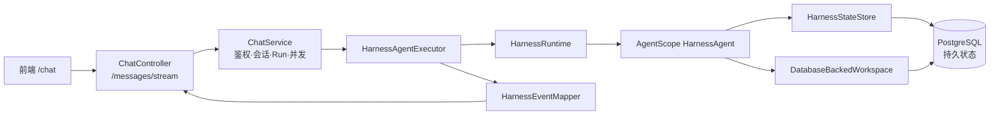

# Harness Agent 0→1 总体设计

- 日期：2026-08-10
- 状态：实现基线
- 依据：[Harness Agent PRD](../../prd/2026-08-08-harness-agent-prd.md)
- 消息与日志细化设计：[Harness 消息事件与会话日志设计](./2026-08-10-harness-message-event-and-session-log-design.md)
- 范围：后端 Harness 运行时、SSE、分布式状态、Memory、Skill、会话日志及前端契约

## 1. 一页结论

系统新增第三种聊天运行时：

```text
harness-agent
→ HARNESS_STREAMING
→ HarnessAgentExecutor
→ AgentScope Java HarnessAgent 2.0.1
```

它继续使用现有会话体系和 `POST /api/chat/messages/stream`，不创建第二套聊天接口，也不让 AgentScope Gateway 替换现有 `ChatController` / `ChatService`。

本期必须支持多实例：请求可以轮询到任意后端节点，不要求 sticky session。PostgreSQL 是 AgentState 的唯一恢复来源；Redis只承担现有分布式并发控制，不再保存 Harness AgentState。任意实例均可根据同一 `userId/sessionId` 从 PostgreSQL 继续会话。

节点本地磁盘不保存任何必须恢复的数据。`MEMORY.md`、`memory/YYYY-MM-DD.md`、Skill 目录和 JSONL 日志仍是 AgentScope 的逻辑概念；其远端副本进入 PostgreSQL，SessionTree 可以保留不参与恢复承诺的节点临时工作副本。

整体复杂度封装在两个深模块后面：

1. `HarnessRuntime`：隐藏 AgentScope 创建、父/子调用、事件和取消。
2. `HarnessStateStore`：隐藏 AgentScope 状态格式，并将完整状态持久化到 PostgreSQL。

对现有 `ChatService` 来说，新能力仍然只是一个 `ChatAgentExecutor`。

## 2. 为什么不直接照搬 LangChain4j Memory

现有 `ChatMemorySnapshotService` 保存的是 LangChain4j `List<ChatMessage>`，适合普通聊天和现有领域 Agent。

Harness 的恢复对象是完整 AgentScope `AgentState`。除模型当前看到的消息窗口外，它还包含继续运行所需的计划、工具、权限和任务状态。若只保存消息，服务重启后会出现“对话内容还在，但 Agent 运行状态丢失”。

因此设计不是推翻现有方案，而是保留“按会话恢复”的简单使用体验，同时减少一层缓存一致性：

```text
按 userId/sessionId 读取 PostgreSQL AgentState
→ 命中后直接继续会话
```

同时为 Harness 使用独立格式和独立表，避免两种框架状态互相误读。

## 3. 范围

### 3.1 本期必须实现

- 使用真实 `HarnessAgent`，不以普通 `ReActAgent` 代替。
- 新增 `HARNESS_STREAMING` 和 `HarnessAgentExecutor`。
- 注册固定 `agentId = harness-agent`。
- 保持 `/api/chat/messages/stream` 外层协议不变。
- 新增版本化 `harness_event`。
- PostgreSQL单独保存完整 `AgentState`。
- 多实例下同一会话单轮串行，任意节点均可恢复。
- Memory、Skill、内部会话日志使用 PostgreSQL持久化。
- 节点本地文件不作为恢复真相，并禁止宿主 Shell。
- 正确处理取消、运行终态和并发许可释放。
- 前端以 `runtimeType` 区分第三种会话。

### 3.2 下一阶段

- 父聊天顶部协作进度。
- `SessionOpen` 返回协作 Agent快照。
- 点击协作 Agent懒加载独立子历史。
- 通过同一 `/messages/stream` 向指定 `subagentId` 追加要求。
- `/me/memory`、`/me/skills` 管理页面和聊天结果卡片。

### 3.3 延后

- 从半个 token 流跨节点续跑。
- 父请求结束后的后台主动推送或长期 WebSocket/SSE Channel。
- HITL、外部执行恢复和复杂权限审批。
- 自动重试、自动改派和复杂调度。
- 可执行 Skill、宿主 Shell和沙箱执行环境。
- 跨地域多活、完整事件回放和面向用户的会话台账。

## 4. 统一概念与数据归属

| 概念 | 作用域 | 用途 | 存储 |
| --- | --- | --- | --- |
| 产品聊天记录 | Session | 前端展示的用户、Agent和资源消息 | 现有 `chat_session_messages` |
| 会话工作上下文 | Runtime Session | 当前模型真正看到的压缩后窗口及运行状态 | PostgreSQL完整 `AgentState` |
| 会话原始日志 | Runtime Session | 不因压缩删除的内部记录，用于内置搜索和辅助排查 | `workspace_files` 中的逻辑 JSONL 远端镜像 |
| 会话压缩摘要 | Runtime Session | 替代早期上下文并继续参与推理 | 最新 `AgentState` 内 |
| 用户记忆流水 | User | 自动提取、只追加、等待整理的记忆素材 | PostgreSQL append-only表 |
| 用户长期记忆 | User | 合并去重、每轮注入、用户可编辑的 Markdown | PostgreSQL正文和修订版本 |
| Skill | User | 后续会话可匹配的能力说明及静态资源 | PostgreSQL Skill表和文件表 |
| 协作 Agent | Parent Session | 当前父会话内的临时协作者 | PostgreSQL产品读模型；AgentScope执行状态 |

必须保持三个边界：

- 产品聊天记录是 UI 事实，不是模型恢复事实。
- `AgentState` 是模型恢复事实，不直接返回前端。
- 压缩只改变工作上下文，不删除产品消息或原始日志。

## 5. 总体架构



不新增独立微服务。每个后端实例创建一个相同配置的 `HarnessAgent` Bean，共享 PostgreSQL；现有 Redis 并发锁继续保护同一会话。会话绑定的是 `agentId/runtime configuration`，不是某个 JVM 中的 Java 对象。

运行状态按下面的身份定位：

```text
(userId, agentId, runtimeSessionId)
```

父 Agent和每个协作 Agent可以拥有各自的 `runtimeSessionId`。

## 6. 模块设计

### 6.1 保持现有 `ChatController` / `ChatService`

继续负责：

- 登录用户和会话归属校验。
- 固定会话 `agentId`。
- 用户消息、Assistant消息和 `agent_runs`。
- session/user/global 并发准入。
- executor选择。
- SSE heartbeat和 outer terminal。

这使普通聊天、领域 Agent和 Harness共享同一产品接入层。

### 6.2 `HarnessAgentExecutor`

负责一次请求的生命周期：

- 构造带 `userId/sessionId` 的 AgentScope `RuntimeContext`。
- 调用 `HarnessRuntime` 并且只订阅一次事件流。
- 映射事件并输出 SSE。
- 从父 `AgentResultEvent` 取得最终回复。
- 保存 Assistant消息、AgentState和 run终态。
- 最后发送 `done` 或 `error`。
- 客户端断开时取消订阅。
- 保证 `onTerminal` 恰好执行一次。

### 6.3 `HarnessRuntime`

这是 AgentScope 集成的主 seam，只需要暴露：

```java
Flux<AgentEvent> streamParent(HarnessRunContext context, String message);
Flux<AgentEvent> streamSubagent(HarnessRunContext context, String subagentId, String message);
void cancel(HarnessRunContext context);
```

内部隐藏 `HarnessAgent`、Gateway bridge、父/子调用差异和 AgentScope版本细节。

AgentScope Gateway只用于协作 Agent exposure和 direct-subagent能力，不替换现有 HTTP Gateway。子 Agent调用仍必须先通过 h-agent 的鉴权和 membership校验。

### 6.4 `HarnessStateStore`

使用 AgentScope `PostgresAgentStateStore`。业务代码不能自行复制 State JSON，也不能从产品聊天消息拼装不完整的运行状态。

### 6.5 `DatabaseBackedWorkspace`

向 AgentScope提供逻辑文件语义，将允许路径映射到 Memory、Skill和Session Log仓库。

本期不允许：

- 使用 `LocalFilesystemSpec` 作为持久化事实来源。
- 把节点本地文件纳入跨节点恢复链路。
- 调用宿主机 Shell。
- 执行 Agent生成脚本。

Memory、Skill、AgentState等必须恢复的数据若没有远端存储，应用应启动失败。AgentScope
`SessionTree` 为实现内置 JSONL 日志而创建的节点工作副本是允许的，其远端镜像按官方
best-effort 语义处理。

## 7. Agent 注册与配置

新增：

```java
AgentRuntimeType.HARNESS_STREAMING
```

注册：

```text
agentId: harness-agent
displayName: 协作 Agent
runtimeType: HARNESS_STREAMING
enabled: true
```

`agentscope-harness:2.0.1` 必须是运行时依赖，不能继续使用 `provided`。AgentScope 与现有 LangChain4j 共用同一份 `.env`：`API_KEY`、`MODEL_NAME` 和 MiniMax Anthropic兼容地址 `https://api.minimaxi.com/anthropic/v1`；两个运行时不得各自维护一套模型配置。

`HarnessAgent` 使用：

- 单例 Bean。
- 分布式 `HarnessStateStore`。
- 官方 `DistributedStore.builder()` 组合 PostgreSQL AgentStateStore 与 BaseStore。
- 数据库工作区。
- 子 Agent和 exposure bridge。
- 显式配置的上下文压缩、用户记忆维护和大工具结果外置策略。

MVP 不依赖 AgentScope 版本中的隐含默认值：会话累计到 50 条消息，或模型上下文窗口扣除
20K 预留 token 后达到阈值时触发压缩；正式压缩前，在 25 条消息或 40K token 时先裁剪
旧工具参数。长期记忆每轮提取，最多每 30 分钟合并一次。超过 80K 字符的工具结果只在
上下文保留 2K 字符首尾预览，全文写入 PostgreSQL 共享的
`artifacts/large_tool_results` 路径。

这里不直接使用 `PostgresDistributedStore.create()`：该快捷实现固定使用默认表名并在运行时自动建表，
不符合本项目由 Flyway 管理 `agentscope.agent_state_snapshots` 与
`agentscope.workspace_files` 的约束。组合后的 `DistributedStore` 必须交给
`HarnessAgent.builder().distributedStore(...)`，不能只分别配置 `stateStore` 和
`filesystem`；Gateway会据此使用 `StoreBackedSubagentRegistry`，使已暴露的协作 Agent
能够跨节点和服务重启解析。

本期禁用需要结构化恢复的 HITL；如果意外产生暂停事件，安全失败而不是伪装成功。

## 8. 父 Agent请求主流程

```text
1. 前端 POST /api/chat/messages/stream
2. ChatService校验用户、会话和agentId
3. 获取现有Redis分布式permit
4. 保存用户消息并发送user_message
5. 创建agent_run
6. HarnessStateStore从PostgreSQL恢复AgentState
7. HarnessAgent.streamEvents执行
8. 父文本和Harness事件持续发送
9. 父AgentResult保存为Assistant消息
10. 新AgentState同步提交PostgreSQL
11. 完成agent_run
12. 发送done并释放permit
```

顺序约束：

- PostgreSQL状态保存成功之前不能发送 `done`。
- 子 Agent局部完成或失败不能发送 outer `done/error`。
- 状态投影失败不能自动重跑 Agent，避免重复工具副作用。
- SSE取消后必须停止模型订阅，不允许后台继续消耗 token。

## 9. SSE 设计

### 9.1 保持外层协议

继续使用：

```json
{
  "type": "...",
  "content": "...",
  "message": null,
  "payload": null
}
```

继续保留 `user_message/chunk/reasoning/image/resource/done/error/blocked`。其中 `done/error/blocked` 只表示整个 HTTP流终止。

### 9.2 新增 `harness_event`

所有 AgentScope细粒度语义统一放在一个版本化事件中：

```json
{
  "type": "harness_event",
  "content": "",
  "payload": {
    "schemaVersion": 1,
    "sdkVersion": "2.0.1",
    "runId": "123",
    "sequence": 17,
    "eventId": "event-id",
    "eventType": "SUBAGENT_EXPOSED",
    "target": {
      "kind": "SUBAGENT",
      "subagentId": "canonical-subagent-id"
    },
    "source": "raw/agentscope/path",
    "correlation": {
      "replyId": null,
      "blockId": null,
      "toolCallId": null
    },
    "metadata": {},
    "data": {}
  }
}
```

规则：

- `sequence` 在一次 backend run内单调递增。
- `eventId` 用于去重。
- `subagentId` 是产品寻址身份。
- `source` 只保留来源信息，不能用于授权或数据库主键。
- 大文件先物化为 resource；密钥、权限规则、内部提示和大段base64不能进入浏览器。
- 父文本同时发已有 `chunk`，旧前端可以正常显示主回答并忽略 `harness_event`。

前端默认只展示父/子文本、协作状态、产物和需要用户处理的产品动作。Thinking、Model/Tool过程和内部诊断默认隐藏。

## 10. 分布式 AgentState

### 10.1 读路径

```text
按服务端 userId + runtimeSessionId读取PostgreSQL
→ 命中则恢复完整AgentState
→ 未命中仅允许新建会话初始化空State
```

已有产品会话读取失败时，不能静默创建空 State继续聊天；应返回可观测错误，避免会话失忆。产品 `chat_session_messages` 只负责 UI 历史，不能替代完整 AgentState。

### 10.2 写路径

```text
Agent turn结束
→ PostgreSQL提交完整AgentState
→ 提交成功后才允许发送done
```

PostgreSQL提交失败则本轮不发送成功 `done`。AgentState每轮整体替换，使用 AgentScope自己的序列化格式保存模型上下文、摘要、权限、计划和任务状态。

本期不沿用旧 LangChain4j快照的“Redis先写、JVM内延迟刷库”，因为服务重启时可能丢失尚未落库的最新轮次。一次 Agent turn只同步保存一次完整 State，性能和实现复杂度都可控。

### 10.3 PostgreSQL

使用 `agentscope.agent_state_snapshots`，主键结构与 AgentScope `PostgresAgentStateStore` 一致：

```text
(session_id, state_key, item_index)
```

`session_id` 由 AgentScope根据 `userId/sessionId` 形成隔离键；`state_data` 保存 AgentScope JsonCodec生成的完整状态。不能直接用 Spring Jackson 3重编码 AgentScope多态消息块。

### 10.4 多实例保证

本期依赖两层简单机制：

1. 现有 Redis `ChatStreamConcurrencyGuard` 保证同一父会话单轮串行，并保留用户/全局限额。
2. PostgreSQL是所有实例共享的 AgentState唯一来源，节点不保留必须恢复的状态。

这足以覆盖当前“多实例轮询 + 服务重启恢复”。复杂 fencing只在未来出现跨地域写入、后台任务绕过现有 permit或长时间网络分区时引入。

Redis不可用时现有并发准入仍然 fail closed，不临时绕过锁继续写，避免同一会话出现双写；这与是否缓存 AgentState无关。

## 11. PostgreSQL 工作区模型

### 11.1 会话原始日志

沿用 AgentScope `SessionTree`：节点同步写 context JSONL 和 never-compacted `.log.jsonl`
工作副本，再异步、best-effort 镜像到 `agentscope.workspace_files`。它服务
`session_search`、`session_history` 和辅助排查，不作为严格审计或产品消息真相。

本期不新增 `harness_session_log_entries`，也不为等待远端镜像而延迟 outer `done`。
镜像完成前节点退出时允许最近内部日志缺失；同步 PostgreSQL AgentState 与
`chat_session_messages` 仍负责会话恢复和用户历史。详细规则见消息与日志细化设计。

### 11.2 用户记忆流水

新增 `harness_memory_ledger_entries`，核心字段包括：

- `user_id`、日期和Markdown内容。
- 来源 session/run/event。
- consolidation revision。
- 创建时间。

记录只追加，来源 event唯一，避免重复提取。AgentScope读取 `memory/YYYY-MM-DD.md` 时，由数据库行按日期和时间拼成逻辑Markdown。

### 11.3 用户长期记忆

新增 `harness_user_memory`，保存：

- 当前 Markdown正文。
- revision和checksum。
- 最近修改来源。
- 创建和更新时间。

需要历史审计时增加 `harness_user_memory_revisions`。

UI编辑、Agent显式“记住”和自动 consolidation必须经过同一个 Memory模块，使用 revision/ETag防止用户编辑与Agent写入互相覆盖。

初始策略：

- 显式“记住”立即写入。
- 普通自动提取先追加ledger。
- 压缩前强制flush。
- consolidation按配置周期执行并在事务中标记已消费ledger。

### 11.4 Skills

新增：

- `harness_skills`：用户、名称、说明、创建者、来源、启用状态、revision。
- `harness_skill_files`：`SKILL.md`、references和静态资源。

规则：

- Skill作用域始终为 User；来源会话只是 provenance。
- 用户创建和Agent创建后按PRD直接正式启用。
- 停用后保留内容，但不进入Agent可见集合。
- AgentScope看到的 `skills/{name}/...` 由数据库适配器虚拟呈现。
- 本期不执行 Skill脚本。

### 11.5 上下文压缩

使用 Harness内置 compaction：较早上下文变成摘要，最近消息原样保留，结果写回最新 `AgentState.context`。

初始策略配置化：

- 消息数达到 50或token预算接近上限时触发。
- 为模型输出预留20K token；动态保留最近25%的可用token，并限制在2K到8K之间。
- 在25条消息或40K token时，先保留最近20条消息并把旧工具参数裁剪到2K字符。
- 溢出时强制压缩并只重试一次。
- 压缩前先完成Memory flush。

压缩后的 State进入PostgreSQL；原始日志和产品聊天记录不删除。

大工具结果使用独立于摘要的 eviction 策略：超过80K字符后，上下文只保留2K字符首尾
预览，完整内容写入数据库工作区的 `artifacts/large_tool_results`。这样可控制上下文体积，
同时保证多实例切换后仍可按路径读取原始结果。

## 12. 协作 Agent与前端

### 12.1 协作 Agent身份

`SUBAGENT_EXPOSED.subagentId` 是产品主键。后端建立 `harness_subagents` 读模型，至少保存所属用户、父会话、child runtime session、名称、委托、顺序和状态。

统一状态：

```text
WAITING
RUNNING
WAITING_INPUT
COMPLETED
FAILED
CANCELLED
```

前端文案使用“等待追加要求”。该读模型也是子 Agent访问授权事实，不能只依赖某个 JVM内的 Gateway registry。

### 12.2 子对话

子历史使用独立 `harness_subagent_messages`，不挤占父消息分页。

下一阶段仍复用 `/messages/stream`，请求增加可选 target：

```json
{
  "message": "请补充定价信息",
  "sessionId": "parent-session",
  "agentId": "harness-agent",
  "target": {
    "kind": "SUBAGENT",
    "subagentId": "canonical-subagent-id"
  }
}
```

缺少 `target` 等价于父 Agent。客户端不能传 child sessionId或 raw source；服务端按登录用户、父会话和 `subagentId` 校验。

### 12.3 前端演进

第一阶段：

- 保存 session DTO中的 `runtimeType`。
- 提供独立“协作 Agent”新会话入口。
- 继续用 `chunk/done/error` 显示父对话。
- 未实现 Harness reducer前安全忽略 `harness_event`。

下一阶段：

- `SessionOpen` 增加 `harnessSnapshot`。
- 父流顶部显示协作进度。
- 按 `subagentId/replyId/blockId` 聚合子消息。
- 点击协作 Agent懒加载子历史。
- `done` 返回 `snapshotRevision`，避免刷新时旧快照覆盖实时状态。

## 13. 故障与生命周期

| 场景 | 行为 |
| --- | --- |
| 请求落到另一实例 | 从共享PostgreSQL恢复完整AgentState |
| 模型执行中实例退出 | SSE中断，恢复到上一轮完整提交状态 |
| PG提交前退出 | 本轮不算成功，不发送 `done` |
| Redis整体不可用 | 现有分布式并发锁不可用，拒绝新Harness turn，避免无锁并发写 |
| 浏览器断开 | dispose AgentScope订阅，run标记取消，释放permit |
| 会话归档 | 保留PG状态；重新激活时直接恢复 |
| 会话硬删除 | 删除父/子State、日志和消息；用户Memory/Skill保留 |

滚动重启时实例先从负载均衡摘除，停止接收新流并等待活动turn结束；超时后取消。第一版不承诺从半段回复续传。

## 14. 一致性规则

1. PostgreSQL是 AgentState、Memory、Skill、产品消息和协作读模型的持久事实来源；内部 JSONL 是 best-effort 远端镜像。
2. Redis只承担分布式协调，不保存Harness AgentState。
3. 节点本地磁盘不进入恢复链路。
4. 同一 Runtime Session同一时间只有一个turn写状态。
5. 旧 `snapshotVersion` 不得覆盖新版本。
6. Assistant消息、AgentState和run成功后才能发送 outer `done`。
7. AgentEvent投影以 `(runId, eventId)` 幂等。
8. 最终父消息以 `(runId, AgentResult.messageId)` 幂等。
9. 投影或持久化失败不能自动重跑 Agent。
10. 用户级Memory和Skill不随来源会话删除。

## 15. 实施顺序

### Step 1：分布式运行时基础

1. 调整 Harness依赖scope，并复用现有 `.env` 中的 MiniMax Anthropic兼容模型配置。
2. 新增 `HARNESS_STREAMING`、Agent definition和executor。
3. 新增 PostgreSQL AgentStateStore和PG migration。
4. 新增数据库工作区最低实现，禁止把本地fallback作为持久化真相，并禁用host shell。
5. 创建真实 `HarnessAgent` Bean。

### Step 2：父 Agent流式闭环

1. 接入 `streamEvents`。
2. 实现 `HarnessEventMapper` 和 `harness_event` v1。
3. 实现父文本、最终结果、State、run和terminal顺序。
4. 实现断开取消。
5. 完成跨实例恢复测试。

完成 Step 2 后，现有前端即可通过 `/messages/stream` 与真实 Harness父 Agent对话。

### Step 3：协作 Agent产品闭环

1. 持久化 `SUBAGENT_EXPOSED` 和状态投影。
2. 增加 SessionOpen快照和协作进度UI。
3. 增加子历史与 `target.subagentId`。

### Step 4：Memory 与 Skill界面

1. 完成 Memory API、ETag、编辑和consolidation。
2. 完成 Skill catalog、文件、启停和来源追踪。
3. 增加聊天结果卡片。

## 16. 本期验证清单

- `harness-agent` 正确注册并绑定 `HARNESS_STREAMING`。
- 保持现有 `/messages/stream`。
- 父回答可以流式显示并正确结束。
- 状态保存失败不会错误发送 `done`。
- SSE断开会停止底层模型流并释放permit。
- 第一轮由实例A执行后，实例B可以继续同一会话。
- 请求切换到另一实例时可以从PG恢复。
- 同一session并发请求只有一个获准执行。
- 服务重启后已完成上下文不丢失。
- 不产生必须依赖本地文件才能恢复的数据。
- 不暴露宿主Shell。
- 普通聊天和领域Agent无回归。
- 前端可通过 `runtimeType` 区分三种会话。

## 17. 官方参考

- [Agent](https://java.agentscope.io/v2/zh/docs/building-blocks/agent.html)
- [消息与事件](https://java.agentscope.io/v2/zh/docs/building-blocks/message-and-event.html)
- [Middleware](https://java.agentscope.io/v2/zh/docs/building-blocks/middleware.html)
- [Harness架构](https://java.agentscope.io/v2/zh/docs/harness/architecture.html)
- [Channel与Gateway](https://java.agentscope.io/v2/zh/docs/harness/channel.html)
- [Filesystem](https://java.agentscope.io/v2/zh/docs/harness/filesystem.html)
- [Memory](https://java.agentscope.io/v2/zh/docs/harness/memory.html)
- [Skill](https://java.agentscope.io/v2/zh/docs/harness/skill.html)

实现时以项目锁定的 AgentScope Java `2.0.1` artifact为准；官网当前文档可能包含高于 `2.0.1` 的接口。
