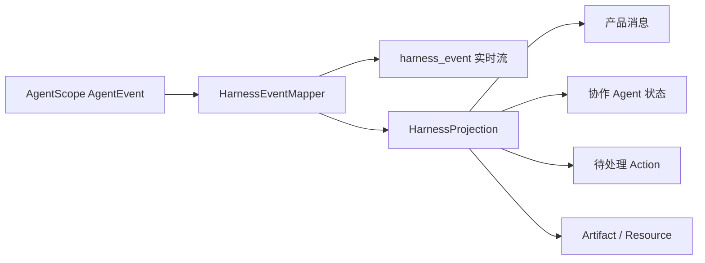

# Harness 消息事件与会话日志设计

- 日期：2026-08-10
- 状态：已确认，作为后续消息与前端扩展基线
- 上位设计：[Harness Agent 0→1 总体设计](./2026-08-10-harness-agent-distributed-design.md)
- 依据：[Harness Agent PRD](../../prd/2026-08-08-harness-agent-prd.md)

## 1. 决策摘要

本设计确认两项决策：

1. Harness 的产品消息与协作状态由 AgentScope `AgentEvent` 驱动投影；每条原始事件都会实时转为 `harness_event`，但不把每条事件当作聊天消息保存。
2. 接受 AgentScope 2.0.1 官方 `SessionTree` 的本地工作副本与远端异步 best-effort 镜像机制。JSONL 用于框架内置搜索、历史和辅助排查，不作为严格审计真相；本期不新增 `harness_session_log_entries`。

系统不要求严格审计、事件级零丢失或节点故障后的完整事件重放。必须保证的是：

- 产品聊天历史可恢复。
- AgentState 可从 PostgreSQL 恢复并继续推理。
- 协作 Agent 列表和稳定状态可恢复。
- 已提交的父/子消息、Action 和产物可恢复。

## 2. 当前消息模型的能力边界

现有 `chat_session_messages` 能稳定保存普通会话和 Harness 父 Agent 的最终消息，但不能完整表达 Harness 的父子线程与运行状态。

当前缺少：

- 父 Agent / 协作 Agent 的 thread target。
- canonical `subagentId`。
- `runId`、`replyId`、`blockId` 等事件关联键。
- 消息提交状态与通用内容类型。
- Action required、Artifact 和协作状态的独立产品模型。

现有 `message_type` 还混合了不同维度：`USER` / `AI` 是角色，`IMAGE` / `VIDEO` 是内容类型。`payload_json` 虽然物理上可扩展，但当前后端只为 `IMAGE` 反序列化，前端类型也只识别固定的旧消息枚举。因此不能仅向 `payload_json` 写入 Harness 数据就宣称完成兼容。

## 3. 三类数据必须分开

| 数据 | 用途 | 当前或目标存储 |
| --- | --- | --- |
| 产品聊天消息 | 前端长期展示、分页、父子对话历史 | `chat_session_messages` |
| Harness 稳定状态投影 | 协作列表、状态、Action、产物 | Harness 产品读模型表 |
| AgentScope 内部日志 | `session_search`、`session_history`、辅助排查 | `workspace_files` 中的逻辑 JSONL |

另外，`agentscope.agent_state_snapshots` 保存当前模型工作上下文、压缩摘要、计划和工具状态，是运行恢复真相，不是产品消息历史。

## 4. Event 是输入事实，不是数据库消息类型

推荐的数据流：



`HarnessEventMapper` 是 AgentScope SDK 与产品契约之间的主 seam。它负责：

- 保留每条 raw `eventType/source`，并只放行经过白名单过滤的 metadata 与 event-specific data。
- 注入 `runId` 和单调 `sequence`。
- 提升 `replyId/blockId/toolCallId`。
- 将 raw source 解析为稳定 product target。
- 产生前端长期依赖的 product `kind`。
- 对工具参数增量、原始 DataBlock、内部 Hint 和未经物化的大块工具结果裁剪字段，并在 `omittedFields` 中明示；不丢弃事件。

`HarnessProjection` 负责把规范化事件变成持久消息和稳定状态。SDK 版本升级导致的字段变化应被封装在这两个模块内，不能扩散到 Controller、消息表和 React 页面。

## 5. `harness_event` 推荐契约

当前实现使用 v2 信封，增加 `kind`、`target` 与 `omittedFields`：

```json
{
  "schema": "harness.agent-event",
  "schemaVersion": 2,
  "sdkVersion": "2.0.1",
  "runId": "123",
  "sequence": 17,
  "eventId": "event-id",
  "eventType": "TEXT_BLOCK_DELTA",
  "kind": "MODEL_OUTPUT",
  "phase": "DELTA",
  "importance": "PRIMARY",
  "occurredAt": "2026-08-10T12:00:00Z",
  "target": {
    "kind": "SUBAGENT",
    "streamKey": "subagent:canonical-subagent-id",
    "subagentId": "canonical-subagent-id",
    "label": "资料整理"
  },
  "correlation": {
    "replyId": "reply-id",
    "blockId": "block-id",
    "toolCallId": null
  },
  "data": {
    "delta": "内容"
  },
  "omittedFields": [],
  "source": {"scope": "SUBAGENT", "path": "source/path"},
  "metadata": {}
}
```

规则：

- `subagentId` 是用户寻址和授权身份。
- raw `source.path` 只用于来源诊断，不作为数据库主键或前端 route key。
- `target.streamKey` 只保证一次实时流内的聚合；子对话授权与寻址必须使用 `subagentId`。
- `sequence` 在单个 backend run 内全局单调，用于处理并行子事件交错与重复。
- 外层 `done/error/blocked` 仍保留现有 HTTP 流终止语义，不属于 `harness_event`。
- 前端按 `(runId,target.streamKey,kind,replyId,blockId,toolCallId)` 合并 START/DELTA/END，避免 token 事件洪水，同时以首次出现的 sequence 固定时间线位置。
- `omittedFields` 表示这一条事件确实发生，但对应字段为了安全、体积或后续资源物化而未进入 SSE；前端不得把它当作事件缺失。

## 6. 产品消息表扩展

父 Agent 和协作 Agent 的已提交产品消息继续统一存放在 `chat_session_messages`。新增字段时保持旧数据默认属于父线程：

```sql
ALTER TABLE chat_session_messages
    ADD COLUMN target_kind VARCHAR(16) NOT NULL DEFAULT 'PARENT',
    ADD COLUMN subagent_id VARCHAR(128),
    ADD COLUMN run_id BIGINT,
    ADD COLUMN reply_id VARCHAR(128),
    ADD COLUMN message_status VARCHAR(32) NOT NULL DEFAULT 'COMMITTED',
    ADD COLUMN content_kind VARCHAR(32) NOT NULL DEFAULT 'TEXT',
    ADD COLUMN metadata_json JSONB NOT NULL DEFAULT '{}'::jsonb;
```

约束：

```text
target_kind = PARENT   → subagent_id 为空
target_kind = SUBAGENT → subagent_id 必填
```

索引应支持先按 thread 过滤再分页：

```sql
CREATE INDEX idx_chat_messages_thread_sequence
ON chat_session_messages (
    session_record_id,
    target_kind,
    subagent_id,
    sequence_no
);
```

消息的维度逐步拆分为：

```text
role: USER | ASSISTANT | SYSTEM
contentKind: TEXT | REASONING | RESOURCE | ACTION | ARTIFACT | STATUS
messageStatus: STREAMING | COMMITTED | FAILED | CANCELLED
target: PARENT | SUBAGENT(subagentId)
```

本期持久化以 `COMMITTED` 为主。流式 `START/DELTA/END` 由前端 reducer 聚合，不能每个 token 插入消息表。

## 7. Event 投影规则

| AgentScope event | 实时行为 | 持久化行为 |
| --- | --- | --- |
| `TEXT_BLOCK_START/DELTA/END` | 按 target/reply/block 更新气泡 | 不逐 delta 保存 |
| `THINKING_BLOCK_*` | 可选折叠显示 | 默认不保存 |
| 父 `AGENT_RESULT` | 完成父气泡 | 提交父 Assistant 消息 |
| 子 `AGENT_RESULT` | 完成子气泡 | 提交对应 subagent 消息 |
| `SUBAGENT_EXPOSED` | 新增协作入口 | upsert 协作 Agent membership/read model |
| 子 `AGENT_START` | 状态变为执行中 | 更新协作 Agent 状态 |
| 子 `AGENT_END` / result | 状态进入稳定终态或等待态 | 更新协作 Agent 状态 |
| `REQUIRE_USER_CONFIRM` | 显示 Action 卡片 | 保存 pending Action |
| `REQUIRE_EXTERNAL_EXECUTION` | 显示 Action 卡片 | 保存 pending Action |
| `USER_CONFIRM_RESULT` / `EXTERNAL_EXECUTION_RESULT` | 更新卡片 | 关闭或更新 Action |
| `TOOL_RESULT_DATA_DELTA` | 更新 Artifact | 最终物化为 Resource / Artifact |
| `MODEL_CALL_START/END` | 显示轻量模型调用状态 | 只进 telemetry |
| `TOOL_CALL_START/END`、`TOOL_RESULT_START/END` | 显示动作名称与状态 | 只进 telemetry |
| `TOOL_CALL_DELTA`、原始工具结果 delta | 发送事件与安全摘要；参数/内容字段列入 `omittedFields` | 默认不保存 |
| `REQUEST_STOP` / `EXCEED_MAX_ITERS` | 显示简短状态 | 更新 run / target 状态 |

子 Agent 的失败或完成不能映射成顶层 `error/done`，否则会提前关闭整个父 HTTP 流。它们必须作为 `harness_event` 中的局部状态。

## 8. 稳定状态读模型

消息表不承担协作 Agent 当前状态。后续新增 `harness_subagents`，最低字段包括：

```text
subagent_id
user_id
parent_session_record_id
agent_id
runtime_session_id
label
assignment
status
display_order
last_run_id
created_at
updated_at
```

产品状态统一为：

```text
WAITING
RUNNING
WAITING_INPUT
WAITING_ACTION
COMPLETED
FAILED
CANCELLED
```

结构化 Action 后续使用独立 `harness_actions`，不能把 tool confirmation 简化为普通自然语言消息。

## 9. Session JSONL 的官方行为与本项目取舍

AgentScope `SessionTree` 维护：

```text
agents/{agentId}/sessions/{sessionId}.jsonl
agents/{agentId}/sessions/{sessionId}.log.jsonl
```

其中 context JSONL 面向当前上下文树，`.log.jsonl` 保存 never-compacted history，供内置 `session_search` / `session_history` 使用。

AgentScope 2.0.1 的真实写入顺序是：

1. 同步追加节点本地工作副本。
2. 把完整文件提交给 daemon mirror executor。
3. 异步上传 RemoteFilesystem。
4. 失败只记录 warning，不影响 Agent call 完成。

本项目接受该官方性能取舍，因为不要求严格审计、事件级零丢失或完整事件回放。定位如下：

```text
agent_state_snapshots = 模型继续推理的恢复真相
chat_session_messages = 用户可见消息真相
harness_subagents/actions = 前端稳定状态真相
SessionTree JSONL = AgentScope兼容日志与内置搜索数据
```

节点本地 JSONL 只是工作副本，不是跨节点恢复依赖。服务在远端镜像完成前崩溃时，最近一轮内部 JSONL 允许缺失；只要同步提交的 AgentState 和产品消息存在，会话仍可继续。

本期明确不新增：

- `harness_session_log_entries`。
- 原始 AgentEvent 全量持久化。
- 事件回放机制。
- 为等待镜像而延迟 outer `done`。

若未来出现合规审计或事件级重放要求，再以独立 append-only event log 实现，不能改变现有消息表语义。

## 10. 实施顺序

### 阶段一：消息与协作投影

1. 扩展 `chat_session_messages` 的 target、correlation 和通用内容字段。
2. 新增 `harness_subagents`。
3. 扩展 `HarnessEventMapper` 并实现 `HarnessProjection`。
4. 父/子 `AGENT_RESULT` 提交 thread-aware 消息。
5. 保证投影完成后才发送 outer `done`。

### 阶段二：前端实时与恢复

1. `apiStream` 消费 `harness_event`。
2. reducer 按 `(runId,target,replyId,blockId)` 聚合增量。
3. SessionOpen 返回协作状态快照。
4. 父历史只查询 PARENT，子历史按 `subagentId` 懒加载。

### 阶段三：Action 与 Artifact

1. 增加 `harness_actions` 和结构化恢复输入。
2. DATA / tool result 外部化为 Resource / Artifact。
3. Memory 与 Skill 写入显示轻量结果卡片。

## 11. 验收规则

- 普通会话不受新增字段影响，旧消息默认属于 PARENT。
- 父/子文本不会互相拼接。
- 刷新后可恢复协作顺序、状态和已提交子消息。
- 未知 AgentScope event 不会导致前端崩溃。
- child terminal 不会关闭 outer stream。
- `done` 到达时，本轮产品消息和稳定状态已经提交。
- JSONL 镜像失败不阻断聊天，也不影响 AgentState 恢复。
- 不把 thinking、tool 参数碎片或潜在敏感 metadata 默认持久化。
